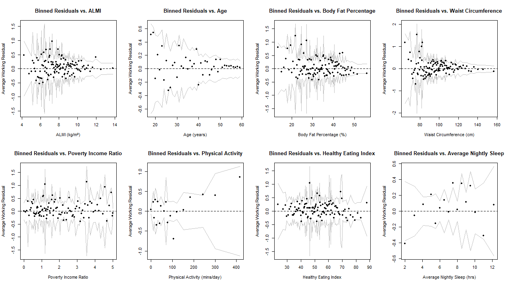
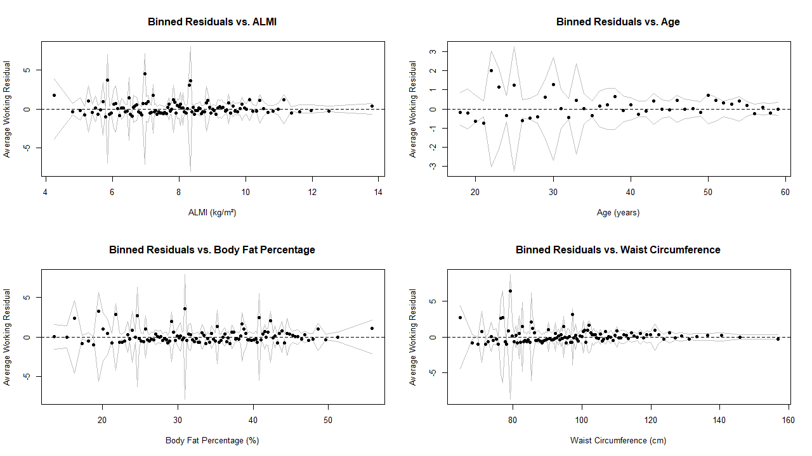

```{r, message=FALSE, include=FALSE}

library(gridExtra)
library(ggthemes)
library(systemfonts)
library(showtext)
library(kableExtra)

# Registering fonts
font_add("barlow",
         regular = "C:\\Users\\Admin\\AppData\\Local\\Microsoft\\Windows\\Fonts\\BarlowSemiCondensed-Regular.ttf",
         bold = "C:\\Users\\Admin\\AppData\\Local\\Microsoft\\Windows\\Fonts\\BarlowSemiCondensed-SemiBold.ttf")

# Verify that showtext sees the font
showtext_auto()
```

```{r, include=FALSE}

# Setting up custom ggplot theme

# Theme by Andrew Heiss
theme_clean = function() {
  theme_minimal(base_family = "barlow") +  # Use the loaded font
    theme(panel.grid.minor = element_blank(),
          plot.background = element_rect(fill = "white", color = NA),
          plot.title = element_text(face = "bold"),
          plot.caption = element_text(size = 10, hjust = 0),
          axis.title = element_text(face = "bold"),
          strip.text = element_text(face = "bold", size = rel(0.8), hjust = 0),
          strip.background = element_rect(fill = "grey80", color = NA),
          legend.title = element_text(face = "bold"))
}
```

```{r, include=FALSE}

# Load the pre-computed objects
load("report_assets.RData")
```

# Abstract

# Introduction

# Methodology {#methodology}

The analytical methods used to investigate the associations of skeletal muscle with glycaemic control involved many sequential stages. The first task was the collection of data from the National Health and Nutrition Examination Survey (NHANES) @nhanes_2024. Following data collection, meticulous creation and harmonisation of various predictor, outcome, and confounding variables was key. Missing data was appropriately handled using a robust multiple imputation strategy, after which, an iterative modelling journey was conducted to identify the most appropriate statistical models for the goal.

The chosen models were thoroughly diagnosed to ensure they were well selected and that inferences made using them were accurate. Once the models were known to be well defined, their coefficients were extracted and examined, they were used to make predictions, and their predictive accuracy was assessed.

The following sections will describe each stage of the methodological journey in detail, aiming to instil confidence in, and understanding of, the analysis and findings.

## Data Source: The National Health and Nutrition Examination Survey (NHANES)

The data used for all analyses are from the National Health and Nutrition Examination Survey (NHANES). NHANES is a large-scale health and nutrition examination program conducted by the National Center for Health Statistics - a subsidiary of the CDC.

The program began in 1959 under a different name - The National Health Examination Survey @nhanes_doc_2021. It was founded to satisfy the National Health Survey Act of 1956, which authorised ongoing surveys “to secure accurate and current statistical information on the amount, distribution, and effects of illness and disability in the United States”.

The overarching goals of NHANES are to deliver reliable data on the prevalence of major health conditions and their risk factors, monitor changes over time in diseases, behaviours, and environmental exposures, identify new and emerging public health issues, and preserve a nationally representative snapshot of the population’s health and nutritional well-being @nhanes_doc_2021.

The manner in which NHANES collects data is from a combination of personal interviews and questionnaires, standardised health examinations, and laboratory tests. Data such as demographics, socio-economic status, and health behaviours such as smoking history, alcohol consumption, and physical activity were recorded through interviews. Examinations, all performed in Mobile Examination Centres (MECs), were responsible for recording anthropometric data and body composition data from dual-energy X-ray absorptiometry (DXA) - the source of the primary muscle mass predictor. Laboratory tests involved the collection of biological specimens such as blood and urine. This was the source of the primary glycaemic control outcome variable.

Approximately 5,000 people take part in NHANES each year, with the data becoming available to the public in biannual cycles. Data from the following cycles have been utilised in this analysis: 2011-12, 2013-14, 2015-16, and 2017-18.

It is common that the format of the interview questionnaires evolves over different cycles of NHANES. Particular questions were not of the same form for every cycle. For this reason, a high level of care had to be taken when merging data from each cycle to create the final comprehensive dataset. Techniques such as variable harmonisation and feature engineering were key to ensure the quality of data was upheld and meaningful predictors were included in the models. Details of this process can be seen in Section \ref{process}.

Crucial elements of NHANES that needed to be considered were its cross-sectional nature and complex, multi-stage probability sampling design @nhanes_design_2018. NHANES is a cross-sectional study, meaning that data from each participant is collected only once at a specific point in time. As a result, analysis of associations between variables is permitted, but inferences of causality are not valid. In addition to its cross-sectional structure, considering the sample design in the analysis allowed for suitable estimation of variance such that statistics are representative of the whole U.S. civilian non-institutionalized population. The key features of the NHANES design are as follows:

1.  **Strata (`SDMVSTRA`):** These are groups of Primary Sampling Units (PSUs) that are similar in terms of geography and demographic characteristics, often defined using state-level health indices. Stratification increases the precision of the final estimates.
2.  **Primary Sampling Units (`SDMVPSU`):** These are the clusters, typically counties or groups of counties, sampled within each stratum. PSUs are selected with probabilities proportionate to their size to ensure that subgroups of public health interest are adequately represented. Accounting for clustering is essential for calculating correct standard errors, as individuals within a cluster may be more similar to each other than to the general population.
3.  **Sample Weights (`WTMEC2YR`):** Each participant is assigned a sample weight that can be thought of as counts of the number of individuals that they represent. A participant's sample weight accounts for their unequal probability of selection (due to oversampling of certain subgroups), as well as adjustments for non-response to the interview and the Mobile Examination Center (MEC) exam (more on this later).

As per the NHANES analytic guidelines @nhanes_design_2018, the MEC exam weight (WTMEC2YR) was used for all analyses. These are the weights that were used for "the least common denominator", meaning the "variable of interest that was collected on the smallest number of respondents". The key outcome variables (e.g., HbA1c) and predictor variables (e.g., ALMI from DXA scans) were collected during the physical examination at the MEC. The subset of individuals that participated in the MEC exam was smaller than the group that were interviewed, making the MEC weights the appropriate choice.

All statistical modelling was carried out using the `survey` package in R. This package provides functions that enable a variety of modelling techniques to be used in conjunction with "multi-stage stratified, cluster-sampled, unequally weighted survey samples" @lumley_2023. More detail of how this package was leveraged can be seen in Section \ref{statmodelling}.

All NHANES data are publicly available on the NCHS website and have been de-identified to maintain the anonymity of the participants. The data can be found alongside comprehensive documentation, including detailed codebooks, survey procedure manuals, and analytical guidelines, the use of which was paramount in ensuring results are statistically valid.

## Variable Selection and Creation {#vars}

As previously mentioned, a thorough process of variable selection, creation, and harmonisation across survey cycles was key in this analysis. Scientifically appropriate outcome, predictor, and confounding variables were chosen to successfully isolate the independent role of muscle mass in glycaemic control.

### Outcome variable: Glycaemic Control {#outcome}

The outcome variable chosen to represent glycaemic control was glycated haemoglobin (HbA1c) @diabetes_uk_2017.

Although the classification of diabetes has historically relied on single-point measures such as fasting plasma glucose (FPG), clinical guidelines have evolved. The recommended method across the globe is now HbA1c, which provides a more stable and comprehensive assessment by measuring average blood glucose levels over the last 2-3 months @iec_2009.

There are many advantages of using HbA1c over single-point measures such as FPG, some of which are as follows:

-   FPG levels are subject to a high degree of day-to-day variability due to a variety of factors including acute stress, illness, or changes in exercise @iec_2009. Such variability is not a concern with HbA1c, making it a more stable and reliable biomarker.

-   HbA1c can be comparable to roughly thousands of individual measurements of FPG, also capturing postprandial spikes in glucose that are often missed by a simple fasting test but are significant contributors to overall glycaemic burden @hb_pros_2011.

-   No fasting is required for retrieving HbA1c measurements, allowing for substantially simpler data collection for large-scale surveys such as NHANES. This also reduces the burden on participants and eliminates the chance of misclassification due to patients not adhering to fasting protocols.

HbA1c measurement has been standardised worldwide through efforts like the National Glycohemoglobin Standardization Program (NGSP), allowing results from various labs and studies to be comparable (<https://ngsp.org/>).

To test the hypothesis that the effect of skeletal muscle on glycaemic control is stage-specific, the continuous HbA1c variable was dichotomized to create two distinct binary outcomes. This approach allows for the separate modelling of the factors associated with the initial onset of dysregulation versus the progression to clinical disease.

The first outcome, representing the "Onset" of elevated risk, was defined using the American Diabetes Association (ADA) threshold for prediabetes @ada_2023. Individuals with HbA1c $<$ 5.7% were classified as "normal", while those with values $\geq$ 5.7% were classified as "elevated".

The second outcome, representing the "Progression" to diabetes, was defined using the ADA's diagnostic threshold of 6.5% HbA1c. This separated individuals below the diabetic threshold ($<$ 6.5%) from those with clinical diabetes ($\geq$ 6.5%).

This dual-outcome strategy directly informs the use of two separate binary classification models in the subsequent analysis, allowing for a nuanced investigation of the stage-specific effects of muscle mass. See Section \ref{imp} for details of how this was coded.

### Primary Predictor Variable: Skeletal Muscle Mass

Skeletal muscle is the largest organ in the human body by mass, consisting of around 40% of total body weight of a young male @merz_thurmond_2020. Physiologically, it the primary site for postprandial glucose disposal, accounting for approximately over 80% of post-meal glucose uptake from the blood. Consequently, insulin sensitivity within skeletal muscle is a key determinant of whole-body glucose homeostasis; when this process is impaired, it becomes a primary driver of whole-body insulin resistance.

Given its central role, further investigating the protective effect of skeletal muscle in the context of diabetes is of high clinical importance. This research moves beyond asking *if* skeletal muscle is protective and instead *when* its effect is most critical. By modelling two distinct clinical thresholds, this study seeks to provide novel evidence that the independent metabolic benefit of skeletal muscle is stage-specific.

The specific metric used as the primary predictor and a proxy for skeletal muscle in this study is appendicular lean mass index (ALMI). This refers the appendicular lean mass (ALM) - muscle mass in the limbs - scaled by height squared. Choosing to only consider muscle in the limbs is key as it allows for greater specificity for skeletal muscle tissue @tinsley_heymsfield_2024. Including whole body lean mass would introduce muscle in the central organs such as the heart, lungs, and liver. This would result in an inflated measure of skeletal muscle that is not representative of the muscle relevant to glucose uptake or metabolism.

To account for inherent differences in body size, ALM was normalized by height squared to create the Appendicular Lean Mass Index (ALMI). This normalization is crucial, as a taller individual will naturally possess greater appendicular lean mass than a shorter individual, even with a similar physique. Indexing to height squared - a method analogous to the calculation of the Body Mass Index (BMI) - allows for valid and meaningful comparisons of muscle mass between individuals of different statures @scaling_2021.

ALMI is the international standard measurement used for diagnosing sarcopenia, demonstrating its trusted clinical usage @sarco_2022.

ALMI is not directly reported by NHANES. However, the necessary data are available: lean mass measurements (excluding bone mass) for each limb obtained using DXA, along with height measurements. After converting lean mass from grams to kilograms and height from centimetres to metres, these variables were combined as follows to calculate ALMI:

\begin{center}

$\text{ALMI} \,(\mathrm{kg}/\mathrm{m}^2) = (\text{Left leg lean mass} \,(\mathrm{kg}) + \text{Right leg lean mass} \,(\mathrm{kg}) + \text{Left arm lean mass} \,(\mathrm{kg}) + \text{Right arm lean mass} \,(\mathrm{kg})) \,/ \,\text{Height}^2 \,(\mathrm{m})$

\end{center}

This conversion was done after multiple imputation, using the appropriate variables in each imputed dataset (see Section \ref{imp}). Doing this prior to imputation would not have been optimal. The multiple imputation algorithm works best when it has the most possible information to learn from. Combining the lean mass measurements of all four limbs into ALMI prematurely would reduce the information that the imputation is able to learn from, likely reducing its accuracy. In addition, calculating ALMI before imputation would result in the loss of information. This would be due to a missing value in any of the four limb measurements, or height, resulting in NA when combined. Forming the ALMI variable after the imputation algorithm is key in maintaining the highest possible accuracy and size of the final dataset.

### Selection of Simple Confounding Variables {#simple}

To isolate the independent effect of skeletal muscle on glycaemic control it is essential to control for potential confounding variables. Failure to do so can lead to biased estimates and spurious correlations. Confounding variables are those that are associated with both the outcome and primary predictor, but are not on the causal pathway between them @confounding_2008.

Choosing what confounding variables to include in the models was done based on the backing of the surrounding literature. Some confounders were simple to obtain and required no extensive harmonisation. These variables, and the reasons for including them, are outlined in this section. See Section \ref{process} for details on the inclusion of those variables that required substantial pre-processing.

Key demographic confounders that are included in the analysis are age, gender, and race. Age has an inverse relationship with muscle mass @demo_muscle_2010. Typically peaking in young adulthood, skeletal muscle mass naturally declines with age. This is what is known as sarcopenia. Body composition, including skeletal muscle, differs greatly between males and females. These differences also extend to people of different ethnic backgrounds.

Furthermore, increasing age is strongly associated with worsening glycaemic control due to insulin sensitivity decreasing with age @demo_gluc_2005. Sex hormones have been shown to have a strong influence on insulin sensitivity, resulting in differing risk profiles for metabolic disease between men and women, with women appearing to have lower insulin resistance than men @geer_shen_2009. Finally, there is a highly documented disparity in the prevalence of type 2 diabetes between those of differing ethnicities @demo_gluc_2005.

These reasons provide strong justification for the inclusion of age, gender, and race as confounding variables in the statistical models. Each variable is readily available in each cycle of NHANES and was directly extracted to be included in the final dataset. The same was done with key body composition confounders, body fat percentage (BFP) and waist circumference (WC).

To comprehensively account for the confounding effects of adiposity, both total BFP and WC were included in the models. As demonstrated by research directly comparing these metrics, both are significant predictors of type 2 diabetes, with central adiposity often showing a particularly strong association @associations_2019. Therefore, including both is essential to fully disentangle their effects from the independent contribution of muscle mass.

Another confounding variable that was considered in the analysis was diet quality due to it being a primary determinant of glycaemic control and strong association with skeletal muscle mass in the body @diet_gluc_2020 @diet_muscle_2023. NHANES collects substantial data regarding diet in the form of "24-hour dietary recalls" @dietary_recall. Since the survey cycle in 2002-2003, each participant has completed two 24-hour dietary recall, with the second between 3 and 10 days of the first. Each dietary recall required information on the individual foods that were consumed and total nutrient intakes.

There is no easy way to manually leverage the complex NHANES dietary recall data to engineer a single variable to include in the models, therefore, the R package `heiscore` was used to seamlessly extract what is known as Healthy Eating Index (HEI) scores for each participant of the required NHANES survey cycles. The Healthy Eating Index (HEI) is a tool used to evaluate diet quality by measuring how closely a group of foods adhere to the core recommendations and dietary patterns outlined in the Dietary Guidelines for Americans @usda_2023. A HEI score is a number from 1 to 100, with numbers closer to 100 indicating a healthier diet.

The final simple confounding variable that has been included in the statistical models is the ratio of family income to poverty (PIR), which is used as a measure of socio-economic status (SES). SES is a well-established social determinant of health, strongly associated with health behaviours, access to healthcare, and the risk of developing type 2 diabetes @ses_gluc_2024 @ses_muscle_2020. It is multifaceted construct that is frequently utilised in epidemiological research through indicators such as educational attainment and occupational status @pir_2014. These indicators may be problematic by attaching excessive significance to education and employment, while failing to acknowledge access to and affordability of healthcare.

This concern is rectified by the use of PIR, which represents household income relative to the appropriate poverty line. The poverty line or threshold is the minimum income level deemed necessary for a family to meet basic needs like food, housing, and clothing, and family income is defined as the total income of all members of a given household or family. A PIR of 1 means the family's income is equal to their poverty threshold, less than one implies they are economically disadvantaged, and greater than one implies they are financially secure, with higher magnitudes of PIR indicating further distance from the poverty line.

### Data Processing and Harmonisation of Lifestyle Confounders {#process}

Section \ref{simple} has outlined the selection of the confounding variables that did not require significant adjustment to be compiled in the final dataset. As previously mentioned, some confounders did require extensive data processing due to reasons such as structural missingness as a result of survey skip patterns and changes to interview structure over different survey cycles.

This section will provide justification for why these remaining confounders were chosen, and it will detail the meticulous wrangling that was needed to form the final comprehensive dataset prior to multiple imputation, including the harmonisation of these more complex confounders over each survey cycle of NHANES, and the techniques used to handle structural missingness. All the required R code for these tasks can be seen in Section \ref{procCode}.

#### Combining NHANES Survey Cycles

The initial task was to combine each relevant dataset from each cycle of NHANES from 2011 to 2018, keeping only the variables required for the analysis. These were each of the aforementioned variables in Section \ref{vars}, an individual ID, and the variables that were needed to engineer lifestyle confounders of physical activity, alcohol consumption, cigarette smoking, and daily hours of sleep. The details of such feature engineering will be outlined later in this section.

Each required dataset within NHANES was obtained using the `nhanesA` package in R. This package provides a simple function `nhanes` which was used to load the relevant data from each survey cycle into R. This process can be seen in Section \ref{nhanes}, along with the use of the `score` function from the aforementioned `heiscore` package to obtain the HEI scores for each participant.

Inner join was used, with the ID variable as they key, to combine each dataset within each survey cycle using a custom function `multi_inner_join`. This function took a list of data frames as an input and outputted the result of combining them with inner join. The use of inner join was crucial in creating a valid analytical sample prior to imputation. Not all individuals that participated in the interview stage also took part in the examination phase and vice versa. Merging datasets with an inner join ensures that only those who took part in both the interview and examination stages are in the final dataset. Failure to do so would result in imputing data that was not missing at random, resulting in a significantly larger but severely biased dataset. Each survey cycle's combined data frame was given a new identifier column to label which survey cycle its observations were from. This variable was key in the variable harmonisation phase.

Next, the complete merged datasets for each survey cycle were simplified by removing every variable within them that was not required. Following this, a new large dataset was formed by binding each survey cycle's dataset by row. This dataset contained 12178 rows comprising of all participants that took part in both the interview and examination in one of any NHANES survey from 2011 to 2018. Due to the cross-sectional nature of NHANES, no individual took part in multiple survey cycles.

#### Physical Activity

Following the creation of this large dataset was the handling of structural missingness and harmonisation of lifestyle confounders, the first of which being physical activity, which is well-known to be strongly associated with skeletal muscle mass and glycaemic control @phys_gluc_2018 @phys_musc_2023. The desired physical activity variable for modelling was one that measured the combined total minutes of "moderate" and "vigorous" recreational physical activity in a typical day (definitions of how NHANES defines "moderate and "vigorous" physical activity can be seen in the survey codebooks).

The physical activity questionnaires in NHANES contain questions that first ask whether the participant takes part in any "moderate" or "vigorous" activity (`PAQ665/PAQ650`). If the participant gives the answer "Yes", they will also be asked how many minutes of it they carry out in a typical day (`PAD675/PAD660`). This structure introduces structural missingness. Any time a participant answered "No" to the initial gatekeeper question, they were not asked the follow up question, resulting in the skipped response being coded as NA in the dataset. Of course, this data is not missing. An initial answer of "No" should correspond to 0 minutes of the appropriate level of physical activity in a typical day. This concern was appropriately handled as seen in Section \ref{procCode}. Very few individuals also responded with "Don't know" when asked the follow-up question regarding minutes of activity. This was coded as 9999 in the dataset, and was handled by setting 9999 values to NA so that they could be imputed. Handling the outlined structural missingness resulted in missing data for `PAD675` and `PAD660` reducing from 69% and 56% respectively, to 0.04% and 0.09%, emphasising the importance of this data processing. The final physical activity variable was formed by summing `PAD675` and `PAD660`.

#### Alcohol Consumption

The next lifestyle confounder to be included was alcohol consumption due to prior evidence showing that alcohol affects both muscle composition and glycaemic regulation @alc_musc_2001 @alc_gluc_2004. Alcohol misuse has been shown to have a direct negative relationship with skeletal muscle, however, moderate alcohol consumption is associated with a reduction in diabetes incidence. The latter finding will be highlighted in this analysis.

The alcohol consumption questionnaire from the NHANES interview stage maintained the same structure for the relevant questions from 2011 to 2016, but underwent alterations for the 2017-2018 cycle. This necessitated a complex multi-stage harmonisation process that resulted in a single, robust 4-level categorical variable (`Alcohol_Status`) distinguishing between those that had never been drinkers, those who are former drinkers, moderate drinkers, and heavy drinkers. Thresholds outlined by the U.S. government's "Dietary Guidelines for Americans" were used to classify drinkers as "moderate" or "heavy" @alcohol_2024.

Differentiating those who have never consumed alcohol and those who are former drinkers is key in handling the "sick-quitter" effect. The sick-quitter effect refers to individuals who stop drinking alcohol because of health problems @sick_quitter_2024. Although they are often categorised as non-drinkers in health data, they may have already experienced alcohol-related harm before quitting. When studies compare drinkers to non-drinkers and the non-drinker group includes former drinkers with existing health issues, it can distort the results. This may make the risks of alcohol seem lower than they are, or even suggest that light drinking offers health benefits. This distortion is known as the sick-quitter effect, and the construction of the `Alcohol_Status` variable handles this appropriately.

A categorical approach has the following key benefits over using a continuous variable of alcoholic drink consumption: The sick-quitter effect would be ignored using a continuous approach, resulting in both "Never Drinkers" and "Former Drinkers" being coded as 0, and the categorical approach captures non-linear risk and avoids the invalid assumption of a linear dose-response relationship.

The harmonisation process involved the following steps:

1.  Harmonisation of Drinking Frequency:

    This stage involved creating a consistent measure of how often participants drunk. For the 2011-2016 cycles, this was recorded as a numerical variable directly measuring the number of drinking days in the past year (`ALQ120Q`). However, for the 2017-2018 cycle, this was replaced with a categorical variable (`ALQ121`). To create a single, continuous variable that was comparable across all cycles 2011-2018 (`Drinking_Days_Per_Year)`, the categorical `ALQ121` was converted into an approximate number of days per year (e.g., "Every day" was converted to 365, "Once a week" to 52, etc.). The new `Drinking_Days_Per_Year` variable was simply the same as `ALQ120Q` for the responses from 2011-2016. Also in this stage, structural missingness was handled appropriately. Codes for "Refused" and "Don't know" responses were assigned to NA across all cycles to be imputed.

2.  Cleaning of Drinking Quantity

    The variable for the quantity of drinks per drinking day (`ALQ130`) was cleaned to handle "Refused" and "Don't know" codes in the same was as previously, and structural missingness. In the original data, values of `ALQ130` were coded as NA for those whose answers to `ALQ120Q` or `ALQ121` were 0 or "Never in the last year" respectively. Of course, this was not true missing data, but rather should be coded as 0. This was fixed by assigning a new clean `ALQ130` variable that was 0 whenever `Drinking_Days_Per_Year` was 0.

3.  Calculation of Average Daily Intake

    The harmonised frequency and cleaned quantity variables were then used to calculate a final, continuous variable denoted by `AvgDailyDrinks`, which measured the average number of daily alcoholic drinks consumed by each participant over the year prior to their survey cycle.

4.  Harmonisation of Lifetime Drinking Status

    This step involved the creation of a consistent flag to identify lifelong abstainers to aid in distinguishing between "never drinkers" and "former drinkers". The relevant questions (`ALQ110` for 2011-2016 and `ALQ111` for 2017-2018) differed in their wording and had different skip patterns. `ALQ111` simply asked if the participant had ever had an alcoholic drink in their life, whereas `ALQ110` asked whether the participant had had at least 12 alcoholic drinks in their life. However, before being asked `ALQ110`, participants were asked whether they had had at least 12 alcoholic drinks in the past year. Answering "Yes" for this question resulted in `ALQ110` being skipped, and an NA value being coded as an answer, when "Yes" would be the correct response. This structural missingness was handled appropriately, and codes for "Refused" and "Don't know" were assigned to NA once more, for imputation. Following this, a clean `LifetimeDrinkerFlag` variable was created using the cleaned `ALQ110` for 2011-2016 observations, and `ALQ111` for those from the 2017-2018 cycle.

5.  Final Variable Correction and Selection

    Due to survey skip patterns, there were instances where `AvgDailyDrinks` was coded as NA where `LifetimeDrinkerFlag` was "Never". This was simple to resolve, setting `AvgDailyDrinks` to 0 in each of these cases. Following this, the `LifetimeDrinkerFlag` variable was converted to a factor with the levels "Never" and "Ever", and the relevant final columns of the dataset were selected, allowing `AvgDailyDrinks` and `LifetimeDrinkerFlag` to be passed into the multiple imputation.

6.  Post Imputation Variable Creation

    Finally, after multiple imputation, `AvgDailyDrinks` and `LifetimeDrinkerFlag` were used to create the final 4-level `Alcohol_Status` variable. This process can be seen in Section \ref{imp}.

#### Smoking Status

Smoking cigarettes has been shown to negatively impact both muscle mass and blood sugar levels @smoke_musc_2020 @smoke_gluc_2013. For this reason, there was strong justification to include smoking status as a confounding variable in the statistical models for this analysis.

The goal was to create a clean categorical `Smoking_Status` variable using the results of two key questions in the smoking interview from NHANES, namely `SMQ020` ("Have you smoked at least 100 cigarettes in your life?") and `SMQ040` ("Do you now smoke cigarettes?"). This allowed for `Smoking_Status` to be a 3-level factor of "Never Smoker", "Former Smoker", and "Current Smoker", effectively handling the sick-quitter phenomenon. The categorical approach was also chosen here due to handling of the sick-quitter effect and not assuming a linear dose-response relationship, as done with the alcohol consumption variable. Unfortunately, there was no question that asked participants whether they had ever smoked in their life, meaning that "Never Smokers" were classified based on if they answered "No" to `SMQ020`.

The process of engineering this variable was largely simple due to the structure of the smoking questionnaire not changing over different survey cycles. The first step was to assign those who answered "No" to `SMQ020` as "Never Smoker", as previously mentioned. Next, responses to `SMQ040` were used to distinguish between those who were former smokers and those who currently smoke. If the response to `SMQ020` or `SMQ040` was "Refused" or "Don't know", `Smoking_Status` was assigned as NA to be imputed. Finally, the factor levels of `Smoking_Status` were assigned, and the relevant columns of the data frame were chosen to lead into further data processing and imputation.

#### Daily Hours of Sleep

The final confounding variable to be engineered and included in the statistical modelling was average daily hours of sleep, which also has been shown in the surrounding literature to be associated with muscle mass and glycated haemoglobin @sleep_musc_2025 @sleep_gluc_2008. A minor harmonisation challenge arose as the variable name for the relevant question in the NHANES questionnaire changed across survey cycles. The question was recorded under the variable `SLD010H` in the 2011-2014 cycles and under `SLD012` in the 2015-2018 cycles. A `case_when` statement was used to combine these into a single, consistent `AvgNightlySleep` variable for the entire eight-year study period. The final variable was then cleaned to remove any special codes, and the final dataset was selected, removing any unnecessary columns.

## Imputing Missing Data

Following the extensive data processing and harmonisation outlined in the previous section, which addressed all identifiable structural missingness, a final analytical dataset was created. Within this dataset, approximately 5% of the total data points remained missing across various variables. A naive approach to handling this issue - listwise deletion - was deemed inappropriate for two primary reasons. Although only 5% of the data was missing, conducting listwise deletion reduced the sample size by 35%, leading to a significant loss of statistical power. Secondly, this method is only valid under the strict and implausible assumption that the data are missing completely at random (MCAR) @buuren. It is far more likely that in a complex health survey like NHANES, the data are Missing at Random (MAR), meaning the probability of a value being missing is related to other observed variables. Using listwise deletion on MAR data is known to introduce bias into the results.

For these reasons, a more sophisticated strategy was required - multiple imputation. This method works by replacing the missing values with plausible estimates drawn from a distribution that is informed by all of the other variables in the dataset. The algorithm takes an incomplete dataset as input, and outputs multiple complete datasets that are formed this way. In this analysis, multiple imputation was conducted using the `Amelia` package in R, with a generous number of 30 imputations to ensure statistical power and minimal bias.

Before conducting the imputation, it was beneficial to define physiologically informed bounds of each variable to be imputed. This prevented the imputation algorithm from generating impossible values such as a negative waist circumference or age of 200. Parallel processing was also utilised when running the imputation algorithm. This allowed for the use of multiple CPU cores, vastly speeding up computation times. After imputation, there was a minor data processing task which involved calculating the ALMI primary predictor, creating the `Alcohol_Status` variable using the now complete `AvgDailyDrinks` and `LifetimeDrinkerFlag` variables, creating the `at_risk_or_worse` and `is_diabetic` outcome variables for the onset and progression models respectfully, and removing variables that were no longer needed. This is was done for all 30 imputed datasets. See Section \ref{imp} for details on the process outlined in this section.

## Statistical Model Fitting {#statmodelling}

Statistical modelling was carried out following the completion of data processing and multiple imputation. The primary goal was to test the stage-specific hypothesis of the role of skeletal muscle in glycaemic control. As described in Section \ref{outcome}, this was achieved using a dual-model framework:

-   Onset models to investigate the transition from normal to elevated HbA1c.
-   Progression models to investigate the transition from a non-diabetic to a clinical diabetic state.

The use of the `survey` R package was key in fitting models that respected the survey design of the NHANES data. Prior to model fitting, the survey design of each of the 30 imputed datasets was specified using `svydesign`. When fitting the models that respect the survey structure, the survey design object was supplied to the fitting functions rather than the raw datasets.

### Modelling Strategy

Prior to the dual-model approach, the initial modelling strategy was to use survey weighted ordinal logistic regression with the R function `svyolr`. This method involved fitting models with a single categorical outcome variable rather than the dual-outcome approach with the outcome variables of `at_risk_or_worse` and `is_diabetic`. The outcome variable was a 3-level factor of the following categories:

1.  Normal HbA1c ($<$ 5.7%)

2.  Prediabetic HbA1c ($\geq$ 5.7% & $<$ 6.5%)

3.  Diabetic HbA1c ($\geq$ 6.5%)

This form of model attempts to predict the cumulative log odds of being at or below a certain step of the ordered outcome, and how the predictors effect it. The key assumption that is associated with ordinal regression is that of proportional odds. The assumption is that the effect of any given predictor is the same across all the different thresholds of the outcome variable. This means that the effect of having more muscle (ALMI) on the odds of moving from "Normal" to "Prediabetic" is the same as moving from "Prediabetic to "Diabetic".

For the ordinal regression approach to be valid, the proportional odds assumption must be met. A formal test was conducted by fitting two separate binary logistic regression models: one comparing 'Normal' vs. 'Prediabetic or worse', and a second comparing 'Normal or Prediabetic' vs. 'Diabetic'. The results of this test revealed that the coefficients for key predictors, including ALMI, were significantly different between these two models. This violation was not merely a statistical issue; it provided direct evidence supporting the core research hypothesis that the effect of skeletal muscle is stage-specific. Therefore, the ordinal approach was abandoned, as it could not adequately capture this complexity, necessitating the adoption of the final dual-model framework.

The first application of the final binary classification modelling framework was using survey weighted generalised linear models with a quasipoisson family and log link function through the `svyglm` function in R. This approach is often favoured in epidemiological research as it allows for the direct estimation of prevalence ratios (or risk ratios), which can be more intuitive to interpret than odds ratios @zou_2004. However, goodness-of-fit diagnostic tests confirmed that onset models fit using the quasipoisson assumption were not well defined, and did not fit the data well. The goodness-of-fit test used was the Archer-Lemeshow test - a specialised diagnostic tool for assessing the fit of binary classification models fitted using survey weighted data @archer_lemeshow_2006. More detail on this diagnostics process can be seen in Section \ref{diag}, in which the final models were thoroughly tested.

Consequently, the quasipoisson family was discarded in favour of quasibinomial, as this provided a stable and good fit to the data for both outcomes, which was later confirmed by goodness-of-fit testing. The results are therefore presented as odds ratios.

The complex multi-stage probability sampling design employed by NHANES, in particular the clustering of observations within PSUs, leads to a violation of the assumption of independence among observations inherent in standard GLMs. This intra-cluster correlation is known to produce apparent overdispersion, which, if unaddressed, would result in badly defined standard errors @lumley_2011. To appropriately account for this design effect, quasi-likelihood models were utilised, directly estimating a dispersion parameter to model the extra variance, and ensuring the calculation of robust, design-corrected standard errors for valid statistical inference.

### Stepwise Model Building {#stepwise}

To understand the influence of different confounders and select a final model for both the Onset and Progression outcomes, a hierarchical model-building approach was employed.

This process involved fitting a sequence of ten nested models, where logical blocks of covariates were added at each step. The initial model of the sequence was crude and only contained the primary predictor (ALMI). Each successive model progressively adjusted for demographics, body composition, socio-economic status, and finally, all lifestyle factors.

A critical aspect of this process was that it was applied across the multiply imputed data. Each of the ten models in the sequence were fitted to all 30 imputed datasets and the results were pooled using Rubin's Rules by using the `MIcombine` function. This resulted in a single, robust set of estimates for each individual model definition.

This systematic model building strategy functioned as a sensitivity analysis, demonstrating how the ALMI coefficient responded to the inclusion of each confounding variable. To formally investigate the statistical mechanism behind these changes, particularly the multicollinearity between the three body composition variables, survey-weighted Variance Inflation Factor (VIF) values were calculated at key steps of the model-building process.

The final model for the Progression outcome was chosen to contain only the confounders that, once added, changed the estimation of the ALMI coefficient by 10% or more @tenperc_2019. This provided a data-driven justification for selecting a parsimonious model that was both well-fitting and did not possess needless complexity. Such a model was not chosen for the Onset outcome; instead, the fully adjusted model (Model 10) is presented in Section \ref{results} to show the association of ALMI and glycaemic status after accounting for all potential confounders. The reasons for the differing approach for the different outcomes will become clear in Section \ref{results}.

## Model Diagnostics {#diag}

Following the selection of the final models, a suite of diagnostics tests were carried out to ensure each model was well defined, robust, and suitable to make inferences from. Section \ref{diagcode} contains the code needed for the processes outlined in this section.

The first stage of this process was conducting Archer-Lemeshow goodness of fit tests. The test was run on each of 30 imputed datasets for a given model, and the results were pooled appropriately. The Archer-Lemeshow test outputs a single p-value to indicate goodness-of-fit. It is statistically invalid to simply average p-values across imputed datasets to obtain a single result for each model, in a similar way that combining model coefficients across imputations must be done using Rubin's rules to account for the within- and between-imputation variance. Therefore, a specific pooling procedure based on the test's F-statistic was required.

For a given model, the F-statistic of the test for each of the 30 imputations was stored in a list. This list, along with the appropriate degrees of freedom, was then supplied to the `micombine.F` function, which viably pools the test statistics and outputs a single p-value that can be used to assess the fit of a given pooled model. In this case, p-values larger than 0.05 indicate a good fit.

To compare the relative explanatory power of the nested models, McFadden's Pseudo $\text{R}^2$ was calculated. While not a direct analogue to $\text{R}^2$ in linear regression, it serves as a valuable metric for assessing the proportional reduction in model deviance, with values between 0.2 and 0.4 often considered to indicate an excellent fit @hensher_stopher_2021.

A key technical consideration is that a true likelihood, and therefore a true deviance, is not defined for quasibinomial models. However, the `fit.svyglm` function used for this analysis calculates this metric by applying the standard binomial deviance formula to the quasibinomial model fit @quasi_2019. Given this, the resulting Pseudo $\text{R}^2$ should be interpreted as a heuristic rather than an absolute measure of variance explained.

McFadden's Pseudo $\text{R}^2$ was calculated for all 30 imputed datasets for each model, and the mean was taken to represent the final statistic for each pooled model. Simply averaging the $\text{R}^2$ values is argued to be more appropriate than pooling using methods such as Rubin's rules @mean_r_2019.

To further assess model validity, visualisations of binned residual plots were used. This was only done using the fully adjusted onset model and final parsimonious progression model chosen using the methods outlined in Section \ref{stepwise}.

Residual diagnostics are key in model evaluation to ensure that overdispersion has been well-handled, and to discern whether higher order terms of the covariates are required. Standard residual plots are not useful in a logistic regression context due to the binary outcome variable. Binned residual plots overcome this by grouping observations into bins based on their predicted values and plotting the average residual vs average fitted value in each bin @binnedresids. Any clear systematic patterns, or too many points outside the $\pm 2$ standard error bounds would be a cause for concern and warrant further testing. With regards to the standard error bounds, it is expected that around 95% of points should be contained within them.

Binned residual plots were produced using for the linear predictor vs residuals to assess overall model fit, and further component-wise residual plots were produced to more accurately validate the assumption of linear continuous covariates. Due to the multiple imputation framework, linear predictor binned residual plots were produced for each of the first 9 imputed datasets for the required two models. These plots were visualised together to identify any differences between imputations, from which it was discerned that none were significant. Therefore, component-wise residual plots were only formed using the first imputed dataset.

As a final validation check, it was useful to investigate any significant outliers in the data to ensure that model conclusions were robust and not disproportionately influenced by a small number of unusual observations. The primary diagnostics tool for this was Cook's distance, which was calculated for the final models using the R function `svyCooksD` to correctly account for the complex survey design.

The first stage of this test was to identify which observations were the most influential. This was done by finding those with the top 1% Cook's distance values from the final onset and progression models. Due to residual diagnostics indicating no significant variation between imputations, this process was done only on the models fit to imputation 1. Next, these models were refit using redefined survey design objects formed using the first imputed dataset with these points removed. The coefficients from the original and refitted models were then compared to assess the stability of the findings.

## Model Prediction {#modpreds}

To aid in the interpretation of the primary significant identified relationships, predicted probabilities were generated. The goal of this process was to clearly illustrate the shape and magnitude of the key associations of skeletal muscle and glycaemic control that were uncovered during the analysis, and the surrounding uncertainty of these findings. Therefore, predictions were generated using the final parsimonious Progression model, allowing for a visual representation of the associations of ALMI and the probability of becoming diabetic. This was done separately for males and females due to previously discussed well-documented differences in hormonal profiles and body composition between the sexes.

Predictions were initially made in the logit scale, and then converted back to the probability scale after the calculation of the confidence intervals. This was done to avoid incorrect calculations of negative confidence intervals.

The initial step was to create a new dataset with the values of each covariate to predict for. A sequence of evenly spaced ALMI values were chosen from the minimum and maximum observed in the data, the continuous covariates such as age and body fat percentage were fixed at their mean, and categorical variables such as race were set to their mode.

To fully capture uncertainty due to missing data, body fat percentage and waist circumference were fixed at their means over all 30 imputed datasets. The variables of Age and Race did not contain any missing values and were not imputed, therefore, they were assigned their averages from imputation 1. Furthermore, predictions were made across all 30 imputed datasets, and the final point estimate of the prediction was found by taking the mean of these 30 values. To construct meaningful confidence intervals, the within- and between-imputation variance of the predictions were combined using Rubin's Rules variance pooling methods, resulting in a total variance that was used for their formation. The resulting mean predictions and confidence intervals were plotted using `ggplot`. The code for the processes outlined in this section can be seen in Section \ref{predcode}.

## Assessment of Predictive Accuracy (Cross-Validation) {#crossval}

The final stage in the methodology of this analysis was to assess the predictive accuracy of the final parsimonious Progression model by implementing k-fold cross-validation. This approach was key in determining the generalisability of the model by assessing its performance when tested on data other than what it was trained on.

Due to the computational complexity of running the procedure across all 30 imputed datasets, the cross-validation was conducted on the first imputed dataset as a representative sample. As residual diagnostics confirmed no significant differences between imputations, this is a valid approach.

No R function exists to conduct k-fold cross-validation to assess the performance of survey weighted classification models, therefore, a custom algorithm was employed for this task. The process involved 5-fold cross-validation repeated 10 times to ensure robust results and no dependency on the random allocation of the 5 folds.

For each of the 10 repeats, the following stages were carried out for each fold:

1.  The dataset was partitioned into training and testing portions, with 80% allocated for training, and 20% for testing.
2.  A survey design object was created using the training dataset, and was then used to fit a survey weighted logistic regression model using the same model specification as the final parsimonious Progression model.
3.  The model was then used to generate probability predictions for the training data. An optimal classification threshold was determined by calculating a survey weighted Receiver Operating Classification (ROC) curve on the training predictions and selecting the threshold that maximised Youden's J statistic. This method ensures the greatest distance between sensitivity and the false positive rate, resulting in an optimal balance between sensitivity and specificity @youdens_2024.
4.  The model, trained in Step 2, and the optimal threshold, determined in Step 3, were applied to the test data, classifying observations as either diabetic or non-diabetic.
5.  Based on the results, performance metrics were calculated on the test set. The primary metric was the Area Under the Curve (AUC), which quantified the model's ability to distinguish between the two classes on a scale from 0.5 to 1. An AUC of 0.5 means a model has no discriminatory power, whereas an AUC of 1 indicates perfect classification. AUC values of above 0.8 are considered to indicate that a model has clinical utility @auc_2023. Further measures of performance such as sensitivity, specificity, and overall accuracy were also stored. The process of calculating performance metrics required careful consideration of the survey design using functions such as `WeightedAUC` for survey weighted AUCs, `svymean` for calculation of weighted errors, and `svytable` for weighted confusions matrices.

The mean performance metrics from each repeat were averaged to produce the final estimates of the model's predictive performance. To further aid in the understanding of the procedure, the ROC curve from the final iteration of the cross-validation was plotted and labelled with the optimal threshold and AUC.

# Results {#results}

This chapter will present the findings of the analytical processes outlined in the methodology. It will begin by providing a broad summary of the final analytical sample formed by the diligent data processing discussed in Section \ref{vars}, followed by the results of the hierarchical model building procedure that led to the choice of the final models. Inferences of the final models are then presented, detailing the key findings that they have made possible. Finally, the results of model-based prediction and a thorough assessment of the predictive accuracy of the final parsimonious Progression model are shown.

## Descriptive Statistics of the Analytical Sample

Once the raw data had been fully processed and all missing values had been imputed, the final analytical sample consisted of 12,178 participants between the ages of 18 and 59. The pooled, survey-weighted characteristics of the sample are presented in @tbl-desc.

```{r, echo=FALSE}
#| label: tbl-desc
#| tbl-cap: "Pooled Characteristics of the Final Analytical Sample"
#| tbl-pos: "!h"

descriptive.tbl.kbl
```

The mean age of participants in the sample was 39.0 years (SD = 12.3), indicating a wide age distribution representative of the adult US population. 51.7% of the sample were female. The population was predominantly Non-Hispanic White (61.9%), with the second most populous group being Non-Hispanic Black (12.3%), and the remaining groups each comprising under 10% of the sample.

The mean value of the primary predictor, ALMI, was 8.0 kg/m² (SD = 1.7), and the mean HbA1c was 5.5% (SD = 0.9). The distribution of the outcome variables for the Onset and Progression models showed that 76% of the population were in the normal healthy range of blood glucose levels, leaving 24% in the elevated range ($\geq$ 5.7%). In addition, 94% had HbA1c levels below the diabetic threshold, meaning 6% were in the range of clinical diabetes ($\geq$ 6.5%).

Body composition characteristics showed considerable variability, with a mean body fat percentage of 33.5% (SD = 8.7) and a mean waist circumference of 98.7 cm (SD = 17.4). The mean ratio of family income to poverty was 2.9 (SD = 1.7), reflecting a wide spectrum of socio-economic conditions across the sample.

Lifestyle factors also varied substantially. The mean Healthy Eating Index score was 52.6 (SD = 13.5), and the average nightly sleep was 7.2 hours (SD = 1.4). Of particular note, recreational physical activity levels were highly skewed. While the mean was 55 minutes per day, the large standard deviation of 75.1 minutes indicates that many participants reported little to no activity, while a smaller number of highly active individuals significantly influenced the average.

The vast majority of the cohort were classified as "moderate" drinkers, with this group containing 75.8% of the sample. Only 2.2% of participants were "heavy" drinkers, 10.6% were former drinkers, and 11.5% had never consumed an alcoholic beverage. The significant number of people in the "Former Drinker" category, namely 1291, highlights the importance of handling the "sick-quitter" bias. In contrast, the majority of individuals had never smoked cigarettes, with the "Never Smoker" category consisting of 60.6% of the population. 19.3% of people were former smokers, leaving 20.2% as current smokers.

## Hierarchical Model Building and Final Model Selection

The methodological and hierarchical model-building process used to understand the influence of various confounding variables, and to choose robust final models for both the Onset and Progression outcomes is summarised in @tbl-onsetsum and @tbl-progsum respectively. These tables track the change in the ALMI coefficient, its odds ratio, and key model diagnostics as logical blocks of, and individual variables were sequentially added, and allow for a comprehensive understanding of why the final models were chosen. Each model is the result of pooling across all 30 imputations as outlined in Section \ref{stepwise}.

```{r, echo=FALSE}
#| label: tbl-onsetsum
#| tbl-cap: "Summary of Logistic Regression Pooled Onset Models"
#| tbl-pos: "!h"

onset.summary.table.kbl
```

The stepwise model-building of the Onset models summarised in @tbl-onsetsum illustrates how, before adjusting for any confounders in the crude model, the odds ratio of ALMI was 1.29 with a 95% CI of \[1.240, 1.342\]. This implies that higher levels of skeletal muscle are associated with an increase in the odds of having elevated HbA1c by 29%. This result is counter-intuitive and comes as a result of a failure to control for confounding. The inclusion of the demographic variables and body fat percentage resulted in significant fluctuations of the ALMI coefficient, where significant is defined as a change larger than 10%; however, it still remained positive and statistically significant, resulting in odds ratios larger

In Model 4, once waist circumference was added into the model, the ALMI coefficient became statistically insignificant, with it's 95% CI containing 1 on the odds ratio scale. The addition of any further covariates up to the fully adjusted Model 10 did not alter this, with ALMI remaining insignificant. The introduction of waist circumference leading to ALMI becoming insignificant in the model indicates that the initial positive association was driven by confounding from central adiposity. The models prior to model 4 discerned that in the sample, people with more muscle also tended to have other characteristics that increased their risk, specifically a larger waist.

The McFadden Pseudo $R^2$ values can be seen to increase throughout the stepwise process. The addition of the demographic variables resulted in its largest jump from 0.033 to 0.165. The fully adjusted Model 10 had a value of 0.196, meaning that even after comprehensive adjustment of all confounders, it still cannot be thought to have an "excellent" fit, as discussed in Section \ref{diag}. Importantly, the Archer-Lemeshow goodness-of-fit tests were non-significant for all ten models (all p \> 0.05), confirming that each model in the sequence was well-calibrated.

The "Percentage Change in Coefficient" column demonstrates the sensitivity of the ALMI coefficient to the sequential addition of confounders. While the coefficient's estimate continued to change by more than 10% in subsequent models, this criterion is no longer a meaningful guide for selecting a parsimonious model once the primary association had been fully attenuated. Since the effect of ALMI became statistically insignificant in Model 4 and remained so thereafter, the 10% rule was not used to select a final model for this outcome.

The primary finding from the Onset modelling process is that ALMI is not significantly associated with glycaemic dysregulation. A final model must show that this result holds with appropriate confounder adjustment, therefore, the fully adjusted Model 10 is chosen in this case.

```{r, echo=FALSE}
#| label: tbl-progsum
#| tbl-cap: "Summary of Logistic Regression Pooled Progression Models"
#| tbl-pos: "!h"

prog.summary.table.kbl
```

The immediate difference between the results of the Onset and Progression outcomes is that in the Progression setting seen in @tbl-progsum, the ALMI coefficient is statistically significant for every iteration of the model-building process. This implies that ALMI is associated with the transition to clinical diabetes, therefore, the goal is to select a final model that adjusts for confounding while avoiding unnecessary complexity. This will be done using the 10% rule. The final model can then be used to make a conclusive statement regarding the association of skeletal muscle and the odds of becoming diabetic.

The paradoxical positive association seen in the crude Onset model (Model 1) also translates to the crude Progression model. Here, ALMI is associated with a 39% increase in the odds of becoming diabetic, with a 95% CI of \[1.319, 1.463\]. As also seen with the Onset models, this counter-intuitive finding persists after adjusting for key demographics and body fat percentage.

Where the Progression models differ from the Onset models comes after the inclusion of waist circumference in Model 4. Where the Onset Model 4 saw the association for ALMI lose statistical significance, the Progression Model 4 results in its dramatic inversion to a statistically significant and protective odds ratio of 0.788, with a 95% CI of \[0.683, 0.910\]. This represents a -162.6% change in the coefficient, providing clear evidence of the strong confounding effect of waist circumference that was masking the true protective role of muscle mass in the simpler models.

As further lifestyle and socio-economic confounders were added in Models 5 through 10, the odds ratio for ALMI remained stable and statistically significant, confirming the robustness of this protective association. After Model 4, the inclusion of further predictors did not change the coefficient for ALMI by more than 6%. The final, fully adjusted model (Model 10) yielded an odds ratio of 0.796.

The survey-weighted variance inflation factors (VIFs), calculated for Onset and Progression Models 3 an 4, provide a clear statistical explanation for the observed coefficient changes. In Model 3 for both outcomes, which did not include waist circumference, all VIF values were below 2.5, demonstrating no significant multicollinearity. However, upon the inclusion of waist circumference in Model 4, the VIF values for the three body composition variables rose sharply, confirming a high degree of multicollinearity (VIFs of 4.5, 6.5, and 7 for the Onset model; 6, 6, and 9 for the Progression model).

This finding provides further justification for the observed results that the inclusion of waist circumference was necessary for the independent effect of muscle mass to be brought to light. Its inclusion in the Onset models unmasked the true null association of muscle mass and the initial onset of elevated blood glucose; whereas, for the the Progression models, it unveiled the true protective effect of muscle against clinical diabetes.

The McFadden's Pseudo $R^2$ values increased in a similar manner as they did throughout the Onset models, with the largest increase being from 0.044 to 0.157 from Model 1 to Model 2. However, from Model 4 onwards, they reached values of above 0.2, indicating an "excellent" fit. The Archer-Lemeshow goodness-of-fit tests were non-significant for all 10 models (p \> 0.05), meaning than every model was well-calibrated.

The final Progression model from which conclusions can be drawn from is Model 4. This is due the ALMI coefficient changing by no more than 6% from the inclusion of any further covariates, justifying the choice of Model 4 on the basis of parsimony. This model contains only the predictors that are significant confounders of the association of muscle and diabetic status. The odds ratio of ALMI in Model 4 can be used to infer that an increase in ALMI by 1 kg/m² is associated with a 21.2% reduction in the odds of progressing to diabetic levels of blood glucose.

## Final Model Validation and Robustness Checks

Residual diagnostics and influential point analyses are included to confirm the validity of the final models and ensure the robustness of their findings.

The binned residual plots in @fig-onsetResids show no significant patterns, with the majority of the residuals falling within the grey bands. This indicates that the final Onset model is well-specified. In addition, there are no clear differences between the residuals of each imputation, meaning that the imputation strategy is robust.

{#fig-onsetResids}

The component-wise binned residual plots for Onset Model 10 in @fig-onsetVarResids evidence that the assumptions of linear covariates in the model are justified. There are no clear curves in the residuals that would suggest higher order terms of covariates would provide significant advantages. The pattern of large residuals seen in the physical activity plot is likely a product of data sparsity at the extreme end of the distribution, and is not a cause for concern. Furthermore, there is fanning of the residuals, particularly in the plot for age; however, this is also not a concern, as the quasibinomial model framework is appropriately handling the potential overdispersion that these plots highlight. Only imputation 1 was used for these plots due to @fig-onsetResids providing strong evidence of stability across imputations.

{#fig-onsetVarResids}

As seen in @fig-progResids, the residuals for the final Progression model also show no systematic patterns, stay mostly within the grey $\pm 2$ standard error boundaries, and are consistent across imputations, suggesting the model is well-defined and robust.

{#fig-progResids}

Finally, the component-wise binned residual plots for Progression Model 4 in @fig-progVarResids also suggest that the assumption of linear covariates is valid, with no systematic patterns visible in any plot. As was the case for the Onset component wise residual plots, these were formed using only imputation 1 due to the plots in @fig-progResids demonstrating consistency over imputations.

{#fig-progVarResids}

In addition to the residual diagnostics confirming the validity of the final models for both outcomes, the results of the influential points analysis also do so.

In addition to the residual diagnostics, both Onset Model 10 and Progression Model 4 were refit using reduced datasets that no longer contained the observations that were in the top 1% of Cook's Distance of their original fits. The ALMI coefficient was still statistically insignificant in Onset Model 10, and was equal to -0.235, corresponding to an odds ratio of 0.79, and statistically significant in Progression Model 4. This meant that the finding of both models are robust and are not driven by extreme outliers in the data.

## Visualising the Association between ALMI and Diabetes

To visualise the shape and magnitude of the association of skeletal muscle mass and diabetes, Progression Model 4 was used to generate probability predictions of becoming diabetic for a range of ALMI values, while holding age, race, and body composition constant at their average across all imputations. This was done for both males and females, as discussed in \ref{modpreds}. The results of the model predictions are seen in @fig-predPlot.

```{r, echo=FALSE}
#| label: fig-predPlot
#| fig-cap: "Predicted probability of diabetes across the range of Appendicular Lean Mass Index (ALMI), stratified by gender. Predictions are generated from Progression Model 4, holding all other covariates constant at their mean or mode. Solid lines represent the pooled mean prediction, and the shaded areas represent the corresponding 95% confidence intervals."

pred.plot
```

This diagram clearly illustrates the strong protective effect that skeletal muscle has against the likelihood of becoming diabetic, with higher values of ALMI corresponding to lower predicted probabilities. The trend for both men and women is non-linear, with both curves demonstrating a shape similar to exponential decay. Women appear to have a higher probability of diabetes for all amounts of skeletal muscle, with the red mean prediction line always above the blue. However, for ALMI below approximately 5 kg/m² and above 10 kg/m², there is overlap of the confidence intervals between both genders, implying the probability differences between genders is less certain here. The red curve being steeper than the blue also suggests that the protective effects of skeletal muscle are perhaps stronger in women. 

The predicted probability at the lowest level of ALMI present in the data (2.1 kg/m²) was 0.1 for females and 0.04 for males; however, predictions made at lower levels of ALMI carry a high degree of uncertainty, highlighted by the large confidence intervals at these levels. This uncertainty is likely due to the lack of data in this range of ALMI. There were only 5 individuals ALMI below 5 kg/m² in the first imputed dataset. This is assumed to not be significantly different across all other imputations, leading to the wide confidence intervals.

Conversely, for ALMI above around 5 kg/m², the confidence intervals are much narrower, meaning predictions here are much more precise. Across all imputed datasets, the mean value of ALMI for females was 7.2 kg/m², and 9.0 kg/m² for men. The predicted probability of becoming diabetic for females at their mean ALMI was 0.03, and for men it was 0.007.

While the data was also sparse for large ALMI (only 9 individuals had more than 15 kg/m²), the confidence intervals in this range maintain their restricted width. This is due to a mathematical property of probability. As the model's predicted probability of diabetes approaches its absolute floor of zero, the potential for variance is naturally compressed. Therefore, the confidence interval is forced to be narrow, as the lower bound is anchored near zero, and the upper bound is unable to significantly vary due to the already low point estimate.

## Cross-Validation Performance

This final subsection of the results will evaluate the findings of the cross-validation approach outlined in Section \ref{crossval} to determine Progression Model 4's generalisability and clinical usability for classification. These findings are summarised in @tbl-cvtable.

```{r, echo=FALSE}
#| label: tbl-cvtable
#| tbl-cap: "Results of 5-fold Cross-Validation Repeated 10 Times"
#| tbl-pos: "!h"

cv_summary_tbl_kbl
```

```{r, echo=FALSE}
#| label: rocPlot
#| fig-cap: "ROC Curve"

roc_plot
```

# Discussion

# Conclusions

# Appendices

The following appendices contain all the R code needed to produce the results of this research paper.

## Appendix A: Loading packages

\scriptsize

```{r, eval=FALSE}
# ------------------------------------------ #
# Loading required packages for the analysis
# ------------------------------------------ #

library(nhanesA) # For NHANES data
library(survey) # For incorporation of survey design elements
library(systemfonts) # For fonts
library(showtext) # Also for fonts
library(Amelia) # For multiple imputation
library(parallel) # For parallel processing
library(mice) # For more imputation tools
library(mitools) # For even MORE imputation tools
library(svydiags) # For survey model diagnostics
library(poliscidata) # For fit.svyglm function
library(tidyverse) # For tidyverse functions
library(heiscore) # For HEI scores
library(car) # For useful analysis tools
library(svydiags) # For diagnostics of svyglms
library(miceadds) # For micombine.F
library(gt) # For tables
library(arm) # For binned residual plots
library(gridExtra) # For presentation of visualisations
library(WeightedROC) # For survey weighted ROC and AUC calculations 
```

## Appendix B: Loading NHANES data {#nhanes}

```{r, eval=FALSE}
# -------------------------------------- #
# Loading the necessary data from NHANES
# -------------------------------------- #

# 2011-12

# Demographics
demo1112 <-nhanes("DEMO_G")
# Body Measures (for height and weight to calculate BMI)
body1112 <- nhanes("BMX_G")
# Glycohemoglobin (HbA1c)
HbA1c1112 <- nhanes("GHB_G")
# DXA data (for appendicular lean mass)
dexa1112 <- nhanes("DXX_G")
# Physical Activity
phys1112 <- nhanes("PAQ_G")
# Alcohol consumption
alcohol1112 <- nhanes("ALQ_G")
# Cigarette smoking data
smoking1112 <- nhanes("SMQ_G")
# Healthy Eating Score
hei1112 <- score(method = "simple", years = "1112", component = "total score")
# Sleep data
sleep1112 <- nhanes("SLQ_G")

# 2013-14

demo1314 <-nhanes("DEMO_H")
body1314 <- nhanes("BMX_H")
HbA1c1314 <- nhanes("GHB_H")
dexa1314 <- nhanes("DXX_H")
phys1314 <- nhanes("PAQ_H")
alcohol1314 <- nhanes("ALQ_H")
smoking1314 <- nhanes("SMQ_H")
hei1314 <- score(method = "simple", years = "1314", component = "total score")
sleep1314 <- nhanes("SLQ_H")

# 2015-16

demo1516 <-nhanes("DEMO_I")
body1516 <- nhanes("BMX_I")
HbA1c1516 <- nhanes("GHB_I")
dexa1516 <- nhanes("DXX_I")
phys1516 <- nhanes("PAQ_I")
alcohol1516 <- nhanes("ALQ_I")
smoking1516 <- nhanes("SMQ_I")
hei1516 <- score(method = "simple", years = "1516", component = "total score")
sleep1516 <- nhanes("SLQ_I")

# 2017-18

# Demographics
demo1718 <-nhanes("DEMO_J")
body1718 <- nhanes("BMX_J")
HbA1c1718 <- nhanes("GHB_J")
dexa1718 <- nhanes("DXX_J")
phys1718 <- nhanes("PAQ_J")
alcohol1718 <- nhanes("ALQ_J")
smoking1718 <- nhanes("SMQ_J")
hei1718 <- score(method = "simple", years = "1718", component = "total score")
sleep1718 <- nhanes("SLQ_J")
```

## Appendix C: Data processing {#procCode}

```{r, eval=FALSE}
# ----------------------------------------------------------------------------------------------- #
# Combining the various survey cycles and carrying feature engineering and variable harminosation
# ----------------------------------------------------------------------------------------------- #

# Helper function for inner join of multiple datasets
multi_inner_join <- function(dfs) {
  reduce(dfs, ~inner_join(.x, .y, by = "SEQN"))
}

# Create lists of datasets for each time period
dfs1112 <- list(demo1112, body1112, HbA1c1112, dexa1112, phys1112, alcohol1112,
                smoking1112, hei1112, sleep1112)

dfs1314 <- list(demo1314, body1314, HbA1c1314, dexa1314, phys1314, alcohol1314,
                smoking1314, hei1314, sleep1314)

dfs1516 <- list(demo1516, body1516, HbA1c1516, dexa1516, phys1516, alcohol1516,
                smoking1516, hei1516, sleep1516)

dfs1718 <- list(demo1718, body1718, HbA1c1718, dexa1718, phys1718, alcohol1718,
                smoking1718, hei1718, sleep1718)

# Applying function and adding variable denoting time period to aid with variable harmonisation
xsec.data1112 <- multi_inner_join(dfs1112) %>%
  mutate(SurveyCycle = "2011-2012")
xsec.data1314 <- multi_inner_join(dfs1314) %>%
  mutate(SurveyCycle = "2013-2014")
xsec.data1516 <- multi_inner_join(dfs1516) %>%
  mutate(SurveyCycle = "2015-2016")
xsec.data1718 <- multi_inner_join(dfs1718) %>%
  mutate(SurveyCycle = "2017-2018")

# Array of variables needed from each time period
vars1112 <- c(
  "SEQN", "SDMVPSU", "SDMVSTRA", "WTMEC2YR", "RIAGENDR", "RIDAGEYR", "RIDRETH3", "INDFMPIR",  # Survey structure and
  # demographics
  "BMXHT", "BMXWAIST",  # Body measures
  "LBXGH",  # HbA1c
  "DXDRALE", "DXDLALE", "DXDRLLE", "DXDLLLE", "DXDTOPF",  # Lean muscle in the limbs
  "PAQ665", "PAD675", "PAQ650", "PAD660",  # Physical activity
  "ALQ120Q", "ALQ130", "ALQ101", "ALQ110",  # Alcohol consumption
  "SMQ040", "SMQ020",  # Smoking habits
  "score",  # Healthy Eating Index score
  "SLD010H",  # Sleep 
  "SurveyCycle"  # Marker for survey years
)

vars1314 <- c(
  "SEQN", "SDMVPSU", "SDMVSTRA", "WTMEC2YR", "RIAGENDR", "RIDAGEYR", "RIDRETH3", "INDFMPIR",
  "BMXHT", "BMXWAIST",
  "LBXGH",
  "DXDRALE", "DXDLALE", "DXDRLLE", "DXDLLLE", "DXDTOPF",
  "PAQ665", "PAD675", "PAQ650", "PAD660",
  "ALQ120Q", "ALQ130", "ALQ101", "ALQ110",
  "SMQ040", "SMQ020",
  "score",
  "SLD010H",
  "SurveyCycle"
)

vars1516 <- c(
  "SEQN", "SDMVPSU", "SDMVSTRA", "WTMEC2YR", "RIAGENDR", "RIDAGEYR", "RIDRETH3", "INDFMPIR",
  "BMXHT", "BMXWAIST",
  "LBXGH",
  "DXDRALE", "DXDLALE", "DXDRLLE", "DXDLLLE", "DXDTOPF",
  "PAQ665", "PAD675", "PAQ650", "PAD660",
  "ALQ120Q", "ALQ130", "ALQ101", "ALQ110",
  "SMQ040", "SMQ020",
  "score",
  "SLD012",
  "SurveyCycle"
)

vars1718 <- c(
  "SEQN", "SDMVPSU", "SDMVSTRA", "WTMEC2YR", "RIAGENDR", "RIDAGEYR", "RIDRETH3", "INDFMPIR",
  "BMXHT", "BMXWAIST",
  "LBXGH",
  "DXDRALE", "DXDLALE", "DXDRLLE", "DXDLLLE", "DXDTOPF",
  "PAQ665", "PAD675", "PAQ650", "PAD660",
  "ALQ121", "ALQ130", "ALQ111",
  "SMQ040", "SMQ020",
  "score",
  "SLD012", "SLD013",
  "SurveyCycle"
)

# Extracting them for each time period
imputation_vars1112 <- xsec.data1112 %>% select(all_of(vars1112))
imputation_vars1314 <- xsec.data1314 %>% select(all_of(vars1314))
imputation_vars1516 <- xsec.data1516 %>% select(all_of(vars1516))
imputation_vars1718 <- xsec.data1718 %>% select(all_of(vars1718))

# Combining
imputation_vars_full <- bind_rows(
  imputation_vars1112,
  imputation_vars1314,
  imputation_vars1516,
  imputation_vars1718
)

# Need to set PAD675 to 0 where PAQ665 is "No" AND set PAD660 to 0 where PAQ650 is "No".
# Also need to set PAD675 and PAD660 to NA whenever they are 9999 

# Proportion missing of minutes of moderate and vigorous physical activity
sum(is.na(imputation_vars_full$PAD660))/nrow(imputation_vars_full) # 69% missing
sum(is.na(imputation_vars_full$PAD675))/nrow(imputation_vars_full) # 56% missing

imputation_vars_full <- imputation_vars_full %>%
  mutate(
    # For Vigorous Activity (PAD660)
    # If PAQ650 is 2 ('No') AND PAD660 is currently NA, change it to 0.
    # Otherwise, leave it as it is.
    PAD660 = ifelse(PAQ650 == "No" & is.na(PAD660), 0, PAD660),
    
    # Assigning NA for "Don't know" code
    PAD660 = ifelse(PAD660 == 9999, NA_real_, PAD660),
    
    # For Moderate Activity (PAD675)
    # If PAQ665 is 2 ('No') AND PAD675 is currently NA, change it to 0.
    # Otherwise, leave it as it is.
    PAD675 = ifelse(PAQ665 == "No" & is.na(PAD675), 0, PAD675),
    
    # Assigning NA for "Don't know" code 
    PAD675 = ifelse(PAD675 == 9999, NA_real_, PAD675)
  ) %>%
  select(-c(PAQ665, PAQ650))

# Proportion missing of minutes of moderate and vigorous physical activity after replacement
sum(is.na(imputation_vars_full$PAD660))/nrow(imputation_vars_full) # 0.04% missing
sum(is.na(imputation_vars_full$PAD675))/nrow(imputation_vars_full) # 0.09% missing

# ---- Cleaning alcohol variables and managing sick quitter effect ---- #

imputation_vars_full.2 <- imputation_vars_full %>%
  
  # --- Step 1: Harmonise the two different frequency variables into one ---
  mutate(
    Drinking_Days_Per_Year = case_when(
      
      # For older cycles, use the direct numeric value from ALQ120Q
      SurveyCycle %in% c("2011-2012", "2013-2014", "2015-2016") & ALQ120Q %in% c(777, 999) ~ NA_real_,
      SurveyCycle %in% c("2011-2012", "2013-2014", "2015-2016") ~ ALQ120Q,
      
      # For the 2017-2018 cycle, convert the categories from ALQ121
      SurveyCycle == "2017-2018" ~ case_when(
        ALQ121 %in% c(77, 99) ~ NA_real_,
        ALQ121 == "Never in the last year" ~ 0,      # Never
        ALQ121 == "Every day" ~ 365,    # Every day
        ALQ121 == "Nearly every day" ~ 312,    # Nearly every day (~6/wk)
        ALQ121 == "3 to 4 times a week" ~ 182,    # 3-4 times a week (~3.5/wk)
        ALQ121 == "2 times a week" ~ 104,    # 2 times a week
        ALQ121 == "Once a week" ~ 52,     # Once a week
        ALQ121 == "2 to 3 times a month" ~ 30,     # 2-3 times a month (~2.5/mo)
        ALQ121 == "Once a month" ~ 12,     # Once a month
        ALQ121 == "7 to 11 times in the last year" ~ 9,      # 7-11 times a year (avg 9)
        ALQ121 == "3 to 6 times in the last year" ~ 4.5,    # 3-6 times a year (avg 4.5)
        ALQ121 == "1 to 2 times in the last year" ~ 1.5,   # 1-2 times a year (avg 1.5)
        TRUE ~ NA_real_
      )
    )
  ) %>%
  
  # --- Step 2: Clean the "drinks per day" variable (ALQ130) ---
  mutate(
    # First, handle the special codes for Refused/Don't Know
    Clean_ALQ130 = case_when(
      ALQ130 %in% c(777, 999) ~ NA_real_, 
      TRUE ~ ALQ130
    ),
    
    # Now, use  harmonised variable to set non-drinkers to 0
    # handles the structural missingness correctly
    Clean_ALQ130 = ifelse(Drinking_Days_Per_Year == 0, 0, Clean_ALQ130)
  ) %>%
  
  # --- Step 3: Calculate the final average daily intake ---
  mutate(
    AvgDailyDrinks = (Clean_ALQ130 * Drinking_Days_Per_Year) / 365
  ) %>%
  
  # --- Step 4: Cleaning ALQ110 and creating the single LifetimeDrinkerFlag ---
  mutate(
    Clean_ALQ110 = case_when(
      # If they are a current regular drinker (ALQ101 == 1), they must have drunk in their lifetime.
      SurveyCycle %in% c("2011-2012", "2013-2014", "2015-2016") & ALQ101 == "Yes" & is.na(ALQ110) ~ "Yes",
      ALQ110 %in% c(7, 9) ~ NA_character_, 
      # Otherwise, keep the original ALQ110 value for now
      SurveyCycle %in% c("2011-2012", "2013-2014", "2015-2016") ~ as.character(ALQ110),
      TRUE ~ NA_character_ # This column doesn't exist in other cycles
    )
  ) %>%
  
  mutate(
    LifetimeDrinkerFlag = case_when(
      SurveyCycle %in% c("2011-2012", "2013-2014", "2015-2016") & Clean_ALQ110 == "No" ~ "Never",
      SurveyCycle %in% c("2011-2012", "2013-2014", "2015-2016") & Clean_ALQ110 == "Yes" ~ "Ever",
      
      SurveyCycle == "2017-2018" & ALQ111 == "No" ~ "Never",
      SurveyCycle == "2017-2018" & ALQ111 == "Yes" ~ "Ever",
      
      # Handle any remaining special codes
      ALQ111 %in% c(7, 9) ~ NA_character_,
      
      TRUE ~ NA_character_
    )
  ) %>%
  
  # --- Step 5: Correct AvgDailyDrinks for Never drinkers ---
  mutate(
    AvgDailyDrinks = ifelse(LifetimeDrinkerFlag == "Never", 0, AvgDailyDrinks),
    
    # Convert the character column to a factor and set the levels
    LifetimeDrinkerFlag = factor(LifetimeDrinkerFlag, 
                                   levels = c("Never", "Ever"))
  ) %>%
  
  # --- Step 6: Final selection ---
  select(-c("ALQ120Q", "ALQ130", "ALQ101", "ALQ110", "ALQ121", "ALQ111", "Drinking_Days_Per_Year", "Clean_ALQ110",
            "Clean_ALQ130"))


# ---- Cleaning smoking variables ---- #

imputation_vars_full.3 <- imputation_vars_full.2 %>%
  mutate(
    # Use case_when for clear, ordered logic.
    Smoking_Status = factor(case_when(
      
      # Condition 1: If they answered "No" to ever smoking 100 cigarettes, they are a Never Smoker.
      # The code for "No" is 2.
      SMQ020 == "No" ~ "Never Smoker",
      
      # Condition 2: If they HAVE smoked 100 cigarettes (SMQ020 == 1),
      # then we look at their answer to SMQ040.
      SMQ020 == "Yes" ~ case_when(
        # If they smoke "Every day" (1) or "Some days" (2), they are a Current Smoker.
        SMQ040 %in% c("Every day", "Some days") ~ "Current Smoker",
        # If they answered "Not at all" (3), they are a Former Smoker.
        SMQ040 == "Not at all" ~ "Former Smoker",
        # Handle any remaining special codes (like Refused/Don't Know) as NA
        TRUE ~ NA_character_
      ),
      
      # A fallback for any other case (e.g., if SMQ020 itself is missing, refused or don't know)
      TRUE ~ NA_character_
    ),
    # Set the order of the factor levels for clear regression output
    levels = c("Never Smoker", "Former Smoker", "Current Smoker"))
  ) %>%
  select(-c("SMQ020", "SMQ040"))

# ---- Cleaning sleep data ---- #

imputation_vars_full.4 <- imputation_vars_full.3 %>%
  mutate(
    # Create a single, harmonised sleep variable in hours
    AvgNightlySleep = case_when(
      
      # For 2011-2014 cycles, use SLD010H
      SurveyCycle %in% c("2011-2012", "2013-2014") & SLD010H %in% c(77, 99) ~ NA_real_,
      SurveyCycle %in% c("2011-2012", "2013-2014") ~ SLD010H, # We will treat the top-code of 12 as 12
      
      # For the 2015-2016 cycle, use SLD012
      SurveyCycle == "2015-2016" & SLD012 > 24 ~ NA_real_, # General plausibility check
      SurveyCycle == "2015-2016" ~ SLD012,
      
      # For the 2017-2018 cycle, calculate the weighted average
      SurveyCycle == "2017-2018" ~ {
        # Handle the special codes first
        weekday_sleep <- ifelse(SLD012 > 24, NA, SLD012)
        weekend_sleep <- ifelse(SLD013 > 24, NA, SLD013)
        
        # Calculate the weighted average
        ((weekday_sleep * 5) + (weekend_sleep * 2)) / 7
      },
      
      # A fallback for any other case
      TRUE ~ NA_real_
    )
  ) %>%
  select(-c("SLD010H", "SLD012", "SLD013", "SurveyCycle"))

# Final adjustments pre-imputation
imputation_vars_1118 <- imputation_vars_full.4 %>%
  mutate(Phys = PAD660 + PAD675,
         Height_m = BMXHT / 100) %>%
  select(-c(BMXHT, PAD660, PAD675)) %>%
  rename(
    ID = SEQN,
    PSU = SDMVPSU,
    Strata = SDMVSTRA,
    SurvWeight = WTMEC2YR,
    Gender = RIAGENDR,
    Age_yrs = RIDAGEYR,
    Race = RIDRETH3,
    FamIncPov_Ratio =INDFMPIR,
    Bfp_perc = DXDTOPF,
    WaistCircum_cm = BMXWAIST,
    Hba1c_perc = LBXGH,
    RightArmLean_g = DXDRALE,
    LeftArmLean_g = DXDLALE,
    RightLegLean_g = DXDRLLE,
    LeftLegLean_g = DXDLLLE,
    HEI = score
  )
```

## Appendix D: Multiple Imputation {#imp}

```{r, eval=FALSE}
# -------------------------------- #
# Multiple imputation using Amelia
# -------------------------------- #

# Imputation

# Good amount of missingness for Amelia to handle
colSums(is.na(imputation_vars_1118))

# Setting realstic bounds for continuous variables for imputation
bounds_matrix_1118 <- matrix(
  c(
    which(names(imputation_vars_1118) == "FamIncPov_Ratio"),               0,     5,   # Family income to poverty ratio
    which(names(imputation_vars_1118) == "Bfp_perc"),  5,     80,     # Total Body Fat (%)
    which(names(imputation_vars_1118) == "WaistCircum_cm"), 40,    250,      # Waist Circumference (cm)
    which(names(imputation_vars_1118) == "Hba1c_perc"),    3.5,   20.0,   # HbA1c (%)
    which(names(imputation_vars_1118) == "Height_m"),    1.2,   2.2,    # Height (m)
    which(names(imputation_vars_1118) == "RightArmLean_g"),  500,   15000,  # R Arm Lean (g)
    which(names(imputation_vars_1118) == "LeftArmLean_g"),  500,   15000,  # L Arm Lean (g)
    which(names(imputation_vars_1118) == "RightLegLean_g"),  500,   15000,  # R Leg Lean (g)
    which(names(imputation_vars_1118) == "LeftLegLean_g"),  500,   15000,  # L Leg Lean (g)
    which(names(imputation_vars_1118) == "Phys"),   0,     2000,   # Moderate + Vigourous Recreational Physical
    # Activity (mins)
    which(names(imputation_vars_1118) == "AvgDailyDrinks"), 0,    20,        # Average # of alcoholic drinks per day
    # for the last year
    which(names(imputation_vars_1118) == "HEI"), 0,    100,      # Healthy Eating Index (HEI)
    which(names(imputation_vars_1118) == "AvgNightlySleep"),     2,     15   # Average hours of sleep per night
  ),
  ncol = 3,
  byrow = TRUE
)

# Run Amelia
amelia_out_1118 <- amelia(imputation_vars_1118, m = 30,
                                idvars = c("ID", "PSU", "Strata", "SurvWeight"),
                                noms = c("Gender", "Race", "LifetimeDrinkerFlag", "Smoking_Status"),
                                bounds = bounds_matrix_1118,
                                parallel = "multicore",
                                ncpus  = 15)    

# Feature engineering to form ALMI, alcohol status, and hba1c outcome variables
# Also removing redundant columns 
imputed_1118 <- lapply(amelia_out_1118$imputations, function(df) {
  df %>%
    mutate(
      Alm_kg = (RightArmLean_g + LeftArmLean_g + RightLegLean_g + LeftLegLean_g) / 1000,
      Almi = Alm_kg / (Height_m^2),
    ) %>%
    
    # Creating Alcohol_Status variable
    mutate(
      # Create the final 4-level 'Alcohol_Status' factor
      Alcohol_Status = factor(case_when(
        
        # Condition 1: Never Drinkers
        LifetimeDrinkerFlag == "Never" ~ "Never Drinker",
        
        # Condition 2: Former Drinkers
        # They have drunk in their life ("Ever") but their current average is 0
        LifetimeDrinkerFlag == "Ever" & AvgDailyDrinks == 0 ~ "Former Drinker",
        
        # Condition 3: Heavy Drinkers (among current drinkers)
        Gender == "Female" & AvgDailyDrinks > 1 ~ "Heavy Drinker",
        Gender == "Male" & AvgDailyDrinks > 2 ~ "Heavy Drinker",
        
        # Condition 4: Moderate Drinkers
        # Any remaining person with AvgDailyDrinks > 0 is a moderate drinker
        AvgDailyDrinks > 0 ~ "Moderate Drinker"
        
      ),
      # Set the order of the factor levels for clear regression output,
      # with "Never Drinker" as the clean reference category.
      levels = c("Never Drinker", "Former Drinker", "Moderate Drinker", "Heavy Drinker"))
    ) %>%
    
    mutate(
      # Outcome for Model 1: At Risk or Worse
      # Ensure this is numeric 0/1
      at_risk_or_worse = ifelse(Hba1c_perc >= 5.7, 1, 0),
      
      # Outcome for Model 2: Has Diabetes
      # This is the crucial change for the model that was causing the error
      is_diabetic = ifelse(Hba1c_perc >= 6.5, 1, 0)
    ) %>%
    
    select(-c(RightArmLean_g, LeftArmLean_g, RightLegLean_g, LeftLegLean_g, Alm_kg, AvgDailyDrinks,
              LifetimeDrinkerFlag))
})
```

## Appendix E: Exploratory Data Analysis

```{r, eval=FALSE}
# -------------------------------------------- #
# Exploratory data analysis prior to modelling
# -------------------------------------------- #

# Using the imputation 1 dataset

imp1 <- imputed_1118$imp1

# --- Distributions of the outcome in continuous form (HbA1c) and the main predictor of interest (ALMI) --- # 

# Histogram and density plot for HbA1c (Outcome)
ggplot(imp1, aes(x = Hba1c_perc)) +
  geom_histogram(aes(y = after_stat(density)), binwidth = 0.2, fill = "lightblue", color = "black") +
  geom_density(alpha = .2, fill = "#FF6666") +
  labs(title = "Distribution of HbA1c", x = "HbA1c (%)", y = "Density") +
  theme_minimal()

# Histogram and density plot for ALMI (Predictor)
ggplot(imp1, aes(x = Almi)) +
  geom_histogram(aes(y = after_stat(density)), binwidth = 0.5, fill = "lightgreen", color = "black") +
  geom_density(alpha = .2, fill = "#FF6666") +
  labs(title = "Distribution of Appendicular Lean Mass Index (Almi)", x = "Almi (kg/m²)", y = "Density") +
  theme_minimal()

# --- Frequency of categorical variables --- #

# Bar chart for Gender predictor
ggplot(imp1, aes(x = as.factor(Gender))) +
  geom_bar(fill = "steelblue", color = "black", size = 1) +
  labs(title = "Frequency of Genders", x = "Gender", y = "Count")

# Bar chart for the onset model outcome 'at_risk_or_worse'
ggplot(imp1, aes(x = as.factor(at_risk_or_worse))) +
  geom_bar(fill = "steelblue", color = "black", size = 1) +
  scale_x_discrete(labels=c("0" = "Healthy", "1" = "Dysglycemia")) +
  labs(title = "Frequency of Dysglycemia Status", x = "Blood Glucose Status", y = "Count")

# Bar chart for the progression model outcome 'is_diabetic'
ggplot(imp1, aes(x = as.factor(is_diabetic))) +
  geom_bar(fill = "steelblue", color = "black", size = 1) +
  scale_x_discrete(labels=c("0" = "Non-Diabetic", "1" = "Diabetic")) +
  labs(title = "Frequency of Diabetic Status", x = "Blood Glucose Status", y = "Count")

# Bar chart for Alcohol_Status predictor
ggplot(imp1, aes(x = as.factor(Alcohol_Status))) +
  geom_bar(fill = "steelblue", color = "black", size = 1) +
  labs(title = "Frequency of Alcohol Status Categories", x = "Alcohol Status", y = "Count")

# Bar chart for Smoking_Status predictor
ggplot(imp1, aes(x = as.factor(Smoking_Status))) +
  geom_bar(fill = "steelblue", color = "black", size = 1) +
  labs(title = "Frequency of Smoking Status Categories", x = "Smoking Status", y = "Count")

# --- Explore how relationships differ across categories using box plots --- # 

# Box plot of HbA1c by Sex
ggplot(imp1, aes(x = Gender, y = Hba1c_perc, fill = Gender)) +
  geom_boxplot() +
  scale_x_discrete(labels=c("1" = "Male", "2" = "Female")) +
  labs(title = "HbA1c by Sex", x = "Sex", y = "HbA1c (%)")

# Box plot of ALMI by Sex
ggplot(imp1, aes(x = Gender, y = Almi, fill = Gender)) +
  geom_boxplot() +
  scale_x_discrete(labels=c("1" = "Male", "2" = "Female")) +
  labs(title = "ALMI by Sex", x = "Sex", y = "ALMI (kg/m²)")

# Box plot of HbA1c by Race/Ethnicity
ggplot(imp1, aes(x = Race, y = Hba1c_perc, fill = Race)) +
  geom_boxplot() +
  theme(axis.text.x = element_text(angle = 45, hjust = 1)) + # Rotate x-axis labels for readability
  labs(title = "HbA1c by Race/Ethnicity", x = "Race/Ethnicity", y = "HbA1c (%)")

# Box plot of ALMI by Race/Ethnicity
ggplot(imp1, aes(x = Race, y = Almi, fill = Race)) +
  geom_boxplot() +
  theme(axis.text.x = element_text(angle = 45, hjust = 1)) + 
  labs(title = "ALMI by Race/Ethnicity", x = "Race/Ethnicity", y = "ALMI (kg/m²)")

# --- Visually inspect the relationship between ALMI and HbA1c --- #

# Scatter plot of HbA1c vs. ALMI
ggplot(imp1, aes(x = Almi, y = Hba1c_perc)) +
  geom_point(alpha = 0.4) + # Use alpha for transparency to see dense areas
  geom_smooth(method = "lm", color = "red") + # Add a linear model trendline
  labs(title = "HbA1c vs. ALMI",
       x = "Appendicular Lean Mass Index (kg/m²)",
       y = "Glycated Hemoglobin (HbA1c %)")

# Scatter plot of HbA1c vs. ALMI by Gender
ggplot(imp1, aes(x = Almi, y = Hba1c_perc, colour=Gender)) +
  geom_point(alpha = 0.4) + 
  geom_smooth(method = "lm", color = "red") + 
  labs(title = "Glycated Hemoglobin vs. Appendicular Lean Mass Index by Gender",
       x = "ALMI (kg/m²)",
       y = "HbA1c (%)")
```

## Appendix F: Modelling

```{r, eval=FALSE}
# -------------------------------------------------- #
# Model Fitting with Stepwise Addition of Covariates
# -------------------------------------------------- #

# Survey design list 
design_list <- lapply(imputed_1118, function(dataset) {
  svydesign(
    ids = ~PSU,
    strata = ~Strata,
    weights = ~SurvWeight,
    nest = TRUE,
    data = dataset
  )
})

# Normal vs Elevated - Onset

# at_risk_or_worse ~ Almi
logistic_onset <- lapply(design_list, function(design_obj) {
  svyglm(at_risk_or_worse ~ Almi,
         design = design_obj, family = quasibinomial)
})
pooled_logistic_onset <- MIcombine(logistic_onset)
summary(pooled_logistic_onset)

# at_risk_or_worse ~ Almi + Age_yrs + Gender + Race
logistic_onset.2 <- lapply(design_list, function(design_obj) {
  svyglm(at_risk_or_worse ~ Almi + Age_yrs + Gender + Race,
         design = design_obj, family = quasibinomial)
})
pooled_logistic_onset.2 <- MIcombine(logistic_onset.2)
summary(pooled_logistic_onset.2)

# at_risk_or_worse ~ Almi + Age_yrs + Gender + Race + Bfp_perc
logistic_onset.3 <- lapply(design_list, function(design_obj) {
  svyglm(at_risk_or_worse ~ Almi + Age_yrs + Gender + Race + Bfp_perc,
         design = design_obj, family = quasibinomial)
})
pooled_logistic_onset.3 <- MIcombine(logistic_onset.3)
summary(pooled_logistic_onset.3)

# First model with this FamIncPov_Ratio

# at_risk_or_worse ~ Almi + Age_yrs + Gender + Race + Bfp_perc + WaistCircum_cm
logistic_onset.4 <- lapply(design_list, function(design_obj) {
  svyglm(at_risk_or_worse ~ Almi + Age_yrs + Gender + Race + Bfp_perc + WaistCircum_cm,
         design = design_obj, family = quasibinomial)
})
pooled_logistic_onset.4 <- MIcombine(logistic_onset.4)
summary(pooled_logistic_onset.4)

# at_risk_or_worse ~ Almi + Age_yrs + Gender + Race + Bfp_perc + WaistCircum_cm + FamIncPov_Ratio
logistic_onset.5 <- lapply(design_list, function(design_obj) {
  svyglm(at_risk_or_worse ~ Almi + Age_yrs + Gender + Race + Bfp_perc + WaistCircum_cm + FamIncPov_Ratio,
         design = design_obj, family = quasibinomial)
})
pooled_logistic_onset.5 <- MIcombine(logistic_onset.5)
summary(pooled_logistic_onset.5)

# at_risk_or_worse ~ Almi + Age_yrs + Gender + Race + Bfp_perc + WaistCircum_cm + FamIncPov_Ratio + Phys
logistic_onset.6 <- lapply(design_list, function(design_obj) {
  svyglm(at_risk_or_worse ~ Almi + Age_yrs + Gender + Race + Bfp_perc + WaistCircum_cm + FamIncPov_Ratio + Phys,
         design = design_obj, family = quasibinomial)
})
pooled_logistic_onset.6 <- MIcombine(logistic_onset.6)
summary(pooled_logistic_onset.6)

# at_risk_or_worse ~ Almi + Age_yrs + Gender + Race + Bfp_perc + WaistCircum_cm + FamIncPov_Ratio + Phys + HEI
logistic_onset.7 <- lapply(design_list, function(design_obj) {
  svyglm(at_risk_or_worse ~ Almi + Age_yrs + Gender + Race + Bfp_perc + WaistCircum_cm + FamIncPov_Ratio + Phys + HEI,
         design = design_obj, family = quasibinomial)
})
pooled_logistic_onset.7 <- MIcombine(logistic_onset.7)
summary(pooled_logistic_onset.7)

# at_risk_or_worse ~ Almi + Age_yrs + Gender + Race + Bfp_perc + WaistCircum_cm + FamIncPov_Ratio + Phys + HEI +
# Alcohol_Status
logistic_onset.8 <- lapply(design_list, function(design_obj) {
  svyglm(at_risk_or_worse ~ Almi + Age_yrs + Gender + Race + Bfp_perc + WaistCircum_cm + FamIncPov_Ratio + Phys + HEI
         + Alcohol_Status,
         design = design_obj, family = quasibinomial)
})
pooled_logistic_onset.8 <- MIcombine(logistic_onset.8)
summary(pooled_logistic_onset.8)

# at_risk_or_worse ~ Almi + Age_yrs + Gender + Race + Bfp_perc + WaistCircum_cm + FamIncPov_Ratio + Phys + HEI +
# Alcohol_Status + Smoking_Status
logistic_onset.9 <- lapply(design_list, function(design_obj) {
  svyglm(at_risk_or_worse ~ Almi + Age_yrs + Gender + Race + Bfp_perc + WaistCircum_cm + FamIncPov_Ratio + Phys + HEI
         + Alcohol_Status + Smoking_Status,
         design = design_obj, family = quasibinomial)
})
pooled_logistic_onset.9 <- MIcombine(logistic_onset.9)
summary(pooled_logistic_onset.9)

# at_risk_or_worse ~ Almi + Age_yrs + Gender + Race + Bfp_perc + WaistCircum_cm + FamIncPov_Ratio + Phys + HEI +
# Alcohol_Status + Smoking_Status + AvgNightlySleep
logistic_onset.10 <- lapply(design_list, function(design_obj) {
  svyglm(at_risk_or_worse ~ Almi + Age_yrs + Gender + Race + Bfp_perc + WaistCircum_cm + FamIncPov_Ratio + Phys + HEI
         + Alcohol_Status + Smoking_Status + AvgNightlySleep,
         design = design_obj, family = quasibinomial)
})
pooled_logistic_onset.10 <- MIcombine(logistic_onset.10)
summary(pooled_logistic_onset.10)

# Almi not significant when moving from normal to elevated hba1c.

# Non-Diabetic vs Diabetic - Progression

# is_diabetic ~ Almi
logistic_progression <- lapply(design_list, function(design_obj) {
  svyglm(is_diabetic ~ Almi,
         design = design_obj, family = quasibinomial)
})
pooled_logistic_progression <- MIcombine(logistic_progression)
summary(pooled_logistic_progression)

# is_diabetic ~ Almi + Age_yrs + Gender + Race
logistic_progression.2 <- lapply(design_list, function(design_obj) {
  svyglm(is_diabetic ~ Almi + Age_yrs + Gender + Race,
         design = design_obj, family = quasibinomial)
})
pooled_logistic_progression.2 <- MIcombine(logistic_progression.2)
summary(pooled_logistic_progression.2)

# is_diabetic ~ Almi + Age_yrs + Gender + Race + Bfp_perc
logistic_progression.3 <- lapply(design_list, function(design_obj) {
  svyglm(is_diabetic ~ Almi + Age_yrs + Gender + Race + Bfp_perc,
         design = design_obj, family = quasibinomial)
})
pooled_logistic_progression.3 <- MIcombine(logistic_progression.3)
summary(pooled_logistic_progression.3)

# is_diabetic ~ Almi + Age_yrs + Gender + Race  + Bfp_perc + WaistCircum_cm
logistic_progression.4 <- lapply(design_list, function(design_obj) {
  svyglm(is_diabetic ~ Almi + Age_yrs + Gender + Race + Bfp_perc + WaistCircum_cm,
         design = design_obj, family = quasibinomial)
})
pooled_logistic_progression.4 <- MIcombine(logistic_progression.4)
summary(pooled_logistic_progression.4)

# is_diabetic ~ Almi + Age_yrs + Gender + Race + Bfp_perc + WaistCircum_cm + FamIncPov_Ratio
logistic_progression.5 <- lapply(design_list, function(design_obj) {
  svyglm(is_diabetic ~ Almi + Age_yrs + Gender + Race + Bfp_perc + WaistCircum_cm + FamIncPov_Ratio,
         design = design_obj, family = quasibinomial)
})
pooled_logistic_progression.5 <- MIcombine(logistic_progression.5)
summary(pooled_logistic_progression.5)

# is_diabetic ~ Almi + Age_yrs + Gender + Race + Bfp_perc + WaistCircum_cm + FamIncPov_Ratio + Phys
logistic_progression.6 <- lapply(design_list, function(design_obj) {
  svyglm(is_diabetic ~ Almi + Age_yrs + Gender + Race + Bfp_perc + WaistCircum_cm + FamIncPov_Ratio + Phys,
         design = design_obj, family = quasibinomial)
})
pooled_logistic_progression.6 <- MIcombine(logistic_progression.6)
summary(pooled_logistic_progression.6)

# is_diabetic ~ Almi + Age_yrs + Gender + Race + Bfp_perc + WaistCircum_cm + FamIncPov_Ratio + Phys + HEI
logistic_progression.7 <- lapply(design_list, function(design_obj) {
  svyglm(is_diabetic ~ Almi + Age_yrs + Gender + Race + Bfp_perc + WaistCircum_cm + FamIncPov_Ratio + Phys + HEI,
         design = design_obj, family = quasibinomial)
})
pooled_logistic_progression.7 <- MIcombine(logistic_progression.7)
summary(pooled_logistic_progression.7)

# is_diabetic ~ Almi + Age_yrs + Gender + Race + Bfp_perc + WaistCircum_cm + FamIncPov_Ratio + Phys + HEI + Alcohol_Status
logistic_progression.8 <- lapply(design_list, function(design_obj) {
  svyglm(is_diabetic ~ Almi + Age_yrs + Gender + Race + Bfp_perc + WaistCircum_cm + FamIncPov_Ratio + Phys + HEI
         + Alcohol_Status,
         design = design_obj, family = quasibinomial)
})
pooled_logistic_progression.8 <- MIcombine(logistic_progression.8)
summary(pooled_logistic_progression.8)

# is_diabetic ~ Almi + Age_yrs + Gender + Race + Bfp_perc + WaistCircum_cm + FamIncPov_Ratio + Phys + HEI +
# Alcohol_Status + Smoking_Status
logistic_progression.9 <- lapply(design_list, function(design_obj) {
  svyglm(is_diabetic ~ Almi + Age_yrs + Gender + Race + Bfp_perc + WaistCircum_cm + FamIncPov_Ratio + Phys + HEI
         + Alcohol_Status + Smoking_Status,
         design = design_obj, family = quasibinomial)
})
pooled_logistic_progression.9 <- MIcombine(logistic_progression.9)
summary(pooled_logistic_progression.9)

# is_diabetic ~ Almi + Age_yrs + Gender + Race + Bfp_perc + WaistCircum_cm + FamIncPov_Ratio + Phys + HEI +
# Alcohol_Status + Smoking_Status + AvgNightlySleep
logistic_progression.10 <- lapply(design_list, function(design_obj) {
  svyglm(is_diabetic ~ Almi + Age_yrs + Gender + Race + Bfp_perc + WaistCircum_cm + FamIncPov_Ratio + Phys + HEI
         + Alcohol_Status + Smoking_Status + AvgNightlySleep,
         design = design_obj, family = quasibinomial)
})
pooled_logistic_progression.10 <- MIcombine(logistic_progression.10)
summary(pooled_logistic_progression.10)
```

## Appendix G: Diagnostics {#diagcode}

```{r, eval=FALSE}
# ----------------- #
# Model Diagnostics
# ----------------- #

# --- Archer-Lemeshow Goodness-of-Fit Test --- #

# Goodness-of-fit function 
svy_archer_lemeshow <- function(model, design, groups = 10) {
  residuals <- residuals(model, type = "response")
  fitted_values <- fitted(model)
  
  fitted_groups <- cut(fitted_values,
                       breaks = quantile(fitted_values, probs = seq(0, 1, 1 / groups), na.rm = TRUE),
                       include.lowest = TRUE)
  
  design <- update(design,
                   resids = residuals,
                   fitted_groups = fitted_groups)
  
  gof_model <- svyglm(resids ~ fitted_groups, design = design)
  
  regTermTest(gof_model, ~fitted_groups)
}

# Obtaining a p-value diagnosing the fit of each pooled model
# p > 0.05 indicates good fit

# Onset

# --- Step 1: Organize all unpooled model lists into a single master list ---

all_onset_model_lists <- list(
  logistic_onset,
  logistic_onset.2,
  logistic_onset.3,
  logistic_onset.4,
  logistic_onset.5,
  logistic_onset.6,
  logistic_onset.7,
  logistic_onset.8,
  logistic_onset.9,
  logistic_onset.10
)

# Create vector of model names
model_names <- paste("Model", 1:10)

# --- Step 2: Initialize an array to store the final p-values ---
onset.gof.pvalue <- c()

# --- Step 3: Loop through each model list, run the test, and store the result ---

for (i in 1:10) {
  
  cat("Processing", model_names[i], "...\n")
  
  # Select the current list of model fits
  onset.model.list <- all_onset_model_lists[[i]]
  
  # Initialize an empty vector for F-statistics for the current model
  onset.f.statistics <- c()
  
  # Loop through each imputation for the current model
  for (j in 1:length(onset.model.list)) {
    current_model <- onset.model.list[[j]]
    current_design <- design_list[[j]]
    
    # Run the goodness-of-fit test
    gof_test_result <- svy_archer_lemeshow(current_model, current_design)
    
    # Extract and store the F-statistic
    onset.f.statistics[j] <- gof_test_result$Ftest
  }
  
  # Numerator degrees of freedom (df1)
  df1 <- gof_test_result$df
  
  # Pool the F-statistics for the current model
  pooled_gof_test <- micombine.F(onset.f.statistics, df1 = df1)
  
  # Extract the final pooled p-value
  final_p_value <- pooled_gof_test[2]
  
  # Add the result to array
  
  onset.gof.pvalue[i] = final_p_value
  
}

# Progression

# --- Step 1: Organize all unpooled model lists into a single master list ---

all_prog_model_lists <- list(
  logistic_progression,
  logistic_progression.2,
  logistic_progression.3,
  logistic_progression.4,
  logistic_progression.5,
  logistic_progression.6,
  logistic_progression.7,
  logistic_progression.8,
  logistic_progression.9,
  logistic_progression.10
)

# --- Step 2: Initialize an array to store the final p-values ---
prog.gof.pvalue <- c()

# --- Step 3: Loop through each model list, run the test, and store the result ---

for (i in 1:10) {
  
  cat("Processing", model_names[i], "...\n")
  
  # Select the current list of model fits
  prog.model.list <- all_prog_model_lists[[i]]
  
  # Initialize an empty vector for F-statistics for the current model
  prog.f.statistics <- c()
  
  # Loop through each imputation for the current model
  for (j in 1:length(prog.model.list)) {
    current_model <- prog.model.list[[j]]
    current_design <- design_list[[j]]
    
    # Run the goodness-of-fit test
    gof_test_result <- svy_archer_lemeshow(current_model, current_design)
    
    # Extract and store the F-statistic
    prog.f.statistics[j] <- gof_test_result$Ftest
  }
  
  # Numerator degrees of freedom (df1)
  df1 <- gof_test_result$df
  
  # Pool the F-statistics for the current model
  pooled_gof_test <- micombine.F(prog.f.statistics, df1 = df1)
  
  # Extract the final pooled p-value
  final_p_value <- pooled_gof_test[2]
  
  # Add the result to array
  
  prog.gof.pvalue[i] = final_p_value
  
}

# --- Creating lists of mean McFadden Pseudo R² values for each pooled model --- #

# Onset

# Function for finding the mean McFadden Pseudo R² from list of models
mean_fit_stat <- function(model_list) {
  # Apply fit.svyglm to each model
  fit_results <- lapply(model_list, fit.svyglm)
  
  # Extract the first element from each result
  fit_values <- sapply(fit_results, function(x) x[1])
  
  # Compute and return the mean
  mean(fit_values)
}

# Create the names of the 9 lists as strings
onset.model.names <- c("logistic_onset", paste0("logistic_onset.", 2:10))

# Apply mean_fit_stat to each model list by name
onset.pseudo.r2.list <- sapply(onset.model.names, function(name) {
  model_list <- get(name)
  mean_fit_stat(model_list)
})

# Show results
print(onset.pseudo.r2.list)

# Progression

# Create the names of the 9 lists as strings
prog.model.names <- c("logistic_progression", paste0("logistic_progression.", 2:10))

# Apply mean_fit_stat to each model list by name
prog.pseudo.r2.list <- sapply(prog.model.names, function(name) {
  model_list <- get(name)
  mean_fit_stat(model_list)
})

# Show results
print(prog.pseudo.r2.list)

# Removing array element names for each pseudo R^2 list
names(onset.pseudo.r2.list) <- NULL
names(prog.pseudo.r2.list) <- NULL

# The computed diagnostic statistics are compiled into concise summary tables in script 7 (summaries)

# --- Residual Diagnostics --- #

# The response variable is binary.
# The residuals are not expected to be normally distributed.
# Survey-weighted estimation can distort residual behavior.

# binnedplot in the arm package is ideal for this case

# Seek to plot binned residuals of the fully adjusted onset model and parsimonious progression model
# for the first 9 imputations to assess model fit and if there are any significant
# differences between imputed datasets

# Onset
par(mfrow = c(3, 3))

# Loop through the first 9 imputations for the onset model
for (i in 1:9) {
  # Assuming logistic_onset.4 is a list of model fits
  model_fit <- logistic_onset.10[[i]]
  
  binnedplot(
    fitted(model_fit),
    residuals(model_fit, type = "response"),
    nclass = NULL,
    xlab = "Expected Values",
    ylab = "Average residual",
    main = paste("Onset Model - Imputation", i), # Add a dynamic title
    cex.pts = 0.8,
    col.pts = 1,
    col.int = "gray"
  )
}

# Progression

# Loop through the first 9 imputations for the progression model
for (i in 1:9) {
  # Assuming logistic_progression.4 is a list of model fits
  model_fit <- logistic_progression.4[[i]]
  
  binnedplot(
    fitted(model_fit),
    residuals(model_fit, type = "response"),
    nclass = NULL,
    xlab = "Expected Values",
    ylab = "Average residual",
    main = paste("Progression Model - Imputation", i), # Add a dynamic title
    cex.pts = 0.8,
    col.pts = 1,
    col.int = "gray"
  )
}

par(mfrow = c(1, 1))

# Both look good - residuals fine
# No significant differences between imputations

# Now creating binned component + residual plots to justify the choice of linear
# covariates in both models

# Only using imputation 1 here

# Onset

# Get the working residuals and the specific predictor
onset.model.fit <- logistic_onset.10$imp1
onset.y.outcome <- onset.model.fit$survey.design$variables$at_risk_or_worse
onset.mu.fitted <- fitted(onset.model.fit)
onset.working.residuals <- (onset.y.outcome - onset.mu.fitted) / onset.mu.fitted

onset.almi.data <- onset.model.fit$survey.design$variables$Almi
onset.age.data <- onset.model.fit$survey.design$variables$Age_yrs
onset.bfp.data <- onset.model.fit$survey.design$variables$Bfp_perc
onset.waistcircum.data <- onset.model.fit$survey.design$variables$WaistCircum_cm
onset.pir.data <- onset.model.fit$survey.design$variables$FamIncPov_Ratio
onset.phys.data <- onset.model.fit$survey.design$variables$Phys
onset.hei.data <- onset.model.fit$survey.design$variables$HEI
onset.sleep.data <- onset.model.fit$survey.design$variables$AvgNightlySleep

# Create the binned plot of residuals vs. the predictor
par(mfrow = c(2, 4))
binnedplot(x = onset.almi.data, y = onset.working.residuals,
           xlab = "ALMI (kg/m²)",
           ylab = "Average Working Residual",
           main = "Binned Residuals vs. ALMI")

binnedplot(x = onset.age.data, y = onset.working.residuals,
           xlab = "Age (years)",
           ylab = "Average Working Residual",
           main = "Binned Residuals vs. Age")

binnedplot(x = onset.bfp.data, y = onset.working.residuals,
           xlab = "Body Fat Percentage (%)",
           ylab = "Average Working Residual",
           main = "Binned Residuals vs. Body Fat Percentage")

binnedplot(x = onset.waistcircum.data, y = onset.working.residuals,
           xlab = "Waist Circumference (cm)",
           ylab = "Average Working Residual",
           main = "Binned Residuals vs. Waist Circumference")

binnedplot(x = onset.pir.data, y = onset.working.residuals,
           xlab = "Poverty Income Ratio",
           ylab = "Average Working Residual",
           main = "Binned Residuals vs. Poverty Income Ratio")

binnedplot(x = onset.phys.data, y = onset.working.residuals,
           xlab = "Physical Activity (mins/day)",
           ylab = "Average Working Residual",
           main = "Binned Residuals vs. Physical Activity")

binnedplot(x = onset.hei.data, y = onset.working.residuals,
           xlab = "Healthy Eating Index",
           ylab = "Average Working Residual",
           main = "Binned Residuals vs. Healthy Eating Index")

binnedplot(x = onset.sleep.data, y = onset.working.residuals,
           xlab = "Average Nightly Sleep (hrs)",
           ylab = "Average Working Residual",
           main = "Binned Residuals vs. Average Nightly Sleep")

par(mfrow = c(1, 1))

# Prog
prog.model.fit <- logistic_progression.4$imp1
prog.y.outcome <- prog.model.fit$survey.design$variables$is_diabetic
prog.mu.fitted <- fitted(prog.model.fit)
prog.working.residuals <- (prog.y.outcome - prog.mu.fitted) / prog.mu.fitted

prog.almi.data <- prog.model.fit$survey.design$variables$Almi
prog.age.data <- prog.model.fit$survey.design$variables$Age_yrs
prog.bfp.data <- prog.model.fit$survey.design$variables$Bfp_perc
prog.waistcircum.data <- prog.model.fit$survey.design$variables$WaistCircum_cm

# Plotting 
par(mfrow = c(2, 2))

binnedplot(x = prog.almi.data, y = prog.working.residuals,
           xlab = "ALMI (kg/m²)",
           ylab = "Average Working Residual",
           main = "Binned Residuals vs. ALMI")

binnedplot(x = prog.age.data, y = prog.working.residuals,
           xlab = "Age (years)",
           ylab = "Average Working Residual",
           main = "Binned Residuals vs. Age")

binnedplot(x = prog.bfp.data, y = prog.working.residuals,
           xlab = "Body Fat Percentage (%)",
           ylab = "Average Working Residual",
           main = "Binned Residuals vs. Body Fat Percentage")

binnedplot(x = prog.waistcircum.data, y = prog.working.residuals,
           xlab = "Waist Circumference (cm)",
           ylab = "Average Working Residual",
           main = "Binned Residuals vs. Waist Circumference")

par(mfrow = c(1, 1))

# No evidence that higher order terms are needed
# Random scatter of residuals largely within the grey lines

# ---- Checking for influential points ---- #

# Using survey weighted cook's distance plots

# Onset

# Onset model 4 shows most cooks distances cluster below 10
# It is useful to investigate the outlier observations and how the model performs without them
# We do not want conclusions to depend on a small amount of influential points

# Finding and plotting cooks distances for onset model 10 on imputation 1
# Crucially, the results are very similar on other imputations, so only considering imputation 1 here is okay
# Earlier residual checks also showed no significant differences between imputations
onset.cooks <- svyCooksD(logistic_onset.10$imp1, doplot=TRUE)
# Saving indices of those points with the top 1% cooks distance
onset_cooks_threshold <- quantile(onset.cooks, probs = 0.99)
onset_influential_indices <- which(onset.cooks > onset_cooks_threshold)

# Creating a data frame with these influential observations
# Nothing immediately stands out with these
onset_influential_obs <- design_list$imp1$variables[onset_influential_indices,]
onset_influential_obs$CooksD <- onset.cooks[onset_influential_indices]

# Seek to refit the model without these points

# Create a new data frame by EXCLUDING the influential rows
onset_reduced_data <- design_list$imp1$variables[-onset_influential_indices, ]

# Create a new survey design object with this reduced dataset
# Make sure to use the same formula for strata, id, and weights as the original design
onset_reduced_design <- svydesign(id = ~PSU, 
                            strata = ~Strata, 
                            weights = ~SurvWeight,
                            nest = TRUE,
                            data = onset_reduced_data)

# Refit the model using the reduced design object
onset_without_influential <- svyglm(at_risk_or_worse ~ Almi + Age_yrs + Gender + Race + Bfp_perc + WaistCircum_cm,
                                    design = onset_reduced_design, 
                                    family = quasibinomial)

# Almi coefficient is still not significant
# This means that removing influential points does not change findings
summary(onset_without_influential)

# Now checking this for progression model 4

prog.cooks <- svyCooksD(logistic_progression.4$imp1, doplot=TRUE)
# Saving indices of those points with the top 1% cooks distance
prog_cooks_threshold <- quantile(prog.cooks, probs = 0.99)
prog_influential_indices <- which(prog.cooks > prog_cooks_threshold)

# Creating a data frame with these influential observations
# Nothing immediately stands out with these
prog_influential_obs <- design_list$imp1$variables[prog_influential_indices,]
prog_influential_obs$CooksD <- prog.cooks[prog_influential_indices]

# Seek to refit the model without these points

# Create a new data frame by EXCLUDING the influential rows
prog_reduced_data <- design_list$imp1$variables[-prog_influential_indices, ]

# Create a new survey design object with this reduced dataset
# Make sure to use the same formula for strata, id, and weights as the original design
prog_reduced_design <- svydesign(id = ~PSU, 
                                  strata = ~Strata, 
                                  weights = ~SurvWeight,
                                  nest = TRUE,
                                  data = prog_reduced_data)

# Refit the model using the reduced design object
prog_without_influential <- svyglm(is_diabetic ~ Almi + Age_yrs + Gender + Race + Bfp_perc + WaistCircum_cm,
                                    design = prog_reduced_design, 
                                    family = quasibinomial)

# Once again, nothing has significantly changed.
# Can conclude that findings are robust and not dependant on influential outliers.
summary(prog_without_influential)
```

## Appendix H: Model Results and Summaries

```{r, eval=FALSE}
# ----------------------#
# Data & Model summaries 
# ----------------------#

# Descriptive statistics table of the final analytical sample

# Seek to obtain the mean and standard deviation of each continuous variable, and
# the count and proportion of each categorical variable from each imputed dataset.
# The survey structure must be taken into account for these tasks using functions
# such as svymean for survey-weighted means, and svyvar for survey-weighted variances.

# These statistics will then be pooled and used to produce a concise summary statistics
# table.

# --- Step 1: Define a function to calculate summary stats for ONE dataset ---
get_summary_stats <- function(design) {
  # --- Continuous Variables ---
  continuous_vars <- c("Age_yrs", "Almi", "WaistCircum_cm", "Bfp_perc", 
                       "FamIncPov_Ratio", "HEI", "Phys", "AvgNightlySleep", "Hba1c_perc")
  
  cont_summary <- map_df(continuous_vars, ~{
    mean_val <- svymean(as.formula(paste0("~", .x)), design, na.rm = TRUE)
    var_val <- svyvar(as.formula(paste0("~", .x)), design, na.rm = TRUE)
    tibble(
      Variable = .x,
      Mean = as.numeric(coef(mean_val)),
      SD = sqrt(as.numeric(var_val)),
      Type = "Continuous"
    )
  })
  
  # --- Categorical Variables ---
  categorical_vars <- c("Gender", "Race", "Smoking_Status", "Alcohol_Status", "at_risk_or_worse", "is_diabetic")
  
  cat_summary <- map_df(categorical_vars, ~{
    tbl <- svytable(as.formula(paste0("~", .x)), design)
    props <- prop.table(tbl)
    tibble(
      Variable = paste0(.x, ", ", names(tbl)),
      Prop = as.numeric(props),
      Type = "Categorical"
    )
  })
  
  bind_rows(cont_summary, cat_summary)
}

# --- Step 2: Apply the function to all 30 design objects and pool ---
# map_df runs the function on each design object and stacks the results.
pooled_results <- map_df(design_list, get_summary_stats, .id = "imputation")

# Now, calculate the final pooled estimates by averaging across imputations
final_summary <- pooled_results %>%
  group_by(Variable, Type) %>%
  summarise(
    Pooled_Mean = mean(Mean, na.rm = TRUE),
    Pooled_SD = mean(SD, na.rm = TRUE),
    Pooled_Prop = mean(Prop, na.rm = TRUE),
    .groups = "drop"
  )

# --- Step 3: Format the final table for presentation with gt ---
# Get total N from the first dataset (it's the same for all)
total_n <- nrow(imputed_1118[[1]])

# Format the continuous and categorical results separately
formatted_continuous <- final_summary %>%
  filter(Type == "Continuous") %>%
  mutate(Value = sprintf("%.1f (%.1f)", Pooled_Mean, Pooled_SD)) %>%
  select(Variable, Value)

formatted_categorical <- final_summary %>%
  filter(Type == "Categorical") %>%
  mutate(
    Pooled_N = Pooled_Prop * total_n,
    Value = sprintf("%.0f (%.1f%%)", Pooled_N, Pooled_Prop * 100)
  ) %>%
  select(Variable, Value)

variable_order <- c(
  # Continuous Variables
  "Age (years)", "ALMI (kg/m²)", "HbA1c (%)", "Body Fat Percentage (%)",
  "Waist Circumference (cm)", "Poverty Income Ratio", "Physical Activity (mins/day)",
  "Healthy Eating Index", "Average Nightly Sleep (hours)",
  # Categorical Variables
  "Normal HbA1c", "Elevated HbA1c", "Non-Diabetic", "Diabetic",
  "Male", "Female",
  "Mexican American", "Hispanic", "Non-Hispanic White",
  "Non-Hispanic Black", "Non-Hispanic Asian", "Other Race",
  "Never Drinker", "Former Drinker", "Moderate Drinker", "Heavy Drinker",
  "Never Smoker", "Former Smoker", "Current Smoker"
)


# Combine into the final dataframe for the table
final_table_df <- bind_rows(formatted_continuous, formatted_categorical) %>%
  mutate(Variable_Clean = case_when(
    Variable == "Almi" ~ "ALMI (kg/m²)",
    Variable == "Hba1c_perc" ~ "HbA1c (%)",
    Variable == "at_risk_or_worse, 0" ~ "Normal HbA1c",
    Variable == "at_risk_or_worse, 1" ~ "Elevated HbA1c",
    Variable == "is_diabetic, 0" ~ "Non-Diabetic",
    Variable == "is_diabetic, 1" ~ "Diabetic",
    Variable == "Age_yrs" ~ "Age (years)",
    Variable == "Gender, Male" ~ "Male",
    Variable == "Gender, Female" ~ "Female",
    Variable == "Race, Mexican American" ~ "Mexican American",
    Variable == "Race, Other Hispanic" ~ "Hispanic",
    Variable == "Race, Non-Hispanic White" ~ "Non-Hispanic White",
    Variable == "Race, Non-Hispanic Black" ~ "Non-Hispanic Black",
    Variable == "Race, Non-Hispanic Asian" ~ "Non-Hispanic Asian",
    Variable == "Race, Other Race - Including Multi-Racial" ~ "Other Race",
    Variable == "Bfp_perc" ~ "Body Fat Percentage (%)",
    Variable == "WaistCircum_cm" ~ "Waist Circumference (cm)",
    Variable == "FamIncPov_Ratio" ~ "Poverty Income Ratio",
    Variable == "Phys" ~ "Physical Activity (mins/day)",
    Variable == "HEI" ~ "Healthy Eating Index",
    Variable == "Alcohol_Status, Never Drinker" ~ "Never Drinker",
    Variable == "Alcohol_Status, Former Drinker" ~ "Former Drinker",
    Variable == "Alcohol_Status, Moderate Drinker" ~ "Moderate Drinker",
    Variable == "Alcohol_Status, Heavy Drinker" ~ "Heavy Drinker",
    Variable == "Smoking_Status, Never Smoker" ~ "Never Smoker",
    Variable == "Smoking_Status, Former Smoker" ~ "Former Smoker",
    Variable == "Smoking_Status, Current Smoker" ~ "Current Smoker",
    Variable == "AvgNightlySleep" ~ "Average Nightly Sleep (hours)",
    TRUE ~ Variable  # Keep original name if no match
  )) %>%
  # Convert the clean Variable name to a factor to enforce order
  mutate(Variable_Clean = factor(Variable_Clean, levels = variable_order)) %>%
  # Arrange the data according to the factor levels
  arrange(Variable_Clean) %>%
  # Select the final columns for the table
  select(Variable = Variable_Clean, Value) %>%
  rename(Characteristic = Variable)

# --- Create the Table ---
descriptive_tbl_kbl <- kbl(
  final_table_df,
  format = "latex",
  booktabs = TRUE
) %>%
  kable_styling(
    font_size = 9,
    full_width = FALSE
  ) %>%
  pack_rows("Glycaemic Status (Onset)", 10, 11) %>%
  pack_rows("Diabetes Status (Progression)", 12, 13) %>%
  pack_rows("Gender", 14, 15) %>%
  pack_rows("Race", 16, 21) %>%
  pack_rows("Alcohol Consumption", 22, 25) %>%
  pack_rows("Smoking Status", 26, 28) %>%
  footnote(
    general = "ALMI: Appendicular Lean Mass Index; HbA1c: Haemoglobin A1c.",
    symbol = "Continuous variables presented as mean (SD), categorical variables presented as n (%).",
    threeparttable = TRUE, 
    footnote_as_chunk = TRUE
  )

# Extracting pooled model ALMI coefficients and confidence intervals
# Also finding the % change of each ALMI coefficient progressing through the models

# Onset
pooled.onset.names <- c("pooled_logistic_onset", paste0("pooled_logistic_onset.", 2:10))

onset.almi.coeffs <- sapply(pooled.onset.names, function(name) {
  model_list <- get(name)
  coef(model_list)["Almi"]
})

onset.almi.confint <- sapply(pooled.onset.names, function(name) {
  model_list <- get(name)
  c(confint(model_list)[2,1], confint(model_list)[2,2])
})

# % changes

onset.percent.changes <- c("N/A")  # First % is NA as there is no comparison
for (i in 1:9) {
  onset.percent.changes[i+1] <- ((onset.almi.coeffs[i + 1] - onset.almi.coeffs[i]) / abs(onset.almi.coeffs[i])) * 100
}

# Progression

pooled.prog.names <- c("pooled_logistic_progression", paste0("pooled_logistic_progression.", 2:10))

prog.almi.coeffs <- sapply(pooled.prog.names, function(name) {
  model_list <- get(name)
  coef(model_list)["Almi"]
})

prog.almi.confint <- sapply(pooled.prog.names, function(name) {
  model_list <- get(name)
  c(confint(model_list)[2,1], confint(model_list)[2,2])
})

# % changes

prog.percent.changes <- c("N/A")
for (i in 1:9) {
  prog.percent.changes[i+1] <- ((prog.almi.coeffs[i + 1] - prog.almi.coeffs[i]) / abs(prog.almi.coeffs[i])) * 100
}

# ----- ONSET SUMMARY TABLE ----- #

# Removing names from coeffs and confint objects
names(onset.almi.coeffs) <- NULL
colnames(onset.almi.confint) <- NULL

# Compute exponentiated confidence intervals
onset.lower.bounds <- exp(onset.almi.confint[1,])
onset.upper.bounds <- exp(onset.almi.confint[2,])

# Combine into a single string column
onset.ci.combined <- paste0("(", sprintf("%.3f", onset.lower.bounds), ", ", sprintf("%.3f", onset.upper.bounds), ")")

# Formatting percentage change column
onset.percent.changes.formatted <- c("N/A")
value <- c()
for (i in 2:10) {
  value[i] <- as.numeric(onset.percent.changes[i])
  onset.percent.changes.formatted[i] = paste0(sprintf("%.2f", value[i]), "%")
}

# Array of covariate changes for summary tables
covariates <- c("Crude", "+ Demographics", "+ Body Fat Percentage (%)", "+ Waist Circumference (cm)",
                "+ Poverty Income Ratio", "+ Physical Activity (mins)", "+ Healthy Eating Index", "+ Alcohol Status",
                "+ Smoking Status", "+ Average Daily Sleep (hrs)")

# Data frame
onset.summary.df <- data.frame(
  Model = paste("Model", 1:10),
  `Covariate Changes` = covariates,
  `Odds Ratio (OR)` = exp(onset.almi.coeffs),
  `95% Confidence Interval (OR)` = onset.ci.combined,
  `ALMI Coefficient (log OR)` = onset.almi.coeffs,
  `Percentage Change in Coefficient` = onset.percent.changes.formatted,
  `McFadden Pseudo R²` = onset.pseudo.r2.list,
  `Archer-Lemeshow GoF Test P-value` = onset.gof.pvalue,
  check.names = FALSE
  
)

# Creating table
onset.summary.table.kbl <- kbl(
  onset.summary.df,
  format = "latex",
  booktabs = TRUE,
  linesep = "",
  digits = c(NA, NA, 3, NA, 3, NA, 3, 3),
  align = c("l", "l", "r", "r", "r", "r", "r", "r")
) %>%
  kable_styling(
    font_size = 8
  ) %>%
  add_header_above(
    c("Odds Ratios, Coefficients, Percentage Changes, and Diagnostics" = 8),
    bold = FALSE
  ) %>%
  column_spec(column = 2, width = "15em") %>%
  column_spec(column = 3, width = "4em") %>%
  column_spec(column = 4, width = "7em") %>%
  column_spec(column = 5, width = "5em") %>%
  column_spec(column = 6, width = "5em") %>%
  column_spec(column = 7, width = "5em") %>%
  column_spec(column = 8, width = "5em")

# ----- PROG SUMMARY TABLE ----- #

names(prog.almi.coeffs) <- NULL
colnames(prog.almi.confint) <- NULL

# Compute exponentiated confidence intervals
prog.lower.bounds <- exp(prog.almi.confint[1,])
prog.upper.bounds <- exp(prog.almi.confint[2,])

# Combine into a single string column
prog.ci.combined <- paste0("(", sprintf("%.3f", prog.lower.bounds), ", ", sprintf("%.3f", prog.upper.bounds), ")")

# Formatting percentage change column
prog.percent.changes.formatted <- c("N/A")
value <- c()
for (i in 2:10) {
  value[i] <- as.numeric(prog.percent.changes[i])
  prog.percent.changes.formatted[i] = paste0(sprintf("%.2f", value[i]), "%")
}

# Data frame
prog.summary.df <- data.frame(
  Model = paste("Model", 1:10),
  `Covariate Changes` = covariates,
  `Odds Ratio (OR)` = exp(prog.almi.coeffs),
  `95% Confidence Interval (OR)` = prog.ci.combined,
  `ALMI Coefficient (log OR)` = prog.almi.coeffs,
  `Percentage Change in Coefficient` = prog.percent.changes.formatted,
  `McFadden Pseudo R²` = prog.pseudo.r2.list,
  `Archer-Lemeshow GoF Test P-value` = prog.gof.pvalue,
  check.names = FALSE
  
)

# Creating table
prog.summary.table.kbl <- kbl(
  prog.summary.df,
  format = "latex",
  booktabs = TRUE,
  linesep = "",
  digits = c(NA, NA, 3, NA, 3, NA, 3, 3),
  align = c("l", "l", "r", "r", "r", "r", "r", "r")
) %>%
  kable_styling(
    font_size = 8
  ) %>%
  add_header_above(
    c("Odds Ratios, Coefficients, Percentage Changes, and Diagnostics" = 8),
    bold = FALSE
  ) %>%
  column_spec(column = 2, width = "15em") %>%
  column_spec(column = 3, width = "4em") %>%
  column_spec(column = 4, width = "7em") %>%
  column_spec(column = 5, width = "5em") %>%
  column_spec(column = 6, width = "5em") %>%
  column_spec(column = 7, width = "5em") %>%
  column_spec(column = 8, width = "5em")

# --- Summary tables of all model coefficients from the fully adjusted models --- #

# -- VIF values evidencing the masking effect of waist circumference seen when moving from onset
# and progression models 3 to 4 -- #

# Check of survey adjusted VIF values of progression model 4 show high significant multicollinearity
# This is not a problem - it explains the effect that causes the ALMI coefficient
# becoming negative once waist circumference is added to the model.

# Onset

# Design matrix from the model formula and data
X.onset.3 <- model.matrix(logistic_onset.3$imp1$formula, data = design_list$imp1$variables)
# Remove the intercept column
X.onset.3 <- X.onset.3[, -1]
# Extract the survey weights from the design object
weights <- weights(design_list$imp1)
# Run svyvif
onset_vif_values.3 <- svyvif(mobj = logistic_onset.3$imp1, X = X.onset.3, w = weights)
# Print the results
print(onset_vif_values.3$`Intercept adjusted`)

X.onset.4 <- model.matrix(logistic_onset.4$imp1$formula, data = design_list$imp1$variables)
X.onset.4 <- X.onset.4[, -1]
onset_vif_values.4 <- svyvif(mobj = logistic_onset.4$imp1, X = X.onset.4, w = weights)
print(onset_vif_values.4$`Intercept adjusted`)

# Progression

X.prog.3 <- model.matrix(logistic_progression.3$imp1$formula, data = design_list$imp1$variables)
X.prog.3 <- X.prog.3[, -1]
prog_vif_values.3 <- svyvif(mobj = logistic_progression.3$imp1, X = X.prog.3, w = weights)
print(prog_vif_values.3$`Intercept adjusted`)

X.prog.4 <- model.matrix(logistic_progression.4$imp1$formula, data = design_list$imp1$variables)
X.prog.4 <- X.prog.4[, -1]
prog_vif_values.4 <- svyvif(mobj = logistic_progression.4$imp1, X = X.prog.4, w = weights)
print(prog_vif_values.4$`Intercept adjusted`)

# Before waist circumference is added, there is no evidence of severe multicolinearity,
# as seen by the weighted VIF values of progression model 3.
# This further reinforces the findings.

# --- Forest plots and tables of odds ratios from the final models --- #

# Useful to visualise coefficient estimates

# Onset Model 10

# --- Step 1: Extract the results into a clean dataframe --- #

# Get the full summary table from the pooled model on the log scale
onset_model_summary_log <- summary(pooled_logistic_onset.10)

# Create a clean dataframe from this summary object
onset.forest.plot.data <- data.frame(
  variable = rownames(onset_model_summary_log),
  log_rr = onset_model_summary_log$results,
  log_lower_ci = onset_model_summary_log$`(lower`,
  log_upper_ci = onset_model_summary_log$`upper)`
) %>%
  # Exponentiate everything to get Odds Ratios and their CIs
  mutate(
    rr = exp(log_rr),
    lower_ci = exp(log_lower_ci),
    upper_ci = exp(log_upper_ci)
  ) %>%
  # Remove the intercept row
  filter(variable != "(Intercept)") %>%
  mutate(variable = case_when(
    variable == "Almi" ~ "ALMI",
    variable == "Age_yrs" ~ "Age",
    variable == "GenderFemale" ~ "Female",
    variable == "RaceOther Hispanic" ~ "Hispanic",
    variable == "RaceNon-Hispanic White" ~ "Non-Hispanic White",
    variable == "RaceNon-Hispanic Black" ~ "Non-Hispanic Black",
    variable == "RaceNon-Hispanic Asian" ~ "Non-Hispanic Asian",
    variable == "RaceOther Race - Including Multi-Racial" ~ "Other Race",
    variable == "Bfp_perc" ~ "Body Fat Percentage",
    variable == "WaistCircum_cm" ~ "Waist Circumference",
    variable == "FamIncPov_Ratio" ~ "Ratio of Family Income to Poverty",
    variable == "Phys" ~ "Physical Activity",
    variable == "Hei" ~ "Healthy Eating Index",
    variable == "Alcohol_StatusFormer Drinker" ~ "Former Drinker",
    variable == "Alcohol_StatusModerate Drinker" ~ "Moderate Drinker",
    variable == "Alcohol_StatusHeavy Drinker" ~ "Heavy Drinker",
    variable == "Smoking_StatusFormer Smoker" ~ "Former Smoker",
    variable == "Smoking_StatusCurrent Smoker" ~ "Current Smoker",
    variable == "AvgNightlySleep" ~ "Average Nightly Sleep",
    TRUE ~ variable  # Keep original name if no match
  ))


# --- Step 2: Create the Forest Plot --- #

ggplot(onset.forest.plot.data, aes(x = rr, y = reorder(variable, rr))) +
  # Add the points for the Odds Ratios
  geom_point(size = 3, color = "darkblue") +
  
  # Add the lines for the 95% Confidence Intervals
  geom_errorbarh(aes(xmin = lower_ci, xmax = upper_ci), height = 0.2, color = "darkblue") +
  
  # Add a vertical line at OR = 1.0 for reference (no effect)
  geom_vline(xintercept = 1, linetype = "dashed", color = "red", size = 1) +
  
  # Use a logarithmic scale for the x-axis, which is standard for ratio plots
  scale_x_log10(breaks = c(0.5, 1.0, 1.5, 2.0, 2.5)) +
  
  labs(
    title = "Odds Ratio of Coefficients in the Fully Adjusted Model Onset Model",
    x = "Odds Ratio",
    y = "Predictor Variable"
  )

# Also making a table of these values

# Combining CIs into a single string column
onset.adjusted.ci.combined <- paste0("(", sprintf("%.3f", onset.forest.plot.data$lower_ci), ", ", sprintf("%.3f", onset.forest.plot.data$upper_ci), ")")

# Dataframe for table
onset.adjusted.summary.df <- onset.forest.plot.data[,c(1,5)] %>%
  rename(
    Predictor = variable,
    `Odds Ratio (OR)` = rr
  ) %>%
  mutate(
    `95% Confidence Interval (OR)` = onset.adjusted.ci.combined
  )

# Creating table
onset.adjusted.summary.tbl.kbl <- kbl(
  onset.adjusted.summary.df,
  format = "latex",
  booktabs = TRUE,
  linesep = "",
  digits = c(NA, 3, NA),
  align = c("l", "r", "r")
) %>%
  kable_styling(
    font_size = 10
  ) %>%
  add_header_above(
    c("Odds Ratios and 95% Confidence Intervals" = 3),
    bold = FALSE
  ) 

# Progression Model 4 (Parsimonious)

# --- Step 1: Extract the results into a clean dataframe --- #

# Get the full summary table from the pooled model on the log scale
prog_model_summary_log <- summary(pooled_logistic_progression.4)

# Create a clean dataframe from this summary object
prog.forest.plot.data <- data.frame(
  variable = rownames(prog_model_summary_log),
  log_rr = prog_model_summary_log$results,
  log_lower_ci = prog_model_summary_log$`(lower`,
  log_upper_ci = prog_model_summary_log$`upper)`
) %>%
  # Exponentiate everything to get Odds Ratios and their CIs
  mutate(
    rr = exp(log_rr),
    lower_ci = exp(log_lower_ci),
    upper_ci = exp(log_upper_ci)
  ) %>%
  # Remove the intercept row, as we don't usually plot it
  filter(variable != "(Intercept)") %>%
  mutate(variable = case_when(
    variable == "Almi" ~ "ALMI",
    variable == "Age_yrs" ~ "Age",
    variable == "GenderFemale" ~ "Female",
    variable == "RaceOther Hispanic" ~ "Hispanic",
    variable == "RaceNon-Hispanic White" ~ "Non-Hispanic White",
    variable == "RaceNon-Hispanic Black" ~ "Non-Hispanic Black",
    variable == "RaceNon-Hispanic Asian" ~ "Non-Hispanic Asian",
    variable == "RaceOther Race - Including Multi-Racial" ~ "Other Race",
    variable == "Bfp_perc" ~ "Body Fat Percentage",
    variable == "WaistCircum_cm" ~ "Waist Circumference",
    TRUE ~ variable  # Keep original name if no match
  ))

# --- Step 2: Create the Forest Plot  --- #

ggplot(prog.forest.plot.data, aes(x = rr, y = reorder(variable, rr))) +
  # Add the points for the Odds Ratios
  geom_point(size = 3, color = "darkblue") +
  
  # Add the lines for the 95% Confidence Intervals
  geom_errorbarh(aes(xmin = lower_ci, xmax = upper_ci), height = 0.2, color = "darkblue") +
  
  # Add a vertical line at OR = 1.0 for reference (no effect)
  geom_vline(xintercept = 1, linetype = "dashed", color = "red", size = 1) +
  
  # Use a logarithmic scale for the x-axis, which is standard for ratio plots
  scale_x_log10(breaks = c(0.5, 1.0, 1.5, 2.0, 2.5)) +
  
  labs(
    title = "Odds Ratio of Coefficients in the Fully Adjusted Progression Model",
    x = "Odds Ratio",
    y = "Predictor Variable"
  )

# Now making a table for these values

# Combining CIs into a single string column
prog.adjusted.ci.combined <- paste0("(", sprintf("%.3f", prog.forest.plot.data$lower_ci), ", ", sprintf("%.3f", prog.forest.plot.data$upper_ci), ")")

# Dataframe for table
prog.adjusted.summary.df <- prog.forest.plot.data[,c(1,5)] %>%
  rename(
    Predictor = variable,
    `Odds Ratio (OR)` = rr
  ) %>%
  mutate(
    `95% Confidence Interval (OR)` = prog.adjusted.ci.combined
  )

# Creating table
prog.adjusted.summary.tbl.kbl <- kbl(
  prog.adjusted.summary.df,
  format = "latex",
  booktabs = TRUE,
  linesep = "",
  digits = c(NA, 3, NA),
  align = c("l", "r", "r")
) %>%
  kable_styling(
    font_size = 10
  ) %>%
  add_header_above(
    c("Odds Ratios and 95% Confidence Intervals" = 3),
    bold = FALSE
  ) 
```

## Appendix I: Model Prediction {#predcode}

```{r, eval=FALSE}
# ----------------- #
# Model Predictions
# ----------------- #

# Using progression model 4 to find predictions of the probability of becoming diabetic vs ALMI
# Predictions will be made on all 30 imputations and then combined using Rubin's Rules
# Will produce predictions for both male and female

# --- Step 1: Define model and data objects ---
m <- 30 # Number of imputations

# First, bind all 30 imputed datasets into one large dataframe
# This is needed for variables that were actually imputed.
all_imputed_data <- bind_rows(imputed_1118)

# Use the first imputed dataset as a template for non-imputed variables and ranges
template_data <- imputed_1118[[1]]

# Calculate the pooled mean for the IMPUTED continuous variables
pooled_mean_bfp <- mean(all_imputed_data$Bfp_perc)
pooled_mean_waist <- mean(all_imputed_data$WaistCircum_cm)

# For variables that were NOT imputed, take the value from the template
# This is more efficient as the value is the same across all imputations.
pooled_mean_age <- mean(template_data$Age_yrs)

# Calculate the mode for Race from the template data
pooled_mode_race <- names(which.max(table(template_data$Race)))

# --- Step 2: Create prediction dataframes (one for each gender) ---

# Create a sequence of Almi values to predict over
almi_range <- seq(min(template_data$Almi),
                  max(template_data$Almi),
                  length.out = 1000)

# Base prediction df with average/modal values for all other confounders
predict_df_base <- data.frame(
  Almi = almi_range,
  Age_yrs = pooled_mean_age,
  Race = factor(pooled_mode_race, levels = levels(template_data$Race)),
  Bfp_perc = pooled_mean_bfp,
  WaistCircum_cm = pooled_mean_waist
)

# Create a specific version for Males
predict_df_male <- predict_df_base %>%
  mutate(Gender = factor("Male", levels = levels(template_data$Gender)))

# Create a specific version for Females
predict_df_female <- predict_df_base %>%
  mutate(Gender = factor("Female", levels = levels(template_data$Gender)))

# Combine into a single newdata object for easier looping
predict_df_combined <- rbind(predict_df_male, predict_df_female)

# --- Step 3: Predict on ALL Imputations ---
# Loop through each of the 30 models and get predictions.

prediction_list <- lapply(logistic_progression.4, function(model) {
  
  # Get predictions and the standard error for each in the logit scale
  # This prevents negative probability confidence intervals
  preds <- predict(model, newdata = predict_df_combined, type = "link", se.fit = TRUE)
  
  # Combine the predictors and the predictions into a single dataframe
  imputation_results <- cbind(predict_df_combined, as.data.frame(preds))
  
  return(imputation_results)
})

# --- Step 4: Pool the Results Using Rubin's Rules ---
# Now combine the 30 sets of predictions into one final result.

# First, stack all the dataframes from the list into one big dataframe,
# adding an ID for each imputation.
all_predictions <- bind_rows(prediction_list, .id = "imputation_id")

# Now, group by each prediction point and apply Rubin's rules
plot_data_pooled <- all_predictions %>%
  # Rename columns for clarity
  rename(logit_pred = link, se = SE) %>%
  group_by(Almi, Age_yrs, Gender, Race, Bfp_perc, WaistCircum_cm) %>%
  summarise(
    # Pool the logit predictions
    pooled_logit = mean(logit_pred),
    within_imputation_var = mean(se^2),
    between_imputation_var = var(logit_pred),
    total_variance = within_imputation_var + (1 + 1/m) * between_imputation_var,
    pooled_se_logit = sqrt(total_variance),
    .groups = 'drop'
  ) %>%
  # Back-transform to the Probability Scale 
  mutate(
    # Back-transform the point estimate
    pooled_prevalence = plogis(pooled_logit),
    
    # Calculate the CI on the logit scale
    lower_ci_logit = pooled_logit - 1.96 * pooled_se_logit,
    upper_ci_logit = pooled_logit + 1.96 * pooled_se_logit,
    
    # Back-transform the CI bounds to the probability scale
    lower_ci = plogis(lower_ci_logit),
    upper_ci = plogis(upper_ci_logit)
  )

# --- Step 5: Create the final plot with two lines ---

ggplot(plot_data_pooled, aes(x = Almi, y = pooled_prevalence, color = Gender, fill = Gender)) +
  # Add the prediction lines
  geom_line(linewidth = 1.2) +
  
  # Add the confidence ribbons
  geom_ribbon(aes(ymin = lower_ci, ymax = upper_ci), alpha = 0.2, linetype = "blank") +
  
  # Customize colors and labels
  scale_color_manual(values = c("Male" = "blue", "Female" = "red")) +
  scale_fill_manual(values = c("Male" = "blue", "Female" = "red")) +
  
  labs(
    title = "Predicted Prevalence of Diabetes by Muscle Mass (ALMI) and Gender",
    subtitle = "Pooled across 30 imputations for a person with average age and body composition",
    x = "Appendicular Lean Mass Index (kg/m²)",
    y = "Predicted Prevalence of Diabetes"
  ) +
  theme(legend.position = "bottom")
```

## Appendix J: Cross Validation

```{r, eval=FALSE}
# ----------------------- #
# K-Fold Cross Validation
# ----------------------- #

# Seek to choose one imputation and conduct k-fold cross validation parsimonious
# progression model 4

# Goal is to assess how well the model performance would be when trained using other datasets

# Using 5-fold cross validation for 10 repeats

# There is no neat function to do this for svyglms in the way that is required, so will use a
# custom algorithm

# The algorithm will calculate the optimal threshold my maximising Youden’s J statistic.
# This is the same as choosing the cut-off point closest to the (0, 1) corner of the ROC plane.
# This will of course be done using the training data for each loop.

# Also calculating the sensitivity and specificity for each loop for further helpful diagnostics

# Very important to take survey weights into account in this process

# Creating a duplicate of imputation 1
imp1.2 <- imputed_1118$imp1

# Parameters
k <- 5
n_repeats <- 10

# Setting seed for reproducibility
set.seed(123) 

# Dataframe to store summary results per repeat
repeat_summary <- data.frame(
  `repeat` = integer(n_repeats),
  mean_weighted_auc = numeric(n_repeats),
  mean_optimal_threshold = numeric(n_repeats),
  mean_weighted_error = numeric(n_repeats),
  mean_weighted_sensitivity = numeric(n_repeats),
  mean_weighted_specificity = numeric(n_repeats),
  check.names = FALSE
)

# Repeat process
for (rep in 1:n_repeats) {
  cat("Repeat", rep, "\n")
  
  # Assign new folds for this repeat
  imp1.2$fold_id <- sample(rep(1:k, length.out = nrow(imp1.2)))
  
  # Initialize storage
  weighted_aucs <- numeric(k)
  optimal_thresholds <- numeric(k)
  weighted_errors <- numeric(k)
  weighted_sensitivities <- numeric(k)   
  weighted_specificities <- numeric(k) 
  
  for (i in 1:k) {
    # Split data
    train_data <- imp1.2 %>% filter(fold_id != i)
    test_data  <- imp1.2 %>% filter(fold_id == i)
    
    # Survey design for training
    train_design <- svydesign(
      id = ~PSU,
      strata = ~Strata,
      weights = ~SurvWeight,
      nest = TRUE,
      data = train_data
    )
    
    # Fit model
    model <- svyglm(is_diabetic ~ Almi + Age_yrs + Gender + Race + Bfp_perc + WaistCircum_cm,
                    design = train_design,
                    family = quasibinomial)
    
    # Get predictions for both train and test sets
    train_preds <- predict(model, newdata = train_data, type = "response")
    test_preds  <- predict(model, newdata = test_data,  type = "response")
    
    # Weighted ROC and AUC (from training data)
    roc_obj <- WeightedROC(guess = train_preds, 
                           label = train_data$is_diabetic, 
                           weight = train_data$SurvWeight)
    
    weighted_aucs[i] <- WeightedAUC(roc_obj)
    
    # Optimal threshold from Youden’s J (from training data)
    roc_obj$YoudenJ <- roc_obj$TPR - roc_obj$FPR
    opt_idx <- which.max(roc_obj$YoudenJ)
    optimal_threshold <- roc_obj$threshold[opt_idx]
    optimal_thresholds[i] <- optimal_threshold
    
    # Apply optimal threshold to the test data to predict classes
    predicted_classes <- ifelse(test_preds >= optimal_threshold, 1, 0)
    test_data$predicted_class <- predicted_classes
    
    # Create an error column
    test_data$error <- ifelse(test_data$predicted_class != test_data$is_diabetic, 1, 0)
    
    # Now, define the survey design for the test set
    test_design <- svydesign(
      id = ~PSU,
      strata = ~Strata,
      weights = ~SurvWeight,
      nest = TRUE,
      data = test_data
    )
    
    # Calculate weighted error 
    weighted_errors[i] <- svymean(~error, design = test_design)[1]
    
    # Calculate Weighted Sensitivity & Specificity
    conf_matrix <- svytable(~predicted_class + is_diabetic, design = test_design)
    
    # Extract the four components
    TN <- conf_matrix[1, 1]
    FN <- conf_matrix[1, 2]
    FP <- conf_matrix[2, 1]
    TP <- conf_matrix[2, 2]
    
    # Calculate sensitivity and specificity
    weighted_sensitivities[i] <- TP / (TP + FN)
    weighted_specificities[i] <- TN / (TN + FP)
    
    # Print statement
    cat(sprintf("  Fold %d | AUC: %.3f | Thresh: %.3f | Sens: %.3f | Spec: %.3f | Err: %.3f\n",
                i, weighted_aucs[i], optimal_thresholds[i], 
                weighted_sensitivities[i], weighted_specificities[i], weighted_errors[i]))
  }
  
  # Store means from this repeat
  repeat_summary[rep, ] <- c(
    `repeat` = rep,
    mean_weighted_auc = mean(weighted_aucs),
    mean_optimal_threshold = mean(optimal_thresholds),
    mean_weighted_error = mean(weighted_errors),
    mean_weighted_sensitivity = mean(weighted_sensitivities, na.rm = TRUE), # na.rm is a safeguard
    mean_weighted_specificity = mean(weighted_specificities, na.rm = TRUE)  
  )
  
  # Summary print statement
  cat(sprintf("Repeat %d Summary | Mean AUC: %.3f | Mean Sens: %.3f | Mean Spec: %.3f\n\n",
              rep, repeat_summary$mean_weighted_auc[rep],
              repeat_summary$mean_weighted_sensitivity[rep],
              repeat_summary$mean_weighted_specificity[rep]))
}

# Making table of results

# Long-format data frame for the table that calculates the final average across
# all repeats for each metric.
cv_summary_long <- data.frame(
  Metric = c(
    "Weighted AUC",
    "Optimal Threshold",
    "Sensitivity",
    "Specificity",
    "Weighted Accuracy"
  ),
  Value = c(
    mean(repeat_summary$mean_weighted_auc),
    mean(repeat_summary$mean_optimal_threshold),
    mean(repeat_summary$mean_weighted_sensitivity),
    mean(repeat_summary$mean_weighted_specificity),
    (1 - mean(repeat_summary$mean_weighted_error)) # Convert error to accuracy
  )
)

# Build the final gt table
cv_summary_tbl <- cv_summary_long %>%
  gt() %>%
  # Add the main title and subtitle
  tab_header(
    title = md("**Results of 5-fold Cross-Validation Repeated 10 Times**"),
    subtitle = "Fitting Progression Model 4 to Imputation 1"
  ) %>%
  # Format the numbers in the 'Value' column
  fmt_number(
    columns = Value,
    rows = 1:2, # Format AUC and Threshold as numbers
    decimals = 3
  ) %>%
  fmt_percent(
    columns = Value,
    rows = 3:5, # Format Sens, Spec, and Accuracy as percentages
    decimals = 2
  ) %>%
  # Hide the default column labels to keep the table clean
  cols_label(
    Metric = "",
    Value = ""
  ) %>%
  # Add a source note for the overall method
  tab_source_note(
    source_note = "All metrics are averages from 10-times repeated 5-fold cross-validation."
  ) %>%
  # Add a specific source note explaining the thresholding method
  tab_source_note(
    source_note = "Optimal threshold, sensitivity, specificity, and accuracy were calculated at the threshold that 
    maximises Youden's J statistic."
  ) %>%
  tab_options(
    table.width = px(600) 
  )

# Display table
cv_summary_tbl

# ----- Visualising ROC Curve ----- #

# This helps to convey what maximising Youden’s J statistic is doing

# The following code plots the ROC curve from the final loop in the cross validation,
# with the optimal threshold highlighted whose coordinates were found by maximising
# Youden's J statistic.

# Find the exact coordinates of the optimal point
optimal_point_coords <- roc_obj[which.max(roc_obj$YoudenJ), ]

# Plotting
roc_plot <- ggplot(roc_obj, aes(x = FPR, y = TPR)) +
  
  # 1. Draw a line connecting all the points
  geom_line(color = "#1f77b4", linewidth = 1) +
  
  # 2. Add the diagonal reference line
  geom_abline(slope = 1, intercept = 0, linetype = "dashed", color = "gray") +
  
  # 3. Highlight single optimal point in orange
  geom_point(data = optimal_point_coords, 
             aes(x = FPR, y = TPR), 
             color = "#ff7f0e", 
             size = 5,
             shape = 18) +
  
  # Add a label for the optimal point
  annotate("text", x = optimal_point_coords$FPR, y = optimal_point_coords$TPR - 0.05,
           label = "Optimal Threshold",
           color = "#ff7f0e") +
  
  # Annotate the plot with this fold's AUC value
  annotate("text", x = 0.75, y = 0.25,
           label = paste("AUC =", round(weighted_aucs[k], 3)),
           size = 5) +
  
  # Add labels and a title
  labs(
    x = "False Positive Rate (1 - Specificity)",
    y = "True Positive Rate (Sensitivity)",
    title = "ROC Curve with Optimal Threshold Highlighted"
  ) 

# Display the plot
roc_plot
```

# References
