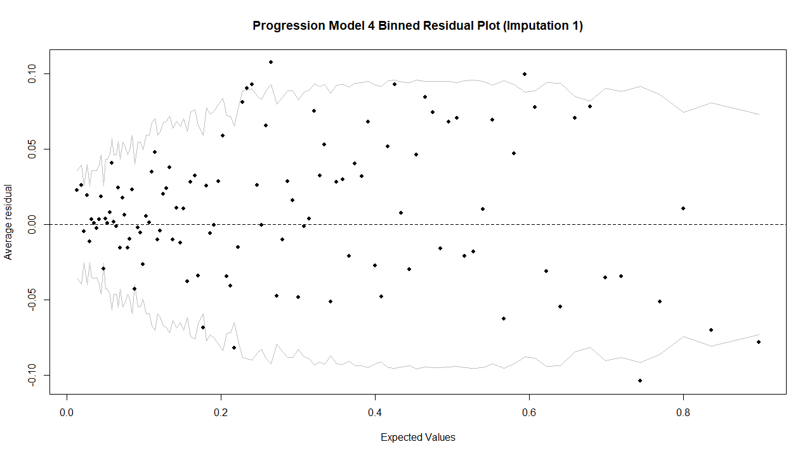
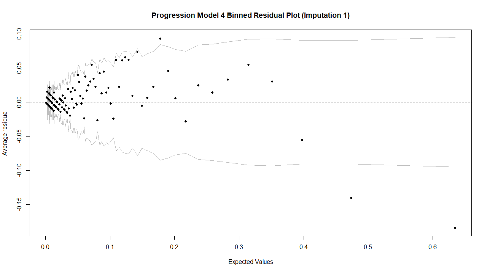

```{r, message=FALSE, include=FALSE}

# Required packages for rendering the document
library(patchwork)
library(kableExtra)

```

```{r, include=FALSE}

# Load the pre-computed objects
# These are all the required figures and tables produced by the code in the appendices
# This approach means code does not need to be executed when rendering the quarto document
load("report_assets.RData")

```

# Abstract

The global prevalence of diabetes has increased substantially in recent decades. Effectively addressing this trend requires a better understanding of the factors associated with the disease. This study examined the independent and potentially stage-specific associations between skeletal muscle mass and glycaemic control in a large, nationally representative US sample.

The analytical sample consisted of 12,178 adults between the ages of 18 and 59 from the 2011-18 cycles of NHANES. Blood glucose was measured using glycated haemoglobin (HbA1c), and skeletal muscle mass was quantified using the appendicular lean mass index (ALMI). After handling missing data with multiple imputation, survey-weighted logistic regression was employed in a dual-model framework by modelling the "Onset" of elevated HbA1c ($\geq$ 5.7%) and "Progression" to clinical diabetes ($\geq$ 6.5%) individually.

Stage-specific associations were found between skeletal muscle mass and glycaemic control after comprehensive adjustment for confounding. Increases in ALMI were not independently associated with the onset of dysglycaemia but were linked to lower odds of the progression to diabetes, with a 1kg/m² increase corresponding to a 21.3% reduction in odds (OR = 0.787, 95% CI \[0.681, 0.907\]). The association with onset became evident only after controlling for central adiposity, whereas the association with progression emerged after accounting for both central and overall adiposity.

In conclusion, the independent protective association of skeletal muscle with diabetes risk appears to be specific to the later stages of glycaemic dysregulation. These findings highlight the importance of comprehensive adjustment for both central and overall adiposity and suggest that the relationship between skeletal muscle mass and glycaemia may vary across different stages of dysregulation.

# Introduction

Epidemiological data indicate a rising prevalence of both type 1 and type 2 diabetes mellitus in recent years. The World Health Organisation states that the number of individuals affected by diabetes rose by 315% from 1990 to 2022 @who_2024. This is a significant public health concern as diabetes is recognised as a leading cause of morbidity and mortality on a global scale @diabetes_world_2023. Prediabetes, an intermediate metabolic state characterised by elevated blood glucose levels below the diagnostic threshold for type 2 diabetes but associated with a substantially increased risk of progression, is also rising in global prevalence. Projections indicate that by 2030, more than 470 million individuals will be classified as prediabetic @prediabetes2_2012. Of these, an estimated 5–10% are expected to progress to type 2 diabetes annually, suggesting that between 23.5 and 47 million or more individuals may develop diabetes by 2030. Understanding the key, modifiable risk factors for these conditions is essential for developing effective prevention strategies.

One of the most commonly known risk factors for diabetes is obesity @fat_2022, frequently identified using measurements such as Body Mass Index (BMI). However, simple metrics such as BMI are often insufficient as they do not distinguish between fat and muscle mass and do not describe the distribution of fat in the body. This is a concern as a more accurate understanding of metabolic risk requires a focus on the interplay between different aspects of body composition such as adiposity and muscle. The distribution of fat is also important, with studies showing that visceral fat, in particular, has a distinct association with diabetes risk compared with overall adiposity @fat_2022.

A specific type of muscle mass has been shown to be protective against the prevalence of diabetes - skeletal muscle @inverse_2011. Skeletal muscle is not simply a tissue used for movement, but is also the body's largest metabolic organ @largest_organ_2013. Physiologically, it is the primary site for postprandial glucose disposal, acting as a metabolic sink and accounting for approximately over 80% of post-meal glucose uptake from the blood @merz_thurmond_2020. Consequently, insulin sensitivity within skeletal muscle is a key determinant of whole-body glucose homeostasis. When this process is impaired, it becomes a primary driver of whole-body insulin resistance.

Given its central role, further investigating the protective effect of skeletal muscle in the context of diabetes is of high clinical importance. This research moves beyond asking *if* skeletal muscle is associated with protection and instead considers *when* this association is most pronounced. By modelling two distinct clinical thresholds, this study explores whether the independent metabolic benefit of skeletal muscle is diabetes stage-specific - that its association with glycaemic control is not uniform over the full glycaemic spectrum.

While the individual roles of adiposity and muscle in glycaemic control across the full range of glycaemia are widely documented, their complex interplay - and particularly the independent stage-specific role of muscle in the face of powerful confounding from fat - is less clear. Understanding these mechanisms will likely lead to clinically relevant knowledge relating to the prevention and treatment of diabetes.

Despite the physiological role of skeletal muscle suggesting a protective association with glycaemic control, there are inconsistencies in the surrounding literature. While several studies have reported that greater muscle mass is linked to a reduced risk of diabetes, others have found no significant association @inverse_2011 @muscle_null_2019. Interestingly, one study even observed that higher levels of lean mass (which includes skeletal muscle) were positively associated with diabetes risk @muscle_bad_2020. These conflicting results may be due to differences in statistical adjustment, particularly a failure to adequately control for the powerful confounding effects of central adiposity, or from modelling the association across the entire glycaemic spectrum as a single, uniform relationship, rather than investigating potential stage-specific differences.

Therefore, we sought to clarify these discrepancies by examining the independent and stage-specific associations of skeletal muscle with glycaemic regulation. Do these associations remain consistent across the entire glycaemic spectrum, or do they vary by stage? The analysis was based on the hypothesis that, given the established physiological role of muscle in glucose disposal, higher muscle mass would be associated with lower blood glucose levels at all stages.

# Methodology {#methodology}

The data is from the National Health and Nutrition Examination Survey (NHANES) @nhanes_2024. Data from the following cycles have been utilised in this analysis: 2011-12, 2013-14, 2015-16, and 2017-18 representing XXXXX participants. As per the NHANES analytic guidelines, the Mobile Examination Centre exam weight was used for all analyses @nhanes_design_2018. Data on glycated haemoglobin (HbA1c), appendicular lean mass (ALM XXXX units XXXXX) ,weight (kg), age (years), gender (male/female), race (XXXXwhat categories XXXXX), body fat percentage (BFP) and waist circumference (WC) , ratio of family income to poverty (PIR), moderate and vigorous work-related and recreational activity in a typical day (MVPA), alcohol status (never drinkers, former drinkers, moderate drinkers, and heavy drinkers), smoking status ("Never Smoker", "Former Smoker", and "Current Smoker") and average daily hours of sleep (hours) XXXXXetc XXXXX were all used in this analysis. Two separate binary classifications of HbA1c were created: \> 5.7% / \<= 5.7% (representing not pre-diabetes/pre-diabetes) and \> 6.5%/ \<= 6.5% (representing no diabetes/diabetes).

Manipulation and harmonisation of the NHANES waves was done using the `nhanesA` package in R.

An index was created by normalising ALM by squared height (AMLI).

A Healthy Eating Index (HEI) (range 0-100) was created from NHANES dietary questions using the R package `heiscore` @usda_2023.

Alcohol status required harmionising different alcohol questions from 2011-2016 and 2017-2018 (XXXXX details at the GitHub XXXXX).

Missing data was handled using a robust multiple imputation strategy (n=30), after which, an iterative modelling journey was conducted to identify the most appropriate statistical models for the goal.

Values above a threshold of 960 minutes for MVPA were assumed to be missing and set to `NA` to be imputed. The choice of this specific threshold was informed by the UK Biobank @uk_biobank_2005.

XXXX

description of models here including the survey methods used

The use of the `survey` R package was key in fitting models that respected the survey design of the NHANES data. Prior to model fitting, the survey design of each of the 30 imputed datasets was specified using `svydesign`. Due to fitting models that respect the survey structure, the survey design object was supplied to the fitting functions rather than the raw datasets.

the initial modelling strategy was to use survey weighted ordinal logistic regression with the R function `svyolr`.

quasi-binomial approach, as this provided a stable, well-fitting model for both outcomes - a result later confirmed by goodness-of-fit testing. The results are therefore presented as odds ratios.

The complex multi-stage probability sampling design employed by NHANES, in particular the clustering of observations within PSUs, leads to a violation of the assumption of independence among observations inherent in standard GLMs. This intra-cluster correlation is known to produce apparent overdispersion, which, if left unaddressed, would result in badly defined standard errors @lumley_2011. The model fitting procedure followed by `svyglm` handles this overdispersion by using a design-based variance estimator (more on this later in this section). The use of "quasi" versions of the model family objects is used to simply avoid warnings in R regarding non-integer responses that occur due to survey weights - not to handle overdispersion, as is common when using unweighted GLMs. This is recommended in the documentation of the `survey` package.

The mathematical definition of the final models is specified as follows:

Let $Y_i$ equal the binary outcome for an individual $i$ where $Y_i = 1$ if the individual has the condition (prediabetes for the Onset outcome and diabetes for the Progression outcome), and $Y_i = 0$ if they do not. Let $\pi_i$ equal the probability that $Y_i = 1$ - the mean. Unlike in standard binomial regression, the model does not assume a binomial likelihood. The mean structure is the same as in an unweighted GLM, while variance for inference is obtained using survey-weighted methods that account for the complex sampling design.

The mean is modelled using a logit link function that ensures that it is of the correct scale - a proportion between 0 and 1. This links the mean to a linear combination of the predictor variables and is defined as follows:

\begin{center}

$logit(\pi_i) = \beta_0 + \beta_1X_{1,i} + \beta_2X_{2,i} + \cdots + \beta_kX_{k,i}$

\end{center}

where $\beta_0$ is the intercept, $\beta_1, \cdots, \beta_k$ are the regression coefficients for the k predictor variables, and $X_{1,i}, \cdots, X_{k,i}$ are the values of the predictor variables for the $ith$ individual.

The coefficients $\beta_1, \cdots, \beta_k$ are estimated using weighted estimating equations as outlined by Thomas Lumley and Alastair Scott in their 2017 article regarding fitting regression models to survey data @lumley_2017.

The variance of the estimated coefficients is computed using Horvitz–Thompson-type standard errors, which is a generalisation of the robust sandwich estimation procedure outlined by Zou in his 2004 article outlining the aforementioned Poisson-based approach for estimating risk ratios in epidemiological studies such as this @zou_2004 @lumley_2017. This is the design-based variance estimator. Unlike in an unweighted quasi-binomial GLM, this approach does not include scaling the variance by an estimated dispersion parameter, while still providing appropriate standard errors, confidence intervals, and p-values under the complex sampling design.

Stepwise regression

The final model for the pre-diabetes outcome was chosen to contain only the confounders that, once added, changed the estimation of the ALMI coefficient by 10% or more @tenperc_2019. For the diabetes outcome, a different modelling strategy was planned, with the aim of providing a comprehensive adjustment for all potential confounders. XXXX Need to explain this here XXXX Details of this approach, along with the justification for why it differed from the Progression outcome, are provided in Section \ref{results}.

Models were fitted to each multiple imputed dataset and results combined using Rubin's rules.

Model fit was assessed using Archer-Lemeshow goodness-of-fit tests. McFadden's Pseudo $\text{R}^2$ values compared the relative explanatory power of nested models. To further assess model validity, visualisations of binned residual plots were used. Outliers were explored using Cook's distance using the R function `svyCooksD`.

Predictions from the final models were calculated and explored across the age range separately for males and females.

K-fold cross-validation was used to assess model performance of the pre-diabetes model.

XXXXX

Predictive accuracy of the models was assessed using unseen data.

### 

##  {#diag}

## Assessment of Predictive Accuracy (Cross-Validation) {#crossval}

The final stage of this analysis was to evaluate the predictive performance of the final parsimonious Progression model using k-fold cross-validation. While the primary objective of this study was explanatory rather than the development of a classification tool, this step provided an important assessment of the model’s generalisability by quantifying its performance on data not used in model fitting.

Due to the computational complexity of running the procedure across all 30 imputed datasets, the cross-validation was conducted on the first imputed dataset as a representative sample. As residual diagnostics confirmed no significant differences between imputations, this is a valid approach.

Although automated R packages for carrying out survey-weighted cross-validation are available, a custom algorithm was used to allow for improved flexibility and specific control of the process. The final validation involved 5-fold cross-validation repeated 10 times to ensure robust results and no dependency on the random allocation of the 5 folds.

This procedure was only carried out using the Progression model outcome for reasons made clear in Section \ref{crossvalresults}.

For each of the 10 repeats, the following stages were carried out for each fold:

1.  The dataset was partitioned into training and testing portions, with 80% allocated for training, and 20% for testing.
2.  A survey design object was created using the training dataset, and was then used to fit a survey weighted logistic regression model using the same model specification as the final parsimonious Progression model.
3.  The model was then used to generate probability predictions for the training data. An optimal classification threshold was determined by calculating a survey weighted Receiver Operating Classification (ROC) curve on the training predictions and selecting the threshold that maximised Youden's J statistic. This method ensures the greatest distance between sensitivity and the false positive rate, resulting in an optimal balance between sensitivity and specificity @youdens_2024.
4.  The model trained in Step 2 and optimal threshold determined in Step 3 were applied to the test data, classifying observations as either diabetic or non-diabetic.
5.  Based on the results, performance metrics were calculated on the test set. The primary metric was the Area Under the Curve (AUC), which quantified the model's ability to distinguish between the two classes on a scale from 0.5 to 1. An AUC of 0.5 means a model has no discriminatory power, whereas an AUC of 1 indicates perfect classification. AUC values of above 0.8 are considered to indicate that a model has clinical utility @auc_2023. Further measures of performance such as sensitivity, specificity, and overall accuracy were also stored. The process of calculating performance metrics required careful consideration of the survey design using functions such as `WeightedAUC` for survey weighted AUCs, `svymean` for calculation of weighted errors, and `svytable` for weighted confusions matrices.

The mean performance metrics from each repeat were averaged to produce the final estimates of the model's predictive performance. To further aid in the understanding of the procedure, the ROC curve from the final iteration of the cross-validation was plotted and labelled with the optimal threshold and AUC.

# Results {#results}

This chapter will present the findings of the analytical processes outlined in the methodology. It will begin by providing a broad summary of the final analytical sample formed by the diligent data processing discussed in Section \ref{vars}, and then present the results of the hierarchical model building procedure that led to the choice of the final models. Inferences of the final models will then be presented, detailing the key findings that they have made possible. Finally, the results of model-based prediction and a thorough assessment of the predictive accuracy of the final parsimonious Progression model are shown.

## Descriptive Statistics of the Analytical Sample

Once the raw data had been fully processed and all missing values had been imputed, the final analytical sample consisted of 12,178 participants between the ages of 18 and 59. The pooled, survey-weighted characteristics of the sample are presented in @tbl-desc.

The mean age of participants in the sample was 39 years (SD = 12.3), indicating a wide age distribution representative of the adult US population. 51.7% of the sample were female. The population was predominantly Non-Hispanic White (61.9%), with the second most populous group being Non-Hispanic Black (12.3%), and the remaining groups each comprising under 10% of the sample.

The mean value of the primary predictor (ALMI) was 8.0 kg/m² (SD = 1.7), and the mean HbA1c was 5.5% (SD = 0.9). The distribution of the outcome variables for the Onset and Progression models showed that 76% of the population were in the normal healthy range of blood glucose levels, leaving 24% in the elevated range ($\geq$ 5.7%). In addition, 94% had HbA1c below the diabetic threshold, meaning 6% were in the range of clinical diabetes ($\geq$ 6.5%).

```{r, echo=FALSE}
#| label: tbl-desc
#| tbl-cap: "Pooled Characteristics of the Final Analytical Sample"
#| tbl-pos: "!h"

descriptive.tbl.kbl
```

\FloatBarrier

Body composition characteristics showed considerable variability, with a mean body fat percentage of 33.5% (SD = 8.7) and a mean waist circumference of 98.7 cm (SD = 17.4). The mean ratio of family income to poverty was 2.9 (SD = 1.7), reflecting a wide spectrum of socio-economic conditions across the sample.

Lifestyle factors also varied substantially. The mean Healthy Eating Index score was 52.6 (SD = 13.5), and the average nightly sleep was 7.2 hours (SD = 1.4). Of particular note, MVPA levels were highly skewed. While the mean was 164.3 minutes per day, the large standard deviation of 196.5 minutes indicates that many participants reported little to no activity, while a smaller number of highly active individuals significantly influenced the average.

The vast majority of the cohort were classified as moderate drinkers, with this group containing 75.8% of the sample. Only 2.2% of participants were heavy drinkers, 10.6% were former drinkers, and 11.5% had never consumed an alcoholic beverage. The significant number of people in the "Former Drinker" category, namely 1291, highlights the importance of handling the sick-quitter bias. In contrast, the majority of individuals had never smoked cigarettes, with the "Never Smoker" category consisting of 60.6% of the population. 19.3% of people were former smokers, leaving 20.2% as current smokers.

## Visualisations of the Analytical Sample

To further enhance the knowledge and understanding of the final analytical sample, the distributions of both the primary predictor (ALMI), the continuous form of the outcome (HbA1c), and the relationship between the can be seen below.

```{r, echo=FALSE}
#| label: fig-almiPlot
#| fig-width: 12
#| fig-cap: "A: Density distribution of Appendicular Lean Mass Index (ALMI) in the final analytical sample. Each blue line corresponds to the distribution of ALMI in each of the 30 imputed datasets. B: Density distribution of Glycated Haemoglobin (HbA1c) in the final analytical sample, also over each imputed dataset."

combined.dens.plot <- musc.dens + gluc.dens + 
  plot_annotation(tag_levels = 'A')

combined.dens.plot
```

@fig-almiPlot shows the distribution of ALMI and HbA1c in each imputed dataset. The ALMI distribution is approximately normal and centred around 8.5 kg/m². There is very little variation in the distributions of different imputations, highlighting the low uncertainty introduced through the imputation process. The HbA1c distribution appears to be uni-modal and highly right-skewed, with the majority of the population clustered around a healthy range (around 5.2%). The very little variation across imputations is also evident here.

```{r, echo=FALSE, message=FALSE}
#| label: fig-almiGlucPlot
#| out-width: "80%"
#| fig-align: "center"
#| fig-cap: "Scatter plot showing the relationship between ALMI and HbA1c in imputation 1 of the final analytical sample, stratified by gender. Points represent individual participants in the first imputed dataset. Solid lines represent the linear model trend line for each gender."

gluc.musc.scat
```

Finally, @fig-almiGlucPlot illustrates the unadjusted relationship between ALMI and HbA1c in the first imputed dataset. The majority of points cluster around 5% HbA1c; however, many outliers exhibit very high HbA1c levels across a range of ALMI values, well above the 6.5% diabetic threshold. These are the cause of the right-skewed density plot of HbA1c in @fig-almiPlot. It is clear that on average, men have a higher ALMI than women, with most of the blue points clustered to the right of the red points. For both men and women, higher ALMI appears to be associated with higher HbA1c. This counter-intuitive observation will later be demonstrated to be an artefact of confounding.

## Hierarchical Model Building and Key Findings

The methodological and hierarchical model-building process, used to understand the influence of various confounding variables and choose robust final models for both the Onset and Progression outcomes, is summarised in @tbl-onsetsum and @tbl-progsum, respectively. These tables track the change in the ALMI coefficient, its odds ratio, and key model diagnostics as logical blocks of, and individual variables were sequentially added, allowing for a comprehensive understanding of why the final models were chosen. Each model is the result of pooling across all 30 imputations as outlined in Section \ref{stepwise}.

```{r, echo=FALSE}
#| label: tbl-onsetsum
#| tbl-cap: "Hierarchical Adjustment of the Association Between ALMI and the Onset of Glycaemic Dysregulation."
#| tbl-pos: "!h"

onset.summary.table.kbl
```

The stepwise model-building of the Onset models summarised in @tbl-onsetsum illustrates how before adjusting for any confounders in the crude model, the odds ratio of ALMI was 1.288 with a 95% CI of \[1.237, 1.341\]. This implies that a 1 kg/m² increase in ALMI is associated with an increase in the odds of having elevated HbA1c by 29%. This result is counter-intuitive and comes as a result of a failure to control for confounding. The inclusion of the demographic variables and body fat percentage resulted in significant fluctuations of the ALMI coefficient, where significant is defined as a change larger than 10%; however, it still remained positive and statistically significant, resulting in an odds ratios larger than 1.

In Model 4, once waist circumference was included, the ALMI coefficient became statistically insignificant, with its 95% CI including 0. The addition of further covariates up to the fully adjusted Model 10 did not change this, with ALMI remaining non-significant throughout. The loss of significance after including waist circumference suggests that the initial positive association may have reflected confounding by central adiposity. The earlier models (prior to Model 4) indicate that participants with higher muscle mass also tended to have other characteristics associated with higher risk, specifically larger waist circumference.

The McFadden Pseudo $R^2$ values can be seen to increase throughout the stepwise process. The addition of the demographic variables resulted in its largest jump from 0.032 to 0.164. The fully adjusted Model 10 had a value of 0.195, meaning that even after comprehensive adjustment of all confounders, it still cannot be thought to have an "excellent" fit, as discussed in Section \ref{diag}. Importantly, the Archer-Lemeshow goodness-of-fit tests were non-significant for all ten models (all p \> 0.05), confirming that each model in the sequence fit the data well.

The "Percentage Change in Coefficient" column demonstrates the sensitivity of the ALMI coefficient to the sequential addition of confounders. While the coefficient's estimate continued to change by more than 10% in subsequent models, this criterion is no longer a meaningful guide for selecting a parsimonious model, as the primary association had been fully attenuated. Since the effect of ALMI became statistically insignificant in Model 4 and remained so thereafter, the 10% rule was not used to select a final model for this outcome.

The primary finding from the Onset modelling process is that ALMI is not significantly associated with glycaemic dysregulation. A final model must show that this result holds with appropriate confounder adjustment; therefore, the fully adjusted Model 10 was chosen in this case. Selecting the fully adjusted model ensures that the null association of ALMI with onset is robust to adjustment for all measured confounders.

```{r, echo=FALSE}
#| label: tbl-progsum
#| tbl-cap: "Hierarchical Adjustment of the Association Between ALMI and the Progression to Diabetes"
#| tbl-pos: "!h"

prog.summary.table.kbl
```

The immediate difference between the results of the Onset and Progression outcomes is that in the Progression setting, seen in @tbl-progsum, the ALMI coefficient is statistically significant for every iteration of the model-building process. This implies that ALMI is associated with the transition to clinical diabetes; therefore, the goal was to select a final model that adjusts for confounding while avoiding unnecessary complexity. This will be done using the 10% rule. The final model can then be used to make a conclusive statement regarding the association of skeletal muscle with the odds of becoming diabetic.

The paradoxical positive association seen in the crude Onset model (Model 1) also translates to the crude Progression model. Here, ALMI is associated with a 38.5% increase in the odds of becoming diabetic, seen from its coefficient of 1.385, with a 95% CI of \[1.312, 1.462\]. As also seen with the Onset models, this counter-intuitive finding persists after adjusting for key demographics and body fat percentage.

Where the Progression models differ from the Onset models comes after the inclusion of waist circumference in Model 4. Where the Onset Model 4 saw the association for ALMI lose statistical significance, the Progression Model 4 results in its dramatic inversion to a statistically significant and protective odds ratio of 0.787, with a 95% CI of \[0.682, 0.907\]. This represents a -163.9% change in the coefficient, providing clear evidence of the strong confounding effect of waist circumference that was masking the true protective association of muscle mass in the simpler models.

As further lifestyle and socio-economic confounders were added in Models 5 through 10, the odds ratio for ALMI remained stable and statistically significant, confirming the robustness of this protective association. After Model 4, the inclusion of further predictors did not change the coefficient for ALMI by more than $\pm$ 6.25%. The final, fully adjusted model (Model 10) yielded an odds ratio of 0.796.

The McFadden's Pseudo $R^2$ values increased in a similar manner as they did throughout the Onset models, with the largest increase being from 0.044 to 0.157 from Model 1 to Model 2. However, from Model 4 onwards, they reached values of above 0.2, indicating an "excellent" fit. The Archer-Lemeshow goodness-of-fit tests were non-significant for all 10 models (p \> 0.05), meaning than every model was well-defined.

The final Progression model from which conclusions can be drawn from is Model 4. This is due to the ALMI coefficient changing by no more than \$\\pm\$ 6.25% after the inclusion of any further covariates, justifying the choice of Model 4 on the basis of parsimony. This model contains only the predictors that this analysis found to be significant confounders of the association of muscle and diabetic status. The odds ratio of ALMI in Model 4 can be used to infer that an increase in ALMI by 1 kg/m² is associated with a 21.3% reduction in the odds of progressing to diabetic levels of blood glucose.

In addition, survey-weighted variance inflation factors (VIFs) and further exploratory modelling provided a clear statistical explanation for the observed coefficient changes. In Model 3 for both outcomes, which did not include waist circumference, all VIF values were below 2.5, demonstrating no significant multicollinearity. However, upon the inclusion of waist circumference in Model 4, the VIF values for the three body composition variables rose sharply, confirming a high degree of multicollinearity (VIFs of 4.4, 6.8, and 7.0 for the Onset model; 5.9, 7.1, and 9.8 for the Progression model).

This multicollinearity had different consequences for each outcome. For the Onset outcome, the null association of ALMI was revealed as soon as waist circumference was added regardless of whether body fat percentage was included, suggesting that central adiposity is the primary confounder of the initial paradoxical association.

In contrast, for the Progression outcome, a more complex suppressor effect was evident. The protective effect of ALMI only became significant when both waist circumference *and* body fat percentage were included in the model, simultaneously. This underscores the critical importance of a comprehensive, two-component body composition adjustment to correctly specify the relationship between muscle mass and the progression to clinical diabetes.

It is also noteworthy that of the covariates included, body fat percentage and waist circumference were strong and statistically significant predictors across both the Onset and Progression models.

The forest plot seen in @fig-almiCoeffPlot concisely visualises the key stage-specific findings by plotting the ALMI odds ratio and 95% confidence intervals estimated by Onset Model 10 and Progression Model 4.

```{r, echo=FALSE}
#| label: fig-almiCoeffPlot
#| out-width: "80%"
#| fig-align: "center"
#| fig-cap: "Stage-specific associations of skeletal muscle, proxied by ALMI, with glycaemic control. The plot displays the odds ratio of ALMI estimated by the final Onset and Progression models (10 and 4, respectively), along with their 95% confidence intervals. The dashed red line at 1.0 represents the null association."

almi_forest_plot
```

The interception of the Onset model line with the dashed red line represents the inclusion of an odds ratio of 1 in the 95% confidence interval. This shows how there is not sufficient evidence to reject the null hypothesis that there is no association between skeletal muscle with the raising of blood glucose levels beyond the normal range.

Conversely, the Progression model line can be seen to the left of the red line, demonstrating the statistically significant protective association of skeletal muscle against the progression to diabetes.

The X-axis in @fig-almiCoeffPlot uses a logarithmic scale. This allows for the odds ratios to be appropriately represented. A standard linear scale would misrepresent the symmetrical aspect of the confidence intervals and multiplicative scaling of the odds ratios.

## Final Model Validation and Robustness Checks

Residual diagnostics and influential point analyses are included to confirm the validity of the final models and ensure the robustness of their findings. All of the binned residual plots referenced in this section can be seen in \ref{residplots}.

The binned residual plot in @fig-onsetResids show no significant patterns, with the majority of the residuals falling within the grey $\pm 2$ standard error boundaries. This indicates that the final Onset model was well-calibrated. In addition, there were no clear differences between the residuals of each imputation, meaning that the imputation strategy was robust.

The component-wise binned residual plots for Onset Model 10 in @fig-onsetVarResids evidence that the assumptions of linear covariates in the model were justified. There are no clear curves in the residuals that would suggest higher order terms of covariates would provide significant advantages. The pattern of large residuals in the physical activity plot is likely a product of data sparsity at the extreme end of the distribution, and is not a cause for concern. Furthermore, there is fanning of the residuals, particularly in the plot for age; however, this is also not a concern, as the design-based standard error estimation employed by `svyglm` appropriately handles the potential overdispersion that these plots highlight. Only imputation 1 was used for these plots due to the previously discussed strong evidence of stability across imputations.

In contrast, the residuals for the final Progression model, seen in @fig-progResids, seem to show a systematic pattern. For very low expected probability of progression to diabetes, there does not appear to be a clear pattern; however, the model seems to systematically underestimate the probability for individuals of low-to-moderate risk and overestimate it for those at very high risk. This provides evidence that the model may be miscalibrated, and that its use for specific probability estimation is not advised. The implications of this finding for the model's explanatory power will be addressed in the Section \ref{discuss}. Despite this, the residuals stay mostly within the grey $\pm 2$ standard error boundaries, although this does not alleviate the calibration concerns. Similarly to the onset model, the residuals remain consistent across imputations, providing further evidence that the imputation process was robust.

Finally, the component-wise binned residual plots for Progression Model 4 in @fig-progVarResids suggest that the assumption of linear covariates is valid, with no systematic patterns visible in any plot. As was the case for the Onset component wise residual plots, these were formed using only imputation 1 due to the consistency over imputations.

In addition to residual diagnostics, the influential points analysis are as follows: Both Onset Model 10 and Progression Model 4 were refit using reduced datasets that did not contain the observations that were in the top 1% of Cook's Distance of their original fits. The ALMI coefficient was still statistically insignificant in Onset Model 10, and in Progression Model 4, it was statistically significant and equal to -0.235, corresponding to an odds ratio of 0.79. This meant that the finding of both models are robust and are not driven by extreme outliers in the data.

## Visualising the Association between ALMI and Diabetes {#visuals}

To visualise the shape and magnitude of the association of skeletal muscle mass and diabetes, Progression Model 4 was used to generate probability predictions of becoming diabetic for a range of ALMI values, while holding age, race, and body composition constant at their average across all imputations. This was done for both males and females, as discussed in \ref{modpreds}. The results of the model predictions are seen in @fig-predPlot.

```{r, echo=FALSE}
#| label: fig-predPlot
#| out-width: "80%"
#| fig-align: "center"
#| fig-cap: "Predicted probability of diabetes across the range of Appendicular Lean Mass Index (ALMI), stratified by gender. Predictions are generated from Progression Model 4, holding all other covariates constant at their mean or mode. Solid lines represent the pooled mean prediction, and the shaded areas represent the corresponding 95% confidence intervals."

pred.plot
```

This diagram clearly illustrates the strong protective association between skeletal muscle against the likelihood of becoming diabetic, with higher values of ALMI corresponding to lower predicted probabilities. The trend for both men and women is non-linear, with both curves demonstrating a shape similar to exponential decay. Women appear to have a higher probability of diabetes for all amounts of skeletal muscle, with the red mean prediction line always above the blue. However, for ALMI below approximately 5 kg/m² and above 10 kg/m², there is overlap of the confidence intervals between both genders, implying the probability differences between genders is less certain here. The red curve being steeper than the blue also suggests that the protective effects of skeletal muscle are perhaps stronger in women.

The predicted probability at the lowest level of ALMI present in the data (2.1 kg/m²) was 0.1 for females and 0.04 for males; however, predictions made at lower levels of ALMI carry a high degree of uncertainty, highlighted by the large confidence intervals at these levels. This uncertainty is likely due to the lack of data in this range of ALMI. There were only 5 individuals with ALMI below 5 kg/m² in the first imputed dataset. This is assumed to not be significantly different across all other imputations.

Conversely, for ALMI above around 5 kg/m², the confidence intervals are much narrower, meaning predictions here are much more precise. Across all imputed datasets, the mean value of ALMI for females was 7.2 kg/m², and was 9.0 kg/m² for men. The predicted probability of becoming diabetic for females at their mean ALMI was 0.03, and for men it was 0.007.

While the data was also sparse for large ALMI (only 9 individuals had more than 15 kg/m²), the confidence intervals in this range maintain their restricted width. This is due to a mathematical property of probability. As the model's predicted probability of diabetes approaches its absolute floor of zero, the potential for variance is naturally compressed. Therefore, the confidence interval is forced to be narrow, as the lower bound is anchored near zero, and the upper bound is unable to significantly vary due to the already low point estimate.

## Cross-Validation Performance {#crossvalresults}

This final subsection of the results will evaluate the findings of the cross-validation approach outlined in Section \ref{crossval} to determine Progression Model 4's generalisability and clinical usability for classification. This process was not carried out for Onset Model 10 due to the insignificance of ALMI in the model. These findings are summarised in @tbl-cvtable.

```{r, echo=FALSE}
#| label: tbl-cvtable
#| tbl-cap: "Results of Survey Weighted 5-fold Cross-Validation Repeated 10 Times"
#| tbl-pos: "!h"

cv_summary_tbl_kbl
```

Specifically, the table contains the mean of the mean performance metrics over each of the 10 repeats, as a way to concisely summarise the overall performance of the model. The most important statistic, the mean weighted AUC of 0.845, suggests that the model has high discriminatory power.

The mean optimal threshold of 0.055, although not a measure of model performance, is useful to be aware of. This means that on average, an observation was classified as diabetic if they were predicted a probability of either 0.055 or higher of being so. This threshold provided the optimal balance between sensitivity and specificity, resulting in the respective means of 81.39% and 72.55%. The mean overall weighted accuracy was 73.07%.

To aid in the interpretation of the results, the ROC curve in @fig-rocPlot provides a visual representation of the model's discriminatory ability.

```{r, echo=FALSE}
#| label: fig-rocPlot
#| out-width: "80%"
#| fig-align: "center"
#| fig-cap: "Receiver Operating Characteristic (ROC) curve from the final iteration of the cross-validation for Progression Model 4. The orange diamond highlights the optimal threshold selected by maximising Youden's J statistic. The Area Under the Curve (AUC) of 0.848 indicates high discriminatory power."

roc_plot
```

The steep initial climb in the ROC curve represents how a high sensitivity is achieved with minimal sacrifice to specificity. The curve sits substantially higher than the grey dotted diagonal, indicating the model's significantly better discriminatory ability than random assignment. The optimal classification threshold found my maximising Youden's J statistic can be seen marked with the orange diamond.

# Discussion {#discuss}

## Summary of Principal Findings

This study, based on the analysis of a large, nationally representative US sample from NHANES, yielded two key findings. The first was that the association between skeletal muscle and glycaemic control appears to be stage-specific. After comprehensive adjustment for confounding, higher skeletal muscle mass was significantly linked to lower odds of progression to clinical diabetes. In other words, among individuals with blood glucose levels in the healthy or prediabetic ranges, greater muscle mass corresponded with reduced odds of developing diabetes. However, no meaningful link was observed between skeletal muscle and the initial onset of dysglycaemia, indicating that higher muscle mass does not relate to a lower likelihood of moving beyond normal glucose levels.

The second key finding was methodological, highlighting a complex interplay between body composition variables that shapes the observed relationships between skeletal muscle and glycaemic regulation. For the onset of dysglycaemia, the initial counter-intuitive positive association between muscle mass and HbA1c was largely attributable to confounding by central adiposity (waist circumference). Once this was accounted for, the underlying null association became evident. Conversely, the apparent protective link between muscle mass and progression to clinical diabetes was revealed only after controlling for both central *and* overall adiposity (body fat percentage).

## Interpretation of Findings in the Context of Existing Literature

The critical stage-specific characteristic of these findings allows for more nuanced inferences into the underlying processes that are associated with poor glycaemic control and the incidence of diabetes. The absence of an independent association between skeletal muscle and the onset of elevated HbA1c indicates that, during the early stages of glycaemic dysregulation, excess adiposity, particularly central adiposity and visceral fat, may play a more dominant role in the observed patterns. This interpretation can be made due to the inference of the coefficients of body fat percentage and waist circumference themselves in the models. In simpler models that did not include waist circumference, the body fat percentage coefficient was positive, indicating that higher levels of overall adiposity were, as expected, associated with higher odds of glycaemic dysregulation. However, upon the inclusion of waist circumference in Models 4 and upwards, its coefficient became negative, implying a protective association.

Although this may seem counter-intuitive, it highlights a nuanced statistical pattern: for individuals with equal visceral fat, a higher overall body fat percentage reflects more subcutaneous rather than central fat. Subcutaneous fat is associated with lower risk of poor glycaemic control than visceral fat. This pattern was observed for both onset and progression outcomes, with visceral fat (waist circumference) showing stronger associations with risk than subcutaneous fat or skeletal muscle during the onset of dysregulation.

The finding of the null association found between skeletal muscle and the onset of dysglycaemia appears to be a novel one. While numerous studies have found a general protective association between muscle mass and glycaemic control, the literature is inconsistent regarding this initial stage, with some studies reporting a risk association and others a protective one. It is plausible that these conflicting results are a direct consequence of the powerful confounding effect of central adiposity, which this analysis was able to isolate and control for, thereby revealing the true null association for skeletal muscle.

These stage-specific results are consistent with extensive literature identifying visceral adiposity as a powerful, independent determinant of insulin resistance and dysglycaemia. Findings from large imaging-based cohort studies, such as the Framingham Heart Study, suggest that independent of total body fat, visceral adipose tissue (VAT) is more strongly associated to insulin resistance and diabetes than subcutaneous adipose tissue (SAT) @vat_2007. The inversion of the coefficient of body fat percentage in this analysis provides statistical evidence directly supporting these findings.

In direct contrast, the significant protective association of skeletal muscle against the progression to clinical diabetes implies that for individuals with already elevated blood sugar in the prediabetic range, the ability for skeletal muscle to act as metabolic sink for glucose disposal becomes crucial, regardless of the remaining strong association of visceral fat mass and risk. Higher degrees of muscle mass provide a greater capacity to clear glucose from the bloodstream, which may aid in preventing the pancreatic beta-cell dysfunction that leads to the final transition to type 2 diabetes @beta_2024.

This finding provides population-level evidence that supports the mechanisms observed in clinical intervention studies. For example, a randomised controlled trial conducted by Luo, X., Wang, Z., Li, B. et al in 2023, found that in a prediabetic cohort, individuals that conducted resistance training (which directly increases muscle mass) over a period of 12 weeks saw significant improvements in glycaemic control and insulin resistance @intervention_2023. Furthermore, another group of participants carried out aerobic exercise regiments for the 12 weeks. It was found that aerobic exercise led to decreases in blood glucose levels as a result of weight loss; whereas, the effect of resistance training aided in glycaemic control through other pathways, and was even found to have a stronger protective effect than weight loss.

## Strengths and Limitations

To provide a thorough evaluation of these findings, it is important to highlight both the key strengths and potential limitations of the analysis. Key aspects of the data and methodological rigour supported the quality of the results. The large, survey-weighted NHANES sample provides nationally representative estimates, increasing reliability and generalisability. Additionally, body composition was measured using dual-energy X-ray absorptiometry (DXA), which offers greater accuracy and objectivity than alternative methods such as BIA @dxa_2020 @dxa_2022.

In addition to features of the NHANES sample itself, the sophisticated analytical processes used to leverage it were key. Surrounding literature was utilised to inform the choice of the appropriate outcome, predictor, and confounding variables, some of which underwent meticulous harmonisation due to changes in the NHANES survey structure across each cycle. This meant that each variable included in the modelling procedure was meaningful and contributed to the goal of finding final, well-defined models for each outcome variable.

Further data processing, such as the handling of structural missingness as a result of survey skip patterns, was paramount. This made certain that no data was assumed missing when it was not, greatly improving the integrity of the sample. Following the completion of the final analytical sample, the robust multiple imputation strategy was a key strength. This ensured that the advantages of the large sample size were not lost due to the loss of a small proportion of data. Using physiologically informed bounds also guaranteed that all imputed data was realistic, further improving data integrity.

The iterative modelling journey allowed for an intricate sensitivity analysis that resulted in the choice of the final models based on the significance of the primary predictor variable (ALMI), and how its coefficient changed when each confounding variable was included. Each model underwent goodness-of-fit diagnostics using the Archer-Lemeshow goodness-of-fit test for survey-weighted models to ensure they were well-defined, and their McFadden's Pseudo R² was also calculated to heuristically represent their respective explanatory power. In addition to these general diagnostics, further residual checks and influential point analyses were conducted on the final Onset and Progression models to provide added nuance into the quality of their fits.

The use of survey-weighted logistic regression models proved effective in isolating the stage-specific role of skeletal muscle both at the onset of dysglycaemia and during progression to clinical diabetes. In particular, the final Progression model yielded a clear odds ratio that directly quantified the protective association of greater muscle mass against diabetes incidence. The methodological progression - from ordinal regression, to quasi-Poisson binary classification, and finally to quasi-binomial logistic regression - reflected both statistical rigour and close attention to the structure of the data.

Extending the analysis beyond simple coefficient inference was a key strength. By using the final model to generate predictions of diabetes prevalence, the abstract statistical findings were translated into a clear, visual representation of the dose-response relationship between muscle mass and diabetes risk. This step quantifies the real-world magnitude of the protective association, making the findings more accessible and clinically relevant. The visualisation of the ALMI coefficient in Onset Model 10 and Progression Model 4 further improved the interpretability of the findings.

Furthermore, the rigorous k-fold cross-validation provided a formal assessment of the generalisability of Progression Model 4. This process confirmed the model's high discriminatory power (AUC = 0.844) on unseen data, demonstrating that its findings are robust and not simply an artefact of overfitting the training sample. Together, these steps enhance the trustworthiness of the study's conclusions.

Despite these strengths, it is crucial to interpret the findings of this analysis in the context of its potential limitations. The most significant of these is perhaps the cross-sectional nature of the NHANES data. Each data point corresponds to a separate individual at a specific point in time. A consequence of this data structure is that, while it is well-suited for identifying statistical associations, it does not allow these inferences to be extended to causal conclusions. Therefore, while this study demonstrates a strong protective association between muscle mass and the progression to diabetes, it cannot establish that increased muscle directly reduces risk.

Another limitation is the potential miscalibration of the final Progression model, as indicated by residual diagnostics. The binned residual plot suggested a mild tendency for the model to under-predict diabetes risk at lower predicted probabilities and over-predict at higher predicted probabilities. Consequently, the absolute predicted probabilities presented in Section \ref{visuals} should be interpreted with caution, although the overall shape of the prediction curves is likely reliable.

Importantly, while this calibration issue warrants caution for predictive applications, it is unlikely to invalidate the model's use for explanatory inference. The distinction between predictive calibration and explanatory inference is crucial: while the model may not be perfectly calibrated for prediction, the odds ratios can remain largely reliable estimates of the direction and strength of association. Component-wise residual diagnostics indicated no need for higher-order covariates, and cross-validated AUC values (\>0.8) demonstrate excellent discrimination. Therefore, the central conclusions regarding stage-specific, independent associations remain well-supported by the data despite the mild calibration issue.

Other potential limitations include the potential for residual confounding despite the comprehensive adjustments made in the stepwise model building process. There likely exists other confounding variables that if included, may improve the models and make their findings even more robust. Examples of such may include unmeasured factors such as genetics or specific dietary patterns. The inclusion of further variables, or interactions between current ones, may improve the calibration issues seen from the residuals.

Furthermore, many of the included lifestyle variables such as MVPA, alcohol consumption, and smoking habits are based on self-report, which is subject to recall bias. Unfortunately, this is unavoidable when including such variables; however, it is worth acknowledging. Another unavoidable limitation of using survey data is the inconsistency in questionnaire structure across survey cycles. Some of these inconsistencies were effectively addressed, as described in Section \ref{process}; however, some remained. For example, lifetime drinking status in the 2011–2016 cycles was assumed to be defined by whether an individual had consumed at least 12 alcoholic drinks in their lifetime, since no question asked about ever having a single drink, unlike in the 2017–2018 cycle. Additionally, the frequency of alcohol consumption in the 2017–2018 cycle was converted from a categorical to a continuous variable to align with the already continuous measure from the 2011–2016 cycles, which inevitably introduced some error due to the assumptions required.

## Implications and Future Directions

The implications of this research in the realm of public health are notable. The specific nuances involved in the mechanisms associated with the onset of dysglycaemia and progression to diabetes imply that a "one-size-fits-all" approach may be too simplistic.

In the early stages of increasing blood sugar, central adiposity possessed the primary independent association with increased risk, with this association also extending to the progression to diabetic HbA1c. Therefore, public health bodies should continue to emphasise the importance of improving diet and increasing general exercise, both of which contribute to reducing visceral fat storages. However, for individuals already categorised as pre-diabetic, added emphasis should be placed upon encouraging resistance training to maintain and/or increase muscle mass, due to this analysis showing that higher levels of skeletal muscle are associated with a reduction in the odds of progression to diabetes from a pre-diabetic state.

From the lens of conducting further research on this topic, the results of this study highlight the importance of comprehensive body composition assessment. The inclusion of muscle mass, central fat, and overall fat in the statistical models is crucial to minimise the risk of obscuring or misinterpreting the true independent associations of each component.

Future studies should extend the findings in this paper by investigating causality. The primary limitation of this study was the cross-sectional design of the data. Exploration of the documented associations in a longitudinal cohort study would have great clinical utility, and would provide stronger evidence that having greater muscle mass precedes a reduction in the risk of progressing from pre-diabetes to diabetes.

Furthermore, if researchers seek to adapt Progression Model 4 as a clinical tool for risk stratification, due to potential calibration issue highlighted by its binned residual plot, recalibration techniques such as logistic recalibration or isotonic regression could be applied post-estimation to improve the accuracy of absolute risk predictions. Additionally, although component-wise residual diagnostics suggested that higher order covariates were not required, it may prove beneficial to explore more flexible modelling of the continuous predictors by using methods such as splines, as this may reduce subtle miscalibration.

It would also be advantageous to explore how the findings evolve with the inclusion of additional, more detailed potential confounding variables - such as muscle quality in addition to muscle quantity, or genetic risk scores for diabetes - to examine potential interactions with body composition. Specific covariate interaction terms could also be included, as these may further improve the models.

# Conclusion

This dissertation sought to discover the independent and stage-specific role of skeletal muscle in glycaemic control. After a comprehensive analysis, it can be concluded that this role is indeed stage-specific. Higher skeletal muscle mass has a protective association against the progression to clinical diabetes. Specifically, it was found that a 1kg/m² increase in appendicular lean mass index was associated with approximately a 21.2% reduction in the odds of becoming diabetic. Conversely, it had no independent association with the initial onset of glycaemic dysregulation.

The research began with the preliminary hypothesis that increases in skeletal muscle would be protective across all stages of glycaemic control. However, the initial results were unexpectedly illogical, suggesting that muscle mass possessed a harmful association across all stages. This prompted a more detailed investigation, which ultimately uncovered the true, nuanced, stage-specific relationship. When modelling for the onset of dysglycaemia, the inclusion of waist circumference as a confounding variable, and proxy for central adiposity, revealed the true null association of muscle mass. In contrast, when modelling the progression to diabetes, a two-component adjustment for both central adiposity and overall adiposity, proxied by body fat percentage, uncovered the aforementioned protective association. A comprehensive sensitivity analysis including adjustment for confounding variables of demographics and lifestyle factors as well as body composition, confirmed that the findings were robust and statistically valid. This process highlighted that the true nature of the associations are more intricate than initially hypothesised.

Several recommendations for future research can be made on the basis of these findings. To extend the association results to inferences of causality, the analysis of longitudinal data is highly important. This would instill further confidence that skeletal muscle and glycaemic control are not spuriously correlated. All future modelling approaches should be sure to control for both central and overall adiposity so that their complex confounding relationship can be handled appropriately and results are not obscured. Furthermore, the addition of potential confounding variables not included in this analysis would allow for added insights into the underlying mechanisms, possibly leading to significant coefficient changes and more sophisticated models. The inclusion of higher orders of the included continuous covariates, or interaction terms, may also add statistically significant nuance to the findings. Finally, if the prediction of direct risk probabilities using the Progression models outlined in this analysis is relevant, recalibration techniques should be employed to improve their accuracy due to residual diagnostics suggesting slight miscalibration for this purpose, although their use for explanatory inference remains valid.

This dissertation makes two key contributions to the fields of metabolic epidemiology and data science in health research. Clinically, it provides novel population-level evidence that the role of skeletal muscle in the control and regulation of blood glucose levels is stage-specific, quantifying this role at each stage. Methodologically, it highlights the critical importance of comprehensively adjusting for body composition in the statistical models, and that failure to do so may lead to misinterpretation of the true, independent role of skeletal muscle.

# Appendices

The following appendices contain all the R code needed to reproduce the results of this research paper. Due to inherent randomness in some of the included procedures, rerunning this code may yield marginally different numerical outputs to those outlined in this report. These differences *do not* affect the interpretation or conclusions drawn in this work.

## Appendix A: Loading packages

\scriptsize

```{r, eval=FALSE}
# ------------------------------------------ #
# Loading required packages for the analysis
# ------------------------------------------ #

library(nhanesA) # For NHANES data
library(survey) # For incorporation of survey design elements
library(systemfonts) # For fonts
library(showtext) # Also for fonts
library(Amelia) # For multiple imputation
library(parallel) # For parallel processing
library(mice) # For more imputation tools
library(mitools) # For even MORE imputation tools
library(svydiags) # For survey model diagnostics
library(poliscidata) # For fit.svyglm function
library(tidyverse) # For tidyverse functions
library(heiscore) # For HEI scores
library(car) # For useful analysis tools
library(svydiags) # For diagnostics of svyglms
library(miceadds) # For micombine.F
library(kableExtra) # For tables
library(arm) # For binned residual plots
library(gridExtra) # For presentation of visualisations
library(WeightedROC) # For survey weighted ROC and AUC calculations 
```

## Appendix B: Loading NHANES data {#nhanes}

```{r, eval=FALSE}
# -------------------------------------- #
# Loading the necessary data from NHANES
# -------------------------------------- #

# 2011-12

# Demographics
demo1112 <- nhanes("DEMO_G")
# Body Measures (for height measurements to calculate ALMI)
body1112 <- nhanes("BMX_G")
# Glycohemoglobin (HbA1c)
HbA1c1112 <- nhanes("GHB_G")
# DXA data (for appendicular lean mass)
dexa1112 <- nhanes("DXX_G")
# Physical Activity
phys1112 <- nhanes("PAQ_G")
# Alcohol consumption
alcohol1112 <- nhanes("ALQ_G")
# Cigarette smoking data
smoking1112 <- nhanes("SMQ_G")
# Healthy Eating Score
hei1112 <- score(method = "simple", years = "1112", component = "total score")
# Sleep data
sleep1112 <- nhanes("SLQ_G")

# 2013-14

demo1314 <- nhanes("DEMO_H")
body1314 <- nhanes("BMX_H")
HbA1c1314 <- nhanes("GHB_H")
dexa1314 <- nhanes("DXX_H")
phys1314 <- nhanes("PAQ_H")
alcohol1314 <- nhanes("ALQ_H")
smoking1314 <- nhanes("SMQ_H")
hei1314 <- score(method = "simple", years = "1314", component = "total score")
sleep1314 <- nhanes("SLQ_H")

# 2015-16

demo1516 <- nhanes("DEMO_I")
body1516 <- nhanes("BMX_I")
HbA1c1516 <- nhanes("GHB_I")
dexa1516 <- nhanes("DXX_I")
phys1516 <- nhanes("PAQ_I")
alcohol1516 <- nhanes("ALQ_I")
smoking1516 <- nhanes("SMQ_I")
hei1516 <- score(method = "simple", years = "1516", component = "total score")
sleep1516 <- nhanes("SLQ_I")

# 2017-18

# Demographics
demo1718 <- nhanes("DEMO_J")
body1718 <- nhanes("BMX_J")
HbA1c1718 <- nhanes("GHB_J")
dexa1718 <- nhanes("DXX_J")
phys1718 <- nhanes("PAQ_J")
alcohol1718 <- nhanes("ALQ_J")
smoking1718 <- nhanes("SMQ_J")
hei1718 <- score(method = "simple", years = "1718", component = "total score")
sleep1718 <- nhanes("SLQ_J")
```

## Appendix C: Data processing {#procCode}

```{r, eval=FALSE}
# ----------------------------------------------------------------------------------------------- #
# Combining the various survey cycles and carrying feature engineering and variable harmonisation
# ----------------------------------------------------------------------------------------------- #

# Helper function for inner join of multiple datasets
multi_inner_join <- function(dfs) {
  reduce(dfs, ~inner_join(.x, .y, by = "SEQN"))
}

# Create lists of datasets for each time period
dfs1112 <- list(demo1112, body1112, HbA1c1112, dexa1112, phys1112, alcohol1112,
                smoking1112, hei1112, sleep1112)

dfs1314 <- list(demo1314, body1314, HbA1c1314, dexa1314, phys1314, alcohol1314,
                smoking1314, hei1314, sleep1314)

dfs1516 <- list(demo1516, body1516, HbA1c1516, dexa1516, phys1516, alcohol1516,
                smoking1516, hei1516, sleep1516)

dfs1718 <- list(demo1718, body1718, HbA1c1718, dexa1718, phys1718, alcohol1718,
                smoking1718, hei1718, sleep1718)

# Applying function and adding variable denoting time period to aid with variable harmonisation
xsec.data1112 <- multi_inner_join(dfs1112) %>%
  mutate(SurveyCycle = "2011-2012")
xsec.data1314 <- multi_inner_join(dfs1314) %>%
  mutate(SurveyCycle = "2013-2014")
xsec.data1516 <- multi_inner_join(dfs1516) %>%
  mutate(SurveyCycle = "2015-2016")
xsec.data1718 <- multi_inner_join(dfs1718) %>%
  mutate(SurveyCycle = "2017-2018")

# Array of variables needed from each time period
vars1112 <- c(
  "SEQN", "SDMVPSU", "SDMVSTRA", "WTMEC2YR", "RIAGENDR", "RIDAGEYR", "RIDRETH3", "INDFMPIR",  # Survey structure and
  # demographics
  "BMXHT", "BMXWAIST",  # Body measures
  "LBXGH",  # HbA1c
  "DXDRALE", "DXDLALE", "DXDRLLE", "DXDLLLE", "DXDTOPF",  # Lean mass in the limbs excl. bone mass
  "PAQ665", "PAD675", "PAQ650", "PAD660",  # Physical activity
  "ALQ120Q", "ALQ130", "ALQ101", "ALQ110",  # Alcohol consumption
  "SMQ040", "SMQ020",  # Smoking habits
  "score",  # Healthy Eating Index score
  "SLD010H",  # Sleep 
  "SurveyCycle"  # Marker for survey years
)

vars1314 <- c(
  "SEQN", "SDMVPSU", "SDMVSTRA", "WTMEC2YR", "RIAGENDR", "RIDAGEYR", "RIDRETH3", "INDFMPIR",
  "BMXHT", "BMXWAIST",
  "LBXGH",
  "DXDRALE", "DXDLALE", "DXDRLLE", "DXDLLLE", "DXDTOPF",
  "PAQ665", "PAD675", "PAQ650", "PAD660",
  "ALQ120Q", "ALQ130", "ALQ101", "ALQ110",
  "SMQ040", "SMQ020",
  "score",
  "SLD010H",
  "SurveyCycle"
)

vars1516 <- c(
  "SEQN", "SDMVPSU", "SDMVSTRA", "WTMEC2YR", "RIAGENDR", "RIDAGEYR", "RIDRETH3", "INDFMPIR",
  "BMXHT", "BMXWAIST",
  "LBXGH",
  "DXDRALE", "DXDLALE", "DXDRLLE", "DXDLLLE", "DXDTOPF",
  "PAQ665", "PAD675", "PAQ650", "PAD660",
  "ALQ120Q", "ALQ130", "ALQ101", "ALQ110",
  "SMQ040", "SMQ020",
  "score",
  "SLD012",
  "SurveyCycle"
)

vars1718 <- c(
  "SEQN", "SDMVPSU", "SDMVSTRA", "WTMEC2YR", "RIAGENDR", "RIDAGEYR", "RIDRETH3", "INDFMPIR",
  "BMXHT", "BMXWAIST",
  "LBXGH",
  "DXDRALE", "DXDLALE", "DXDRLLE", "DXDLLLE", "DXDTOPF",
  "PAQ665", "PAD675", "PAQ650", "PAD660",
  "ALQ121", "ALQ130", "ALQ111",
  "SMQ040", "SMQ020",
  "score",
  "SLD012", "SLD013",
  "SurveyCycle"
)

# Extracting variables for each time period
imputation_vars1112 <- xsec.data1112 %>% select(all_of(vars1112))
imputation_vars1314 <- xsec.data1314 %>% select(all_of(vars1314))
imputation_vars1516 <- xsec.data1516 %>% select(all_of(vars1516))
imputation_vars1718 <- xsec.data1718 %>% select(all_of(vars1718))

# Combining
imputation_vars_full <- bind_rows(
  imputation_vars1112,
  imputation_vars1314,
  imputation_vars1516,
  imputation_vars1718
)

# Need to set PAD675 to 0 where PAQ665 is "No" AND set PAD660 to 0 where PAQ650 is "No".
# Also need to set PAD675 and PAD660 to NA whenever they are 9999 

# Proportion missing of minutes of moderate and vigorous physical activity
sum(is.na(imputation_vars_full$PAD660))/nrow(imputation_vars_full) # 69% missing
sum(is.na(imputation_vars_full$PAD675))/nrow(imputation_vars_full) # 56% missing

imputation_vars_full <- imputation_vars_full %>%
  mutate(
    # For Vigorous Activity (PAD660)
    # If PAQ650 is 2 ('No') AND PAD660 is currently NA, change it to 0.
    # Otherwise, leave it as it is.
    PAD660 = ifelse(PAQ650 == "No" & is.na(PAD660), 0, PAD660),
    
    # Assigning NA for "Don't know" code
    PAD660 = ifelse(PAD660 == 9999, NA_real_, PAD660),
    
    # For Moderate Activity (PAD675)
    # If PAQ665 is 2 ('No') AND PAD675 is currently NA, change it to 0.
    # Otherwise, leave it as it is.
    PAD675 = ifelse(PAQ665 == "No" & is.na(PAD675), 0, PAD675),
    
    # Assigning NA for "Don't know" code 
    PAD675 = ifelse(PAD675 == 9999, NA_real_, PAD675)
  ) %>%
  select(-c(PAQ665, PAQ650))

# Proportion missing of minutes of moderate and vigorous physical activity after replacement
sum(is.na(imputation_vars_full$PAD660))/nrow(imputation_vars_full) # 0.04% missing
sum(is.na(imputation_vars_full$PAD675))/nrow(imputation_vars_full) # 0.09% missing

# ---- Cleaning alcohol variables and managing sick quitter effect ---- #

imputation_vars_full.2 <- imputation_vars_full %>%
  
  # --- Step 1: Harmonise the two different frequency variables into one ---
  mutate(
    Drinking_Days_Per_Year = case_when(
      
      # For older cycles, use the direct numeric value from ALQ120Q
      SurveyCycle %in% c("2011-2012", "2013-2014", "2015-2016") & ALQ120Q %in% c(777, 999) ~ NA_real_,
      SurveyCycle %in% c("2011-2012", "2013-2014", "2015-2016") ~ ALQ120Q,
      
      # For the 2017-2018 cycle, convert the categories from ALQ121
      SurveyCycle == "2017-2018" ~ case_when(
        ALQ121 %in% c(77, 99) ~ NA_real_,
        ALQ121 == "Never in the last year" ~ 0,      # Never
        ALQ121 == "Every day" ~ 365,    # Every day
        ALQ121 == "Nearly every day" ~ 312,    # Nearly every day (~6/wk)
        ALQ121 == "3 to 4 times a week" ~ 182,    # 3-4 times a week (~3.5/wk)
        ALQ121 == "2 times a week" ~ 104,    # 2 times a week
        ALQ121 == "Once a week" ~ 52,     # Once a week
        ALQ121 == "2 to 3 times a month" ~ 30,     # 2-3 times a month (~2.5/mo)
        ALQ121 == "Once a month" ~ 12,     # Once a month
        ALQ121 == "7 to 11 times in the last year" ~ 9,      # 7-11 times a year (avg 9)
        ALQ121 == "3 to 6 times in the last year" ~ 4.5,    # 3-6 times a year (avg 4.5)
        ALQ121 == "1 to 2 times in the last year" ~ 1.5,   # 1-2 times a year (avg 1.5)
        TRUE ~ NA_real_
      )
    )
  ) %>%
  
  # --- Step 2: Clean the "drinks per day" variable (ALQ130) ---
  mutate(
    # First, handle the special codes for Refused/Don't Know
    Clean_ALQ130 = case_when(
      ALQ130 %in% c(777, 999) ~ NA_real_, 
      TRUE ~ ALQ130
    ),
    
    # Now, use  harmonised variable to set non-drinkers to 0
    # handles the structural missingness correctly
    Clean_ALQ130 = ifelse(Drinking_Days_Per_Year == 0, 0, Clean_ALQ130)
  ) %>%
  
  # --- Step 3: Calculate the final average daily intake ---
  mutate(
    AvgDailyDrinks = (Clean_ALQ130 * Drinking_Days_Per_Year) / 365
  ) %>%
  
  # --- Step 4: Cleaning ALQ110 and creating the single LifetimeDrinkerFlag ---
  mutate(
    Clean_ALQ110 = case_when(
      # If they are a current regular drinker (ALQ101 == 1), they must have drunk in their lifetime.
      SurveyCycle %in% c("2011-2012", "2013-2014", "2015-2016") & ALQ101 == "Yes" & is.na(ALQ110) ~ "Yes",
      ALQ110 %in% c(7, 9) ~ NA_character_, 
      # Otherwise, keep the original ALQ110 value for now
      SurveyCycle %in% c("2011-2012", "2013-2014", "2015-2016") ~ as.character(ALQ110),
      TRUE ~ NA_character_ # This column doesn't exist in the 2017-2018 cycle
    )
  ) %>%
  
  mutate(
    LifetimeDrinkerFlag = case_when(
      SurveyCycle %in% c("2011-2012", "2013-2014", "2015-2016") & Clean_ALQ110 == "No" ~ "Never",
      SurveyCycle %in% c("2011-2012", "2013-2014", "2015-2016") & Clean_ALQ110 == "Yes" ~ "Ever",
      
      SurveyCycle == "2017-2018" & ALQ111 == "No" ~ "Never",
      SurveyCycle == "2017-2018" & ALQ111 == "Yes" ~ "Ever",
      
      # Handle any remaining special codes
      ALQ111 %in% c(7, 9) ~ NA_character_,
      
      TRUE ~ NA_character_
    )
  ) %>%
  
  # --- Step 5: Correct AvgDailyDrinks for Never drinkers ---
  mutate(
    AvgDailyDrinks = ifelse(LifetimeDrinkerFlag == "Never", 0, AvgDailyDrinks),
    
    # Convert the character column to a factor and set the levels
    LifetimeDrinkerFlag = factor(LifetimeDrinkerFlag, 
                                   levels = c("Never", "Ever"))
  ) %>%
  
  # --- Step 6: Final selection ---
  select(-c("ALQ120Q", "ALQ130", "ALQ101", "ALQ110", "ALQ121", "ALQ111", "Drinking_Days_Per_Year", "Clean_ALQ110",
            "Clean_ALQ130"))


# ---- Cleaning smoking variables ---- #

imputation_vars_full.3 <- imputation_vars_full.2 %>%
  mutate(
    Smoking_Status = factor(case_when(
      
      # Condition 1: If they answered "No" to ever smoking 100 cigarettes, they are a Never Smoker.
      SMQ020 == "No" ~ "Never Smoker",
      
      # Condition 2: If they HAVE smoked 100 cigarettes (SMQ020 == 1),
      # then look at their answer to SMQ040.
      SMQ020 == "Yes" ~ case_when(
        # If they smoke "Every day" or "Some days", they are a Current Smoker.
        SMQ040 %in% c("Every day", "Some days") ~ "Current Smoker",
        # If they answered "Not at all", they are a Former Smoker.
        SMQ040 == "Not at all" ~ "Former Smoker",
        # Handle any remaining special codes (like Refused/Don't Know) as NA
        TRUE ~ NA_character_
      ),
      
      # A fallback for any other case (e.g., if SMQ020 itself is missing, refused or don't know)
      TRUE ~ NA_character_
    ),
    # Set the order of the factor levels for clear regression output
    levels = c("Never Smoker", "Former Smoker", "Current Smoker"))
  ) %>%
  select(-c("SMQ020", "SMQ040"))

# ---- Cleaning sleep data ---- #

imputation_vars_full.4 <- imputation_vars_full.3 %>%
  mutate(
    # Create a single, harmonised sleep variable in hours
    AvgNightlySleep = case_when(
      
      # For 2011-2014 cycles, use SLD010H
      SurveyCycle %in% c("2011-2012", "2013-2014") & SLD010H %in% c(77, 99) ~ NA_real_,
      SurveyCycle %in% c("2011-2012", "2013-2014") ~ SLD010H, # Treat the top-code of 12 as 12
      
      # For the 2015-2016 cycle, use SLD012
      SurveyCycle == "2015-2016" & SLD012 > 24 ~ NA_real_, # General plausibility check
      SurveyCycle == "2015-2016" ~ SLD012,
      
      # For the 2017-2018 cycle, calculate the weighted average
      SurveyCycle == "2017-2018" ~ {
        # Handle the special codes first
        weekday_sleep <- ifelse(SLD012 > 24, NA, SLD012)
        weekend_sleep <- ifelse(SLD013 > 24, NA, SLD013)
        
        # Calculate the weighted average
        ((weekday_sleep * 5) + (weekend_sleep * 2)) / 7
      },
      
      # A fall-back for any other case
      TRUE ~ NA_real_
    )
  ) %>%
  select(-c("SLD010H", "SLD012", "SLD013", "SurveyCycle"))

# Final adjustments pre-imputation
imputation_vars_1118 <- imputation_vars_full.4 %>%
  mutate(Phys = PAD660 + PAD675,
         Height_m = BMXHT / 100) %>%
  select(-c(BMXHT, PAD660, PAD675)) %>%
  rename(
    ID = SEQN,
    PSU = SDMVPSU,
    Strata = SDMVSTRA,
    SurvWeight = WTMEC2YR,
    Gender = RIAGENDR,
    Age_yrs = RIDAGEYR,
    Race = RIDRETH3,
    FamIncPov_Ratio =INDFMPIR,
    Bfp_perc = DXDTOPF,
    WaistCircum_cm = BMXWAIST,
    Hba1c_perc = LBXGH,
    RightArmLean_g = DXDRALE,
    LeftArmLean_g = DXDLALE,
    RightLegLean_g = DXDRLLE,
    LeftLegLean_g = DXDLLLE,
    HEI = score
  )
```

## Appendix D: Multiple Imputation {#imp}

```{r, eval=FALSE}
# -------------------------------- #
# Multiple imputation using Amelia
# -------------------------------- #

# Imputation

# Good amount of missingness for Amelia to handle
colSums(is.na(imputation_vars_1118))

# Setting realistic bounds for continuous variables for imputation
bounds_matrix_1118 <- matrix(
  c(
    which(names(imputation_vars_1118) == "FamIncPov_Ratio"),               0,     5,   # Family income to poverty ratio
    which(names(imputation_vars_1118) == "Bfp_perc"),  5,     80,     # Total Body Fat (%)
    which(names(imputation_vars_1118) == "WaistCircum_cm"), 40,    250,      # Waist Circumference (cm)
    which(names(imputation_vars_1118) == "Hba1c_perc"),    3.5,   20.0,   # HbA1c (%)
    which(names(imputation_vars_1118) == "Height_m"),    1.2,   2.2,    # Height (m)
    which(names(imputation_vars_1118) == "RightArmLean_g"),  500,   15000,  # R Arm Lean (g)
    which(names(imputation_vars_1118) == "LeftArmLean_g"),  500,   15000,  # L Arm Lean (g)
    which(names(imputation_vars_1118) == "RightLegLean_g"),  500,   15000,  # R Leg Lean (g)
    which(names(imputation_vars_1118) == "LeftLegLean_g"),  500,   15000,  # L Leg Lean (g)
    which(names(imputation_vars_1118) == "Phys"),   0,     2000,   # Moderate + Vigorous Recreational Physical
    # Activity (mins)
    which(names(imputation_vars_1118) == "AvgDailyDrinks"), 0,    20,        # Average # of alcoholic drinks per day
    # for the last year
    which(names(imputation_vars_1118) == "HEI"), 0,    100,      # Healthy Eating Index (HEI)
    which(names(imputation_vars_1118) == "AvgNightlySleep"),     2,     15   # Average hours of sleep per night
  ),
  ncol = 3,
  byrow = TRUE
)

# Run Amelia
amelia_out_1118 <- amelia(imputation_vars_1118, m = 30,
                                idvars = c("ID", "PSU", "Strata", "SurvWeight"),
                                noms = c("Gender", "Race", "LifetimeDrinkerFlag", "Smoking_Status"),
                                bounds = bounds_matrix_1118,
                                parallel = "multicore",
                                ncpus  = 15) # Utilises more CPU cores to speed up processing. Set to # of cores - 1.   

# Feature engineering to form ALMI, alcohol status, and HbA1c outcome variables
# Also removing redundant columns 
imputed_1118 <- lapply(amelia_out_1118$imputations, function(df) {
  df %>%
    # ALMI
    mutate(
      Alm_kg = (RightArmLean_g + LeftArmLean_g + RightLegLean_g + LeftLegLean_g) / 1000,
      Almi = Alm_kg / (Height_m^2),
    ) %>%
    
    # Creating Alcohol_Status variable
    
    # Need to first ensure AvgDailyDrinks is 0 when LifetimeDrinkerFlag is "Never" again.
    # Imputation will have introduced instances where this does not occur due to 
    # missing data in LifetimeDrinkerFlag 
    
    mutate(AvgDailyDrinks = ifelse(LifetimeDrinkerFlag == "Never", 0, AvgDailyDrinks)) %>%
    
    mutate(
      Alcohol_Status = factor(case_when(
        
        # Condition 1: Never Drinkers
        LifetimeDrinkerFlag == "Never" ~ "Never Drinker",
        
        # Condition 2: Former Drinkers
        # They have drunk in their life ("Ever") but their current average is 0
        LifetimeDrinkerFlag == "Ever" & AvgDailyDrinks == 0 ~ "Former Drinker",
        
        # Condition 3: Heavy Drinkers
        Gender == "Female" & AvgDailyDrinks > 1 ~ "Heavy Drinker",
        Gender == "Male" & AvgDailyDrinks > 2 ~ "Heavy Drinker",
        
        # Condition 4: Moderate Drinkers
        # Any remaining person with AvgDailyDrinks > 0 is a moderate drinker
        AvgDailyDrinks > 0 ~ "Moderate Drinker"
        
      ),
      # Set the order of the factor levels for clear regression output,
      # with "Never Drinker" as the clean reference category.
      levels = c("Never Drinker", "Former Drinker", "Moderate Drinker", "Heavy Drinker"))
    ) %>%
    
    mutate(
      # Outcome for Onset models: At Risk or Worse
      # Ensure this is numeric 0/1
      at_risk_or_worse = ifelse(Hba1c_perc >= 5.7, 1, 0),
      
      # Outcome for Progression models: Has Diabetes
      is_diabetic = ifelse(Hba1c_perc >= 6.5, 1, 0)
    ) %>%
    
    select(-c(RightArmLean_g, LeftArmLean_g, RightLegLean_g, LeftLegLean_g, Alm_kg, AvgDailyDrinks,
              LifetimeDrinkerFlag))
})
```

## Appendix E: Exploratory Data Analysis

```{r, eval=FALSE}
# -------------------------------------------- #
# Exploratory data analysis prior to modelling
# -------------------------------------------- #

# Creating a custom theme 
theme_dissertation <- function() {
  theme_minimal() + # Start with minimal theme
    theme(
      # --- Plot Border ---
      # Allow for border around the figure but not around the plotting area
      plot.background = element_rect(color = "black", linewidth = 1),
      panel.border = element_blank(),
      
      # --- Axis Lines ---
      # Add solid black axis lines for x and y
      axis.line = element_line(color = "black", linewidth = 0.5),
      
      # --- Gridlines ---
      # Dotted horizontal gridlines, no vertical gridlines
      panel.grid.major.x = element_blank(),
      panel.grid.minor.x = element_blank(),
      panel.grid.major.y = element_line(color = "grey80", linetype = "dotted"),
      panel.grid.minor.y = element_blank(),
      
      # --- Legend ---
      legend.title = element_text(face = "bold", size = 12),
      legend.text = element_text(size = 11),
      
      # --- Text Elements ---
      # Set the font sizes for titles and axes
      plot.title = element_text(size = 9, face = "bold", hjust = 0),
      plot.subtitle = element_text(size = 7, hjust = 0),
      axis.title = element_text(size = 8),
      axis.text = element_text(size = 7, color = "black")
    )
}

# Storing imputation 1
imp1 <-imputed_1118$imp1

# --- Distributions of the outcome in continuous form (HbA1c) and the main predictor of interest (ALMI) --- #

# Using all imputations for these
# Bind all 30 imputed datasets into one large data frame
all_imputed_data <- bind_rows(imputed_1118, .id = "imputation_id")

# Density plot for HbA1c
gluc.dens <- ggplot(all_imputed_data, aes(x = Hba1c_perc, group = imputation_id)) +
  geom_density(
    data = all_imputed_data %>% filter(imputation_id != "imp1"),
    alpha = .5,
    colour = "darkblue"
  ) +
  geom_density(
    data = all_imputed_data %>% filter(imputation_id == "imp1"),
    linewidth = 1,
    colour = "darkblue"
  ) +
  labs(title = "Distribution of Glycated Haemoglobin (HbA1c)", x = "HbA1c (%)", y = "Density") +
  theme_dissertation()

# Density plot for ALMI (Predictor)
musc.dens <- ggplot(all_imputed_data, aes(x = Almi, group = imputation_id)) +
  geom_density(
    data = all_imputed_data %>% filter(imputation_id != "imp1"),
    alpha = .5,
    colour = "darkblue"
  ) +
  geom_density(
    data = all_imputed_data %>% filter(imputation_id == "imp1"),
    linewidth = 1,
    colour = "darkblue"
  ) +
  labs(title = "Distribution of Appendicular Lean Mass Index (ALMI)", x = "ALMI (kg/m²)", y = "Density") +
  theme_dissertation()

# --- Frequency of categorical variables --- #

# Bar chart for Gender predictor
ggplot(imp1, aes(x = as.factor(Gender))) +
  geom_bar(fill = "steelblue", color = "black", linewidth = 1) +
  labs(title = "Frequency of Genders", x = "Gender", y = "Count") +
  theme_dissertation()

# Bar chart for the onset model outcome 'at_risk_or_worse'
ggplot(imp1, aes(x = as.factor(at_risk_or_worse))) +
  geom_bar(fill = "steelblue", color = "black", linewidth = 1) +
  scale_x_discrete(labels=c("0" = "Healthy", "1" = "Dysglycemia")) +
  labs(title = "Frequency of Dysglycemia Status", x = "Blood Glucose Status", y = "Count") +
  theme_dissertation()

# Bar chart for the progression model outcome 'is_diabetic'
ggplot(imp1, aes(x = as.factor(is_diabetic))) +
  geom_bar(fill = "steelblue", color = "black", linewidth = 1) +
  scale_x_discrete(labels=c("0" = "Non-Diabetic", "1" = "Diabetic")) +
  labs(title = "Frequency of Diabetic Status", x = "Blood Glucose Status", y = "Count") +
  theme_dissertation()

# Bar chart for Alcohol_Status predictor
ggplot(imp1, aes(x = as.factor(Alcohol_Status))) +
  geom_bar(fill = "steelblue", color = "black", linewidth = 1) +
  labs(title = "Frequency of Alcohol Status Categories", x = "Alcohol Status", y = "Count") +
  theme_dissertation()

# Bar chart for Smoking_Status predictor
ggplot(imp1, aes(x = as.factor(Smoking_Status))) +
  geom_bar(fill = "steelblue", color = "black", linewidth = 1) +
  labs(title = "Frequency of Smoking Status Categories", x = "Smoking Status", y = "Count") +
  theme_dissertation()

# --- Explore how relationships differ across categories using box plots --- # 

# Box plot of HbA1c by Sex
ggplot(imp1, aes(x = Gender, y = Hba1c_perc, fill = Gender)) +
  geom_boxplot() +
  scale_x_discrete(labels=c("1" = "Male", "2" = "Female")) +
  labs(title = "HbA1c by Sex", x = "Sex", y = "HbA1c (%)") +
  theme_dissertation()

# Box plot of ALMI by Sex
ggplot(imp1, aes(x = Gender, y = Almi, fill = Gender)) +
  geom_boxplot() +
  scale_x_discrete(labels=c("1" = "Male", "2" = "Female")) +
  labs(title = "ALMI by Sex", x = "Sex", y = "ALMI (kg/m²)") +
  theme_dissertation()

# Box plot of HbA1c by Race/Ethnicity
ggplot(imp1, aes(x = Race, y = Hba1c_perc, fill = Race)) +
  geom_boxplot() +
  theme(axis.text.x = element_text(angle = 45, hjust = 1)) + # Rotate x-axis labels for readability
  labs(title = "HbA1c by Race/Ethnicity", x = "Race/Ethnicity", y = "HbA1c (%)") +
  theme_dissertation()

# Box plot of ALMI by Race/Ethnicity
ggplot(imp1, aes(x = Race, y = Almi, fill = Race)) +
  geom_boxplot() +
  theme(axis.text.x = element_text(angle = 45, hjust = 1)) + 
  labs(title = "ALMI by Race/Ethnicity", x = "Race/Ethnicity", y = "ALMI (kg/m²)") +
  theme_dissertation()

# --- Visually inspect the relationship between ALMI and HbA1c --- #

# Scatter plot of HbA1c vs. ALMI
ggplot(imp1, aes(x = Almi, y = Hba1c_perc)) +
  geom_point(alpha = 0.4) + # Use alpha for transparency to see dense areas
  geom_smooth(method = "lm", color = "red") + # Add a linear model trend line
  labs(title = "HbA1c vs. ALMI",
       x = "Appendicular Lean Mass Index (kg/m²)",
       y = "Glycated Haemoglobin (HbA1c %)") +
  theme_dissertation()

# Scatter plot of HbA1c vs. ALMI by Gender
gluc.musc.scat <- ggplot(imp1, aes(x = Almi, y = Hba1c_perc, colour=Gender)) +
  geom_point(alpha = 0.4) + 
  geom_smooth(method = "lm", linewidth = 1) + 
  scale_colour_manual(values = c("Male" = "#00BFC4", "Female" = "#F8766D")) +
  labs(title = "Glycated Haemoglobin vs. Appendicular Lean Mass Index by Gender",
       x = "ALMI (kg/m²)",
       y = "HbA1c (%)") +
  theme_dissertation()

```

## Appendix F: Modelling

```{r, eval=FALSE}
# -------------------------------------------------- #
# Model Fitting with Stepwise Addition of Covariates
# -------------------------------------------------- #

# Survey design list 
design_list <- lapply(imputed_1118, function(dataset) {
  svydesign(
    ids = ~PSU,
    strata = ~Strata,
    weights = ~SurvWeight,
    nest = TRUE,
    data = dataset
  )
})

# Normal vs Elevated - Onset

# at_risk_or_worse ~ Almi
logistic_onset <- lapply(design_list, function(design_obj) {
  svyglm(at_risk_or_worse ~ Almi,
         design = design_obj, family = quasibinomial)
})
pooled_logistic_onset <- MIcombine(logistic_onset)
summary(pooled_logistic_onset)

# at_risk_or_worse ~ Almi + Age_yrs + Gender + Race
logistic_onset.2 <- lapply(design_list, function(design_obj) {
  svyglm(at_risk_or_worse ~ Almi + Age_yrs + Gender + Race,
         design = design_obj, family = quasibinomial)
})
pooled_logistic_onset.2 <- MIcombine(logistic_onset.2)
summary(pooled_logistic_onset.2)

# at_risk_or_worse ~ Almi + Age_yrs + Gender + Race + Bfp_perc
logistic_onset.3 <- lapply(design_list, function(design_obj) {
  svyglm(at_risk_or_worse ~ Almi + Age_yrs + Gender + Race + Bfp_perc,
         design = design_obj, family = quasibinomial)
})
pooled_logistic_onset.3 <- MIcombine(logistic_onset.3)
summary(pooled_logistic_onset.3)

# First model with this FamIncPov_Ratio

# at_risk_or_worse ~ Almi + Age_yrs + Gender + Race + Bfp_perc + WaistCircum_cm
logistic_onset.4 <- lapply(design_list, function(design_obj) {
  svyglm(at_risk_or_worse ~ Almi + Age_yrs + Gender + Race + Bfp_perc + WaistCircum_cm,
         design = design_obj, family = quasibinomial)
})
pooled_logistic_onset.4 <- MIcombine(logistic_onset.4)
summary(pooled_logistic_onset.4)

# at_risk_or_worse ~ Almi + Age_yrs + Gender + Race + Bfp_perc + WaistCircum_cm + FamIncPov_Ratio
logistic_onset.5 <- lapply(design_list, function(design_obj) {
  svyglm(at_risk_or_worse ~ Almi + Age_yrs + Gender + Race + Bfp_perc + WaistCircum_cm + FamIncPov_Ratio,
         design = design_obj, family = quasibinomial)
})
pooled_logistic_onset.5 <- MIcombine(logistic_onset.5)
summary(pooled_logistic_onset.5)

# at_risk_or_worse ~ Almi + Age_yrs + Gender + Race + Bfp_perc + WaistCircum_cm + FamIncPov_Ratio + Phys
logistic_onset.6 <- lapply(design_list, function(design_obj) {
  svyglm(at_risk_or_worse ~ Almi + Age_yrs + Gender + Race + Bfp_perc + WaistCircum_cm + FamIncPov_Ratio + Phys,
         design = design_obj, family = quasibinomial)
})
pooled_logistic_onset.6 <- MIcombine(logistic_onset.6)
summary(pooled_logistic_onset.6)

# at_risk_or_worse ~ Almi + Age_yrs + Gender + Race + Bfp_perc + WaistCircum_cm + FamIncPov_Ratio + Phys + HEI
logistic_onset.7 <- lapply(design_list, function(design_obj) {
  svyglm(at_risk_or_worse ~ Almi + Age_yrs + Gender + Race + Bfp_perc + WaistCircum_cm + FamIncPov_Ratio + Phys + HEI,
         design = design_obj, family = quasibinomial)
})
pooled_logistic_onset.7 <- MIcombine(logistic_onset.7)
summary(pooled_logistic_onset.7)

# at_risk_or_worse ~ Almi + Age_yrs + Gender + Race + Bfp_perc + WaistCircum_cm + FamIncPov_Ratio + Phys + HEI +
# Alcohol_Status
logistic_onset.8 <- lapply(design_list, function(design_obj) {
  svyglm(at_risk_or_worse ~ Almi + Age_yrs + Gender + Race + Bfp_perc + WaistCircum_cm + FamIncPov_Ratio + Phys + HEI
         + Alcohol_Status,
         design = design_obj, family = quasibinomial)
})
pooled_logistic_onset.8 <- MIcombine(logistic_onset.8)
summary(pooled_logistic_onset.8)

# at_risk_or_worse ~ Almi + Age_yrs + Gender + Race + Bfp_perc + WaistCircum_cm + FamIncPov_Ratio + Phys + HEI +
# Alcohol_Status + Smoking_Status
logistic_onset.9 <- lapply(design_list, function(design_obj) {
  svyglm(at_risk_or_worse ~ Almi + Age_yrs + Gender + Race + Bfp_perc + WaistCircum_cm + FamIncPov_Ratio + Phys + HEI
         + Alcohol_Status + Smoking_Status,
         design = design_obj, family = quasibinomial)
})
pooled_logistic_onset.9 <- MIcombine(logistic_onset.9)
summary(pooled_logistic_onset.9)

# at_risk_or_worse ~ Almi + Age_yrs + Gender + Race + Bfp_perc + WaistCircum_cm + FamIncPov_Ratio + Phys + HEI +
# Alcohol_Status + Smoking_Status + AvgNightlySleep
logistic_onset.10 <- lapply(design_list, function(design_obj) {
  svyglm(at_risk_or_worse ~ Almi + Age_yrs + Gender + Race + Bfp_perc + WaistCircum_cm + FamIncPov_Ratio + Phys + HEI
         + Alcohol_Status + Smoking_Status + AvgNightlySleep,
         design = design_obj, family = quasibinomial)
})
pooled_logistic_onset.10 <- MIcombine(logistic_onset.10)
summary(pooled_logistic_onset.10)

# ALMI not significant when moving from normal to elevated HbA1c

# Non-Diabetic vs Diabetic - Progression

# is_diabetic ~ Almi
logistic_progression <- lapply(design_list, function(design_obj) {
  svyglm(is_diabetic ~ Almi,
         design = design_obj, family = quasibinomial)
})
pooled_logistic_progression <- MIcombine(logistic_progression)
summary(pooled_logistic_progression)

# is_diabetic ~ Almi + Age_yrs + Gender + Race
logistic_progression.2 <- lapply(design_list, function(design_obj) {
  svyglm(is_diabetic ~ Almi + Age_yrs + Gender + Race,
         design = design_obj, family = quasibinomial)
})
pooled_logistic_progression.2 <- MIcombine(logistic_progression.2)
summary(pooled_logistic_progression.2)

# is_diabetic ~ Almi + Age_yrs + Gender + Race + Bfp_perc
logistic_progression.3 <- lapply(design_list, function(design_obj) {
  svyglm(is_diabetic ~ Almi + Age_yrs + Gender + Race + Bfp_perc,
         design = design_obj, family = quasibinomial)
})
pooled_logistic_progression.3 <- MIcombine(logistic_progression.3)
summary(pooled_logistic_progression.3)

# is_diabetic ~ Almi + Age_yrs + Gender + Race  + Bfp_perc + WaistCircum_cm
logistic_progression.4 <- lapply(design_list, function(design_obj) {
  svyglm(is_diabetic ~ Almi + Age_yrs + Gender + Race + Bfp_perc + WaistCircum_cm,
         design = design_obj, family = quasibinomial)
})
pooled_logistic_progression.4 <- MIcombine(logistic_progression.4)
summary(pooled_logistic_progression.4)

# is_diabetic ~ Almi + Age_yrs + Gender + Race + Bfp_perc + WaistCircum_cm + FamIncPov_Ratio
logistic_progression.5 <- lapply(design_list, function(design_obj) {
  svyglm(is_diabetic ~ Almi + Age_yrs + Gender + Race + Bfp_perc + WaistCircum_cm + FamIncPov_Ratio,
         design = design_obj, family = quasibinomial)
})
pooled_logistic_progression.5 <- MIcombine(logistic_progression.5)
summary(pooled_logistic_progression.5)

# is_diabetic ~ Almi + Age_yrs + Gender + Race + Bfp_perc + WaistCircum_cm + FamIncPov_Ratio + Phys
logistic_progression.6 <- lapply(design_list, function(design_obj) {
  svyglm(is_diabetic ~ Almi + Age_yrs + Gender + Race + Bfp_perc + WaistCircum_cm + FamIncPov_Ratio + Phys,
         design = design_obj, family = quasibinomial)
})
pooled_logistic_progression.6 <- MIcombine(logistic_progression.6)
summary(pooled_logistic_progression.6)

# is_diabetic ~ Almi + Age_yrs + Gender + Race + Bfp_perc + WaistCircum_cm + FamIncPov_Ratio + Phys + HEI
logistic_progression.7 <- lapply(design_list, function(design_obj) {
  svyglm(is_diabetic ~ Almi + Age_yrs + Gender + Race + Bfp_perc + WaistCircum_cm + FamIncPov_Ratio + Phys + HEI,
         design = design_obj, family = quasibinomial)
})
pooled_logistic_progression.7 <- MIcombine(logistic_progression.7)
summary(pooled_logistic_progression.7)

# is_diabetic ~ Almi + Age_yrs + Gender + Race + Bfp_perc + WaistCircum_cm + FamIncPov_Ratio + Phys + HEI +
# Alcohol_Status
logistic_progression.8 <- lapply(design_list, function(design_obj) {
  svyglm(is_diabetic ~ Almi + Age_yrs + Gender + Race + Bfp_perc + WaistCircum_cm + FamIncPov_Ratio + Phys + HEI
         + Alcohol_Status,
         design = design_obj, family = quasibinomial)
})
pooled_logistic_progression.8 <- MIcombine(logistic_progression.8)
summary(pooled_logistic_progression.8)

# is_diabetic ~ Almi + Age_yrs + Gender + Race + Bfp_perc + WaistCircum_cm + FamIncPov_Ratio + Phys + HEI +
# Alcohol_Status + Smoking_Status
logistic_progression.9 <- lapply(design_list, function(design_obj) {
  svyglm(is_diabetic ~ Almi + Age_yrs + Gender + Race + Bfp_perc + WaistCircum_cm + FamIncPov_Ratio + Phys + HEI
         + Alcohol_Status + Smoking_Status,
         design = design_obj, family = quasibinomial)
})
pooled_logistic_progression.9 <- MIcombine(logistic_progression.9)
summary(pooled_logistic_progression.9)

# is_diabetic ~ Almi + Age_yrs + Gender + Race + Bfp_perc + WaistCircum_cm + FamIncPov_Ratio + Phys + HEI +
# Alcohol_Status + Smoking_Status + AvgNightlySleep
logistic_progression.10 <- lapply(design_list, function(design_obj) {
  svyglm(is_diabetic ~ Almi + Age_yrs + Gender + Race + Bfp_perc + WaistCircum_cm + FamIncPov_Ratio + Phys + HEI
         + Alcohol_Status + Smoking_Status + AvgNightlySleep,
         design = design_obj, family = quasibinomial)
})
pooled_logistic_progression.10 <- MIcombine(logistic_progression.10)
summary(pooled_logistic_progression.10)

# ALMI IS significant when moving from non-diabetic to diabetic HbA1c
```

## Appendix G: Diagnostics {#diagcode}

```{r, eval=FALSE}
# ----------------- #
# Model Diagnostics
# ----------------- #

# --- Archer-Lemeshow Goodness-of-Fit Test --- #

# Goodness-of-fit function 
svy_archer_lemeshow <- function(model, design, groups = 10) {
  residuals <- residuals(model, type = "response")
  fitted_values <- fitted(model)
  
  fitted_groups <- cut(fitted_values,
                       breaks = quantile(fitted_values, probs = seq(0, 1, 1 / groups), na.rm = TRUE),
                       include.lowest = TRUE)
  
  design <- update(design,
                   resids = residuals,
                   fitted_groups = fitted_groups)
  
  gof_model <- svyglm(resids ~ fitted_groups, design = design)
  
  regTermTest(gof_model, ~fitted_groups)
}

# Obtaining a p-value diagnosing the fit of each pooled model
# p > 0.05 indicates good fit

# Onset

# --- Step 1: Organize all un-pooled model lists into a single master list ---

all_onset_model_lists <- list(
  logistic_onset,
  logistic_onset.2,
  logistic_onset.3,
  logistic_onset.4,
  logistic_onset.5,
  logistic_onset.6,
  logistic_onset.7,
  logistic_onset.8,
  logistic_onset.9,
  logistic_onset.10
)

# Create vector of model names
model_names <- paste("Model", 1:10)

# --- Step 2: Initialize an array to store the final p-values ---
onset.gof.pvalue <- c()

# --- Step 3: Loop through each model list, run the test, and store the result ---

for (i in 1:10) {
  
  cat("Processing", model_names[i], "...\n")
  
  # Select the current list of model fits
  onset.model.list <- all_onset_model_lists[[i]]
  
  # Initialize an empty vector for F-statistics for the current model
  onset.f.statistics <- c()
  
  # Loop through each imputation for the current model
  for (j in 1:length(onset.model.list)) {
    current_model <- onset.model.list[[j]]
    current_design <- design_list[[j]]
    
    # Run the goodness-of-fit test
    gof_test_result <- svy_archer_lemeshow(current_model, current_design)
    
    # Extract and store the F-statistic
    onset.f.statistics[j] <- gof_test_result$Ftest
  }
  
  # Numerator degrees of freedom (df1)
  df1 <- gof_test_result$df
  
  # Pool the F-statistics for the current model
  pooled_gof_test <- micombine.F(onset.f.statistics, df1 = df1)
  
  # Extract the final pooled p-value
  final_p_value <- pooled_gof_test[2]
  
  # Add the result to array
  onset.gof.pvalue[i] = final_p_value

}

# Progression

# --- Step 1: Organize all unpooled model lists into a single master list ---

all_prog_model_lists <- list(
  logistic_progression,
  logistic_progression.2,
  logistic_progression.3,
  logistic_progression.4,
  logistic_progression.5,
  logistic_progression.6,
  logistic_progression.7,
  logistic_progression.8,
  logistic_progression.9,
  logistic_progression.10
)

# --- Step 2: Initialize an array to store the final p-values ---
prog.gof.pvalue <- c()

# --- Step 3: Loop through each model list, run the test, and store the result ---

for (i in 1:10) {
  
  cat("Processing", model_names[i], "...\n")
  
  # Select the current list of model fits
  prog.model.list <- all_prog_model_lists[[i]]
  
  # Initialize an empty vector for F-statistics for the current model
  prog.f.statistics <- c()
  
  # Loop through each imputation for the current model
  for (j in 1:length(prog.model.list)) {
    current_model <- prog.model.list[[j]]
    current_design <- design_list[[j]]
    
    # Run the goodness-of-fit test
    gof_test_result <- svy_archer_lemeshow(current_model, current_design)
    
    # Extract and store the F-statistic
    prog.f.statistics[j] <- gof_test_result$Ftest
  }
  
  # Numerator degrees of freedom (df1)
  df1 <- gof_test_result$df
  
  # Pool the F-statistics for the current model
  pooled_gof_test <- micombine.F(prog.f.statistics, df1 = df1)
  
  # Extract the final pooled p-value
  final_p_value <- pooled_gof_test[2]
  
  # Add the result to array
  prog.gof.pvalue[i] = final_p_value
  
}

# --- Creating lists of mean McFadden Pseudo R² values for each pooled model --- #

# Onset

# Function for finding the mean McFadden Pseudo R² from list of models
mean_fit_stat <- function(model_list) {
  # Apply fit.svyglm to each model
  fit_results <- lapply(model_list, fit.svyglm)
  
  # Extract the first element from each result
  fit_values <- sapply(fit_results, function(x) x[1])
  
  # Compute and return the mean
  mean(fit_values)
}

# Create the names of the 9 lists as strings
onset.model.names <- c("logistic_onset", paste0("logistic_onset.", 2:10))

# Apply mean_fit_stat to each model list by name
onset.pseudo.r2.list <- sapply(onset.model.names, function(name) {
  model_list <- get(name)
  mean_fit_stat(model_list)
})

# Show results
print(onset.pseudo.r2.list)

# Progression

# Create the names of the 9 lists as strings
prog.model.names <- c("logistic_progression", paste0("logistic_progression.", 2:10))

# Apply mean_fit_stat to each model list by name
prog.pseudo.r2.list <- sapply(prog.model.names, function(name) {
  model_list <- get(name)
  mean_fit_stat(model_list)
})

# Show results
print(prog.pseudo.r2.list)

# Removing array element names for each pseudo R^2 list
names(onset.pseudo.r2.list) <- NULL
names(prog.pseudo.r2.list) <- NULL

# The computed diagnostic statistics are compiled into concise summary tables in script 7 (summaries)

# --- Residual Diagnostics --- #

# The response variable is binary.
# The residuals are not expected to be normally distributed.
# Survey-weighted estimation can distort residual behaviour.

# binnedplot in the arm package is ideal for this case

# Seek to check binned residuals of the fully adjusted onset model and parsimonious progression model
# for all imputations to assess model fit and if there are any significant
# differences between imputed datasets

# Will only include imputation 1 in thesis to save space

# Onset

# Loop through the imputations for the onset model
for (i in 1:30) {
  
  model_fit <- logistic_onset.10[[i]]
  
  binnedplot(
    fitted(model_fit),
    residuals(model_fit, type = "response"),
    nclass = NULL,
    xlab = "Expected Values",
    ylab = "Average residual",
    main = paste("Onset Model - Imputation", i), # Add a dynamic title
    cex.pts = 0.8,
    col.pts = 1,
    col.int = "gray"
  )
}

# Progression

# Loop through the imputations for the progression model
for (i in 1:30) {

  model_fit <- logistic_progression.4[[i]]
  
  binnedplot(
    fitted(model_fit),
    residuals(model_fit, type = "response"),
    nclass = NULL,
    xlab = "Expected Values",
    ylab = "Average residual",
    main = paste("Progression Model - Imputation", i), 
    cex.pts = 0.8,
    col.pts = 1,
    col.int = "gray"
  )
}

# Residuals fine for onset model - some patterns evident in progression model
# No significant differences between imputations

# Now creating binned component + residual plots to justify the choice of linear
# covariates in both models

# Only using imputation 1 here

# Onset

# Get the working residuals and the specific predictor
onset.model.fit <- logistic_onset.10$imp1
onset.y.outcome <- onset.model.fit$survey.design$variables$at_risk_or_worse
onset.mu.fitted <- fitted(onset.model.fit)
onset.working.residuals <- (onset.y.outcome - onset.mu.fitted) / onset.mu.fitted

onset.almi.data <- onset.model.fit$survey.design$variables$Almi
onset.age.data <- onset.model.fit$survey.design$variables$Age_yrs
onset.bfp.data <- onset.model.fit$survey.design$variables$Bfp_perc
onset.waistcircum.data <- onset.model.fit$survey.design$variables$WaistCircum_cm
onset.pir.data <- onset.model.fit$survey.design$variables$FamIncPov_Ratio
onset.phys.data <- onset.model.fit$survey.design$variables$Phys
onset.hei.data <- onset.model.fit$survey.design$variables$HEI
onset.sleep.data <- onset.model.fit$survey.design$variables$AvgNightlySleep

# Create the binned plot of residuals vs. the predictor
par(mfrow = c(2, 4))
binnedplot(x = onset.almi.data, y = onset.working.residuals,
           xlab = "ALMI (kg/m²)",
           ylab = "Average Working Residual",
           main = "Binned Residuals vs. ALMI")

binnedplot(x = onset.age.data, y = onset.working.residuals,
           xlab = "Age (years)",
           ylab = "Average Working Residual",
           main = "Binned Residuals vs. Age")

binnedplot(x = onset.bfp.data, y = onset.working.residuals,
           xlab = "Body Fat Percentage (%)",
           ylab = "Average Working Residual",
           main = "Binned Residuals vs. Body Fat Percentage")

binnedplot(x = onset.waistcircum.data, y = onset.working.residuals,
           xlab = "Waist Circumference (cm)",
           ylab = "Average Working Residual",
           main = "Binned Residuals vs. Waist Circumference")

binnedplot(x = onset.pir.data, y = onset.working.residuals,
           xlab = "Poverty Income Ratio",
           ylab = "Average Working Residual",
           main = "Binned Residuals vs. Poverty Income Ratio")

binnedplot(x = onset.phys.data, y = onset.working.residuals,
           xlab = "Physical Activity (mins/day)",
           ylab = "Average Working Residual",
           main = "Binned Residuals vs. Physical Activity")

binnedplot(x = onset.hei.data, y = onset.working.residuals,
           xlab = "Healthy Eating Index",
           ylab = "Average Working Residual",
           main = "Binned Residuals vs. Healthy Eating Index")

binnedplot(x = onset.sleep.data, y = onset.working.residuals,
           xlab = "Average Nightly Sleep (hrs)",
           ylab = "Average Working Residual",
           main = "Binned Residuals vs. Average Nightly Sleep")

par(mfrow = c(2, 2))

# Prog
prog.model.fit <- logistic_progression.4$imp1
prog.y.outcome <- prog.model.fit$survey.design$variables$is_diabetic
prog.mu.fitted <- fitted(prog.model.fit)
prog.working.residuals <- (prog.y.outcome - prog.mu.fitted) / prog.mu.fitted

prog.almi.data <- prog.model.fit$survey.design$variables$Almi
prog.age.data <- prog.model.fit$survey.design$variables$Age_yrs
prog.bfp.data <- prog.model.fit$survey.design$variables$Bfp_perc
prog.waistcircum.data <- prog.model.fit$survey.design$variables$WaistCircum_cm

# Plotting 

binnedplot(x = prog.almi.data, y = prog.working.residuals,
           xlab = "ALMI (kg/m²)",
           ylab = "Average Working Residual",
           main = "Binned Residuals vs. ALMI")

binnedplot(x = prog.age.data, y = prog.working.residuals,
           xlab = "Age (years)",
           ylab = "Average Working Residual",
           main = "Binned Residuals vs. Age")

binnedplot(x = prog.bfp.data, y = prog.working.residuals,
           xlab = "Body Fat Percentage (%)",
           ylab = "Average Working Residual",
           main = "Binned Residuals vs. Body Fat Percentage")

binnedplot(x = prog.waistcircum.data, y = prog.working.residuals,
           xlab = "Waist Circumference (cm)",
           ylab = "Average Working Residual",
           main = "Binned Residuals vs. Waist Circumference")

par(mfrow = c(1, 1))

# No evidence that higher order terms are needed

# ---- Checking for influential points ---- #

# Using survey weighted cook's distance plots

# Onset

# Onset model 4 shows most cooks distances cluster below 10
# It is useful to investigate the outlier observations and how the model performs without them
# We do not want conclusions to depend on a small amount of influential points

# Finding and plotting cooks distances for onset model 10 on imputation 1
# Crucially, the results are very similar on other imputations, so only considering imputation 1 here is okay
# Earlier residual checks also showed no significant differences between imputations
onset.cooks <- svyCooksD(logistic_onset.10$imp1, doplot=TRUE)
# Saving indices of those points with the top 1% cooks distance
onset_cooks_threshold <- quantile(onset.cooks, probs = 0.99)
onset_influential_indices <- which(onset.cooks > onset_cooks_threshold)

# Creating a data frame with these influential observations
# Nothing immediately stands out with these
onset_influential_obs <- design_list$imp1$variables[onset_influential_indices,]
onset_influential_obs$CooksD <- onset.cooks[onset_influential_indices]

# Seek to refit the model without these points

# Create a new data frame by EXCLUDING the influential rows
onset_reduced_data <- design_list$imp1$variables[-onset_influential_indices, ]

# Create a new survey design object with this reduced dataset
onset_reduced_design <- svydesign(id = ~PSU, 
                            strata = ~Strata, 
                            weights = ~SurvWeight,
                            nest = TRUE,
                            data = onset_reduced_data)

# Refit the model using the reduced design object
onset_without_influential <- svyglm(at_risk_or_worse ~ Almi + Age_yrs + Gender + Race + Bfp_perc + WaistCircum_cm,
                                    design = onset_reduced_design, 
                                    family = quasibinomial)

# Almi coefficient is still not significant
# This means that removing influential points does not change the findings
summary(onset_without_influential)

# Now checking this for progression model 4

prog.cooks <- svyCooksD(logistic_progression.4$imp1, doplot=TRUE)
# Saving indices of those points with the top 1% cooks distance
prog_cooks_threshold <- quantile(prog.cooks, probs = 0.99)
prog_influential_indices <- which(prog.cooks > prog_cooks_threshold)

# Creating a data frame with these influential observations
# Nothing immediately stands out
prog_influential_obs <- design_list$imp1$variables[prog_influential_indices,]
prog_influential_obs$CooksD <- prog.cooks[prog_influential_indices]

# Refit the model without these points

# Create a new data frame without the influential rows
prog_reduced_data <- design_list$imp1$variables[-prog_influential_indices, ]

# Create a new survey design object with this reduced dataset
prog_reduced_design <- svydesign(id = ~PSU, 
                                  strata = ~Strata, 
                                  weights = ~SurvWeight,
                                  nest = TRUE,
                                  data = prog_reduced_data)

# Refit the model using the reduced design object
prog_without_influential <- svyglm(is_diabetic ~ Almi + Age_yrs + Gender + Race + Bfp_perc + WaistCircum_cm,
                                    design = prog_reduced_design, 
                                    family = quasibinomial)

# Once again, nothing has significantly changed.
# Can conclude that findings are robust and not dependant on influential outliers.
summary(prog_without_influential)
```

### Binned Residual Plots {#residplots}

{#fig-onsetResids width="80%" fig-align="center"}

{#fig-onsetVarResids width="90%" fig-align="center"}

{#fig-progResids width="80%" fig-align="center"}

{#fig-progVarResids width="90%" fig-align="center"}

## Appendix H: Model Results and Summaries

```{r, eval=FALSE}
# ----------------------#
# Data & Model summaries 
# ----------------------#

# Descriptive statistics table of the final analytical sample

# Seek to obtain the mean and standard deviation of each continuous variable, and
# the count and proportion of each categorical variable from each imputed dataset.
# The survey structure must be taken into account for these tasks using functions
# such as svymean for survey-weighted means and svyvar for survey-weighted variances.

# These statistics will then be pooled and used to produce a concise summary statistics
# table.

# --- Step 1: Define a function to calculate summary stats for ONE dataset ---
get_summary_stats <- function(design) {
  # --- Continuous Variables ---
  continuous_vars <- c("Age_yrs", "Almi", "WaistCircum_cm", "Bfp_perc", 
                       "FamIncPov_Ratio", "HEI", "Phys", "AvgNightlySleep", "Hba1c_perc")
  
  cont_summary <- map_df(continuous_vars, ~{
    mean_val <- svymean(as.formula(paste0("~", .x)), design, na.rm = TRUE)
    var_val <- svyvar(as.formula(paste0("~", .x)), design, na.rm = TRUE)
    tibble(
      Variable = .x,
      Mean = as.numeric(coef(mean_val)),
      SD = sqrt(as.numeric(var_val)),
      Type = "Continuous"
    )
  })
  
  # --- Categorical Variables ---
  categorical_vars <- c("Gender", "Race", "Smoking_Status", "Alcohol_Status", "at_risk_or_worse", "is_diabetic")
  
  cat_summary <- map_df(categorical_vars, ~{
    tbl <- svytable(as.formula(paste0("~", .x)), design)
    props <- prop.table(tbl)
    tibble(
      Variable = paste0(.x, ", ", names(tbl)),
      Prop = as.numeric(props),
      Type = "Categorical"
    )
  })
  
  bind_rows(cont_summary, cat_summary)
}

# --- Step 2: Apply the function to all 30 design objects and pool ---
# map_df runs the function on each design object and stacks the results.
pooled_results <- map_df(design_list, get_summary_stats, .id = "imputation")

# Now, calculate the final pooled estimates by averaging across imputations
final_summary <- pooled_results %>%
  group_by(Variable, Type) %>%
  summarise(
    Pooled_Mean = mean(Mean, na.rm = TRUE),
    Pooled_SD = mean(SD, na.rm = TRUE),
    Pooled_Prop = mean(Prop, na.rm = TRUE),
    .groups = "drop"
  )

# --- Step 3: Format the final table ---
# Get total N from the first imputation (it's the same for all)
total_n <- nrow(imputed_1118[[1]])

# Format the continuous and categorical results separately
formatted_continuous <- final_summary %>%
  filter(Type == "Continuous") %>%
  mutate(Value = sprintf("%.1f (%.1f)", Pooled_Mean, Pooled_SD)) %>%
  select(Variable, Value)

formatted_categorical <- final_summary %>%
  filter(Type == "Categorical") %>%
  mutate(
    Pooled_N = Pooled_Prop * total_n,
    Value = sprintf("%.0f (%.1f%%)", Pooled_N, Pooled_Prop * 100)
  ) %>%
  select(Variable, Value)

variable_order <- c(
  # Continuous Variables
  "Age (years)", "ALMI (kg/m²)", "HbA1c (%)", "Body Fat Percentage (%)",
  "Waist Circumference (cm)", "Poverty Income Ratio", "Physical Activity (mins/day)",
  "Healthy Eating Index", "Average Nightly Sleep (hours)",
  # Categorical Variables
  "Normal HbA1c", "Elevated HbA1c", "Non-Diabetic", "Diabetic",
  "Male", "Female",
  "Mexican American", "Hispanic", "Non-Hispanic White",
  "Non-Hispanic Black", "Non-Hispanic Asian", "Other Race",
  "Never Drinker", "Former Drinker", "Moderate Drinker", "Heavy Drinker",
  "Never Smoker", "Former Smoker", "Current Smoker"
)

# Combine into the final data frame for the table
final_table_df <- bind_rows(formatted_continuous, formatted_categorical) %>%
  mutate(Variable_Clean = case_when(
    Variable == "Almi" ~ "ALMI (kg/m²)",
    Variable == "Hba1c_perc" ~ "HbA1c (%)",
    Variable == "at_risk_or_worse, 0" ~ "Normal HbA1c",
    Variable == "at_risk_or_worse, 1" ~ "Elevated HbA1c",
    Variable == "is_diabetic, 0" ~ "Non-Diabetic",
    Variable == "is_diabetic, 1" ~ "Diabetic",
    Variable == "Age_yrs" ~ "Age (years)",
    Variable == "Gender, Male" ~ "Male",
    Variable == "Gender, Female" ~ "Female",
    Variable == "Race, Mexican American" ~ "Mexican American",
    Variable == "Race, Other Hispanic" ~ "Hispanic",
    Variable == "Race, Non-Hispanic White" ~ "Non-Hispanic White",
    Variable == "Race, Non-Hispanic Black" ~ "Non-Hispanic Black",
    Variable == "Race, Non-Hispanic Asian" ~ "Non-Hispanic Asian",
    Variable == "Race, Other Race - Including Multi-Racial" ~ "Other Race",
    Variable == "Bfp_perc" ~ "Body Fat Percentage (%)",
    Variable == "WaistCircum_cm" ~ "Waist Circumference (cm)",
    Variable == "FamIncPov_Ratio" ~ "Poverty Income Ratio",
    Variable == "Phys" ~ "Physical Activity (mins/day)",
    Variable == "HEI" ~ "Healthy Eating Index",
    Variable == "Alcohol_Status, Never Drinker" ~ "Never Drinker",
    Variable == "Alcohol_Status, Former Drinker" ~ "Former Drinker",
    Variable == "Alcohol_Status, Moderate Drinker" ~ "Moderate Drinker",
    Variable == "Alcohol_Status, Heavy Drinker" ~ "Heavy Drinker",
    Variable == "Smoking_Status, Never Smoker" ~ "Never Smoker",
    Variable == "Smoking_Status, Former Smoker" ~ "Former Smoker",
    Variable == "Smoking_Status, Current Smoker" ~ "Current Smoker",
    Variable == "AvgNightlySleep" ~ "Average Nightly Sleep (hours)",
    TRUE ~ Variable  # Keep original name if no match
  )) %>%
  # Convert the clean Variable name to a factor to enforce order
  mutate(Variable_Clean = factor(Variable_Clean, levels = variable_order)) %>%
  # Arrange the data according to the factor levels
  arrange(Variable_Clean) %>%
  # Select the final columns for the table
  select(Variable = Variable_Clean, Value) %>%
  # Renaming variable column
  rename(Characteristic = Variable)

# --- Create the Table ---
descriptive.tbl.kbl <- kbl(
  final_table_df,
  format = "latex",
  booktabs = TRUE
) %>%
  kable_styling(
    font_size = 7,
    full_width = FALSE
  ) %>%
  pack_rows("Glycaemic Status (Onset)", 10, 11) %>%
  pack_rows("Diabetes Status (Progression)", 12, 13) %>%
  pack_rows("Gender", 14, 15) %>%
  pack_rows("Race", 16, 21) %>%
  pack_rows("Alcohol Consumption", 22, 25) %>%
  pack_rows("Smoking Status", 26, 28) %>%
  footnote(
    general = "ALMI: Appendicular Lean Mass Index; HbA1c: Haemoglobin A1c.",
    symbol = "Continuous variables presented as mean (SD), categorical variables presented as n (%).",
    threeparttable = TRUE, 
    footnote_as_chunk = TRUE
  )

# --- Hierarchical model building tables --- #

# Extracting pooled model ALMI coefficients and confidence intervals
# Also finding the % change of each ALMI coefficient progressing through the models

# Onset

# Model names
pooled.onset.names <- c("pooled_logistic_onset", paste0("pooled_logistic_onset.", 2:10))

# ALMI coefficients
onset.almi.coeffs <- sapply(pooled.onset.names, function(name) {
  model_list <- get(name)
  coef(model_list)["Almi"]
})

# ALMI confidence intervals
onset.almi.confint <- sapply(pooled.onset.names, function(name) {
  model_list <- get(name)
  c(confint(model_list)[2,1], confint(model_list)[2,2])
})

# % changes
onset.percent.changes <- c("N/A")  # First % is NA as there is no comparison
for (i in 1:9) {
  onset.percent.changes[i+1] <- ((onset.almi.coeffs[i + 1] - onset.almi.coeffs[i]) / abs(onset.almi.coeffs[i])) * 100
}

# Progression

# Model names
pooled.prog.names <- c("pooled_logistic_progression", paste0("pooled_logistic_progression.", 2:10))

# ALMI coefficients
prog.almi.coeffs <- sapply(pooled.prog.names, function(name) {
  model_list <- get(name)
  coef(model_list)["Almi"]
})

# ALMI confidence intervals
prog.almi.confint <- sapply(pooled.prog.names, function(name) {
  model_list <- get(name)
  c(confint(model_list)[2,1], confint(model_list)[2,2])
})

# % changes
prog.percent.changes <- c("N/A")
for (i in 1:9) {
  prog.percent.changes[i+1] <- ((prog.almi.coeffs[i + 1] - prog.almi.coeffs[i]) / abs(prog.almi.coeffs[i])) * 100
}

# ----- ONSET SUMMARY TABLE ----- #

# Removing names from coeffs and confint objects
names(onset.almi.coeffs) <- NULL
colnames(onset.almi.confint) <- NULL

# Compute exponentiated confidence intervals
onset.lower.bounds <- exp(onset.almi.confint[1,])
onset.upper.bounds <- exp(onset.almi.confint[2,])

# Combine into a single string column
onset.ci.combined <- paste0("(", sprintf("%.3f", onset.lower.bounds), ", ", sprintf("%.3f", onset.upper.bounds), ")")

# Formatting percentage change column
onset.percent.changes.formatted <- c("N/A")
value <- c()
for (i in 2:10) {
  value[i] <- as.numeric(onset.percent.changes[i])
  onset.percent.changes.formatted[i] = paste0(sprintf("%.2f", value[i]), "%")
}

# Array of covariate changes for summary tables
covariates <- c("Crude", "+ Demographics", "+ Body Fat Percentage (%)", "+ Waist Circumference (cm)",
                "+ Poverty Income Ratio", "+ Physical Activity (mins)", "+ Healthy Eating Index", "+ Alcohol Status",
                "+ Smoking Status", "+ Average Daily Sleep (hrs)")

# Data frame
onset.summary.df <- data.frame(
  Model = paste("Model", 1:10),
  `Covariate Changes` = covariates,
  `ALMI Odds Ratio (OR)` = exp(onset.almi.coeffs),
  `95% Confidence Interval (OR)` = onset.ci.combined,
  `ALMI Coefficient (log OR)` = onset.almi.coeffs,
  `Percentage Change in Coefficient` = onset.percent.changes.formatted,
  `McFadden Pseudo R²` = onset.pseudo.r2.list,
  `Archer-Lemeshow GoF Test P-value` = onset.gof.pvalue,
  check.names = FALSE
  
)

# Creating table
onset.summary.table.kbl <- kbl(
  onset.summary.df,
  format = "latex",
  booktabs = TRUE,
  linesep = "",
  digits = c(NA, NA, 3, NA, 3, NA, 3, 3),
  align = c("l", "l", "r", "r", "r", "r", "r", "r")
) %>%
  kable_styling(
    font_size = 8
  ) %>%
  add_header_above(
    c("Odds Ratios, Coefficients, Percentage Changes, and Diagnostics" = 8),
    bold = FALSE
  ) %>%
  column_spec(column = 2, width = "15em") %>%
  column_spec(column = 3, width = "4em") %>%
  column_spec(column = 4, width = "7em") %>%
  column_spec(column = 5, width = "5em") %>%
  column_spec(column = 6, width = "5em") %>%
  column_spec(column = 7, width = "5em") %>%
  column_spec(column = 8, width = "5em")

# ----- PROG SUMMARY TABLE ----- #

names(prog.almi.coeffs) <- NULL
colnames(prog.almi.confint) <- NULL

# Compute exponentiated confidence intervals
prog.lower.bounds <- exp(prog.almi.confint[1,])
prog.upper.bounds <- exp(prog.almi.confint[2,])

# Combine into a single string column
prog.ci.combined <- paste0("(", sprintf("%.3f", prog.lower.bounds), ", ", sprintf("%.3f", prog.upper.bounds), ")")

# Formatting percentage change column
prog.percent.changes.formatted <- c("N/A")
value <- c()
for (i in 2:10) {
  value[i] <- as.numeric(prog.percent.changes[i])
  prog.percent.changes.formatted[i] = paste0(sprintf("%.2f", value[i]), "%")
}

# Data frame
prog.summary.df <- data.frame(
  Model = paste("Model", 1:10),
  `Covariate Changes` = covariates,
  `ALMI Odds Ratio (OR)` = exp(prog.almi.coeffs),
  `95% Confidence Interval (OR)` = prog.ci.combined,
  `ALMI Coefficient (log OR)` = prog.almi.coeffs,
  `Percentage Change in Coefficient` = prog.percent.changes.formatted,
  `McFadden Pseudo R²` = prog.pseudo.r2.list,
  `Archer-Lemeshow GoF Test P-value` = prog.gof.pvalue,
  check.names = FALSE
  
)

# Creating table
prog.summary.table.kbl <- kbl(
  prog.summary.df,
  format = "latex",
  booktabs = TRUE,
  linesep = "",
  digits = c(NA, NA, 3, NA, 3, NA, 3, 3),
  align = c("l", "l", "r", "r", "r", "r", "r", "r")
) %>%
  kable_styling(
    font_size = 8
  ) %>%
  add_header_above(
    c("Odds Ratios, Coefficients, Percentage Changes, and Diagnostics" = 8),
    bold = FALSE
  ) %>%
  column_spec(column = 2, width = "15em") %>%
  column_spec(column = 3, width = "4em") %>%
  column_spec(column = 4, width = "7em") %>%
  column_spec(column = 5, width = "5em") %>%
  column_spec(column = 6, width = "5em") %>%
  column_spec(column = 7, width = "5em") %>%
  column_spec(column = 8, width = "5em")

# -- VIF values evidencing the masking effect of waist circumference seen when moving from onset
# and progression models 3 to 4 -- #

# Check of survey adjusted VIF values of progression model 4 show high significant multicollinearity
# This is not a problem - it explains the effect that causes the ALMI coefficient
# becoming negative once waist circumference is added to the model.

# Onset

# Model 3
# Design matrix from the model formula and data
X.onset.3 <- model.matrix(logistic_onset.3$imp1$formula, data = design_list$imp1$variables)
# Remove the intercept column
X.onset.3 <- X.onset.3[, -1]
# Extract the survey weights from the design object
weights <- weights(design_list$imp1)
# Run svyvif
onset_vif_values.3 <- svyvif(mobj = logistic_onset.3$imp1, X = X.onset.3, w = weights)
# Print the results
print(onset_vif_values.3$`Intercept adjusted`)

# Model 4
X.onset.4 <- model.matrix(logistic_onset.4$imp1$formula, data = design_list$imp1$variables)
X.onset.4 <- X.onset.4[, -1]
onset_vif_values.4 <- svyvif(mobj = logistic_onset.4$imp1, X = X.onset.4, w = weights)
print(onset_vif_values.4$`Intercept adjusted`)

# Progression

# Model 3
X.prog.3 <- model.matrix(logistic_progression.3$imp1$formula, data = design_list$imp1$variables)
X.prog.3 <- X.prog.3[, -1]
prog_vif_values.3 <- svyvif(mobj = logistic_progression.3$imp1, X = X.prog.3, w = weights)
print(prog_vif_values.3$`Intercept adjusted`)

# Model 4
X.prog.4 <- model.matrix(logistic_progression.4$imp1$formula, data = design_list$imp1$variables)
X.prog.4 <- X.prog.4[, -1]
prog_vif_values.4 <- svyvif(mobj = logistic_progression.4$imp1, X = X.prog.4, w = weights)
print(prog_vif_values.4$`Intercept adjusted`)

# Before waist circumference is added, there is no evidence of severe multicollinearity,
# as seen by the weighted VIF values of progression model 3.
# This further reinforces the findings.
```

## Appendix I: Model Prediction {#predcode}

```{r, eval=FALSE}
# ----------------- #
# Model Predictions
# ----------------- #

# Using Progression model 4 to find predictions of the probability of becoming diabetic vs ALMI
# Predictions will be made on all 30 imputations and then combined using Rubin's Rules
# Will produce predictions for both male and female because model coefficients suggested
# odds of diabetes were largely different between men and women

# --- Step 1: Define model and data objects ---
m <- 30 # Number of imputations

# Use the first imputed dataset as a template for non-imputed variables and ranges
template_data <- imputed_1118[[1]]

# Calculate the pooled mean for the continuous variables that were involved in imputation
pooled_mean_bfp <- mean(all_imputed_data$Bfp_perc)
pooled_mean_waist <- mean(all_imputed_data$WaistCircum_cm)

# For variables that were NOT imputed, take the value from the template
# This is more efficient as the value is the same across all imputed datasets.
pooled_mean_age <- mean(template_data$Age_yrs)

# Calculate the mode for Race from the template data
pooled_mode_race <- names(which.max(table(template_data$Race)))

# --- Step 2: Create prediction data frames (one for each gender) ---

# Create a sequence of ALMI values to predict over
almi_range <- seq(min(template_data$Almi),
                  max(template_data$Almi),
                  length.out = 1000)

# Base prediction df with average/modal values for all other confounders
predict_df_base <- data.frame(
  Almi = almi_range,
  Age_yrs = pooled_mean_age,
  Race = factor(pooled_mode_race, levels = levels(template_data$Race)),
  Bfp_perc = pooled_mean_bfp,
  WaistCircum_cm = pooled_mean_waist
)

# Create a specific version for Males
predict_df_male <- predict_df_base %>%
  mutate(Gender = factor("Male", levels = levels(template_data$Gender)))

# Create a specific version for Females
predict_df_female <- predict_df_base %>%
  mutate(Gender = factor("Female", levels = levels(template_data$Gender)))

# Combine into a single newdata object for easier looping
predict_df_combined <- rbind(predict_df_male, predict_df_female)

# --- Step 3: Predict on ALL Imputations ---
# Loop through each of the 30 models and get predictions.

prediction_list <- lapply(logistic_progression.4, function(model) {
  
  # Get predictions and the standard error for each in the logit scale
  # This prevents negative probability confidence intervals
  preds <- predict(model, newdata = predict_df_combined, type = "link", se.fit = TRUE)
  
  # Combine the predictors and the predictions into a single dataframe
  imputation_results <- cbind(predict_df_combined, as.data.frame(preds))
  
  return(imputation_results)
})

# --- Step 4: Pool the Results Using Rubin's Rules ---
# Now combine the 30 sets of predictions into one final result.

# First, stack all the data frames from the list into one big data frame,
# adding an ID for each imputation.
all_predictions <- bind_rows(prediction_list, .id = "imputation_id")

# Now, group by each prediction point and apply Rubin's rules
plot_data_pooled <- all_predictions %>%
  # Rename columns for clarity
  rename(logit_pred = link, se = SE) %>%
  group_by(Almi, Age_yrs, Gender, Race, Bfp_perc, WaistCircum_cm) %>%
  summarise(
    # Pool the logit predictions
    pooled_logit = mean(logit_pred),
    within_imputation_var = mean(se^2),
    between_imputation_var = var(logit_pred),
    total_variance = within_imputation_var + (1 + 1/m) * between_imputation_var,
    pooled_se_logit = sqrt(total_variance),
    .groups = 'drop'
  ) %>%
  # Back-transform to the Probability Scale 
  mutate(
    # Back-transform the point estimate
    pooled_prevalence = plogis(pooled_logit),
    
    # Calculate the CI on the logit scale
    lower_ci_logit = pooled_logit - 1.96 * pooled_se_logit,
    upper_ci_logit = pooled_logit + 1.96 * pooled_se_logit,
    
    # Back-transform the CI bounds to the probability scale
    lower_ci = plogis(lower_ci_logit),
    upper_ci = plogis(upper_ci_logit)
  )

# --- Step 5: Create the final plot with two lines ---

pred.plot <- ggplot(plot_data_pooled, aes(x = Almi, y = pooled_prevalence, color = Gender, fill = Gender)) +
  # Add the prediction lines
  geom_line(linewidth = 1.2) +
  
  # Add the confidence ribbons
  geom_ribbon(aes(ymin = lower_ci, ymax = upper_ci), alpha = 0.2, linetype = "blank") +
  
  # Customize colours and labels
  scale_color_manual(values = c("Male" = "blue", "Female" = "red")) +
  scale_fill_manual(values = c("Male" = "blue", "Female" = "red")) +
  
  labs(
    title = "Predicted Prevalence of Diabetes by Muscle Mass (ALMI) and Gender",
    subtitle = "Pooled across 30 imputations for a person with average age and body composition",
    x = "Appendicular Lean Mass Index (kg/m²)",
    y = "Predicted Prevalence of Diabetes"
  ) +
  theme_dissertation()
```

## Appendix J: Cross Validation

```{r, eval=FALSE}
# ----------------------- #
# K-Fold Cross Validation
# ----------------------- #

# Seek to choose one imputation and conduct k-fold cross validation parsimonious
# Progression model 4

# Goal is to assess how well the model performance would be when trained using other datasets

# Using 5-fold cross validation for 10 repeats

# Using a custom algorithm for flexibility

# The algorithm will calculate the optimal threshold my maximising Youden’s J statistic
# This will be done using the training data for each loop

# Also calculating the sensitivity and specificity for each loop for further helpful diagnostics

# Very important to take survey weights into account in this process

# Creating a duplicate of imputation 1
imp1.2 <- imputed_1118$imp1

# Parameters
k <- 5
n_repeats <- 10

# Setting seed for reproducibility
set.seed(123) 

# Data frame to store summary results per repeat
repeat_summary <- data.frame(
  `repeat` = integer(n_repeats),
  mean_weighted_auc = numeric(n_repeats),
  mean_optimal_threshold = numeric(n_repeats),
  mean_weighted_error = numeric(n_repeats),
  mean_weighted_sensitivity = numeric(n_repeats),
  mean_weighted_specificity = numeric(n_repeats),
  check.names = FALSE
)

# Repeat process
for (rep in 1:n_repeats) {
  cat("Repeat", rep, "\n")
  
  # Assign new folds for this repeat
  imp1.2$fold_id <- sample(rep(1:k, length.out = nrow(imp1.2)))
  
  # Initialise storage
  weighted_aucs <- numeric(k)
  optimal_thresholds <- numeric(k)
  weighted_errors <- numeric(k)
  weighted_sensitivities <- numeric(k)   
  weighted_specificities <- numeric(k) 
  
  for (i in 1:k) {
    # Split data
    train_data <- imp1.2 %>% filter(fold_id != i)
    test_data  <- imp1.2 %>% filter(fold_id == i)
    
    # Survey design for training
    train_design <- svydesign(
      id = ~PSU,
      strata = ~Strata,
      weights = ~SurvWeight,
      nest = TRUE,
      data = train_data
    )
    
    # Fit model
    model <- svyglm(is_diabetic ~ Almi + Age_yrs + Gender + Race + Bfp_perc + WaistCircum_cm,
                    design = train_design,
                    family = quasibinomial)
    
    # Get predictions for both train and test sets
    train_preds <- predict(model, newdata = train_data, type = "response")
    test_preds  <- predict(model, newdata = test_data,  type = "response")
    
    # Weighted ROC and AUC (from training data)
    roc_obj <- WeightedROC(guess = train_preds, 
                           label = train_data$is_diabetic, 
                           weight = train_data$SurvWeight)
    
    weighted_aucs[i] <- WeightedAUC(roc_obj)
    
    # Optimal threshold from Youden’s J (from training data)
    roc_obj$YoudenJ <- roc_obj$TPR - roc_obj$FPR
    opt_idx <- which.max(roc_obj$YoudenJ)
    optimal_threshold <- roc_obj$threshold[opt_idx]
    optimal_thresholds[i] <- optimal_threshold
    
    # Apply optimal threshold to the test data to predict classes
    predicted_classes <- ifelse(test_preds >= optimal_threshold, 1, 0)
    test_data$predicted_class <- predicted_classes
    
    # Create an error column
    test_data$error <- ifelse(test_data$predicted_class != test_data$is_diabetic, 1, 0)
    
    # Now, define the survey design for the test set
    test_design <- svydesign(
      id = ~PSU,
      strata = ~Strata,
      weights = ~SurvWeight,
      nest = TRUE,
      data = test_data
    )
    
    # Calculate weighted error 
    weighted_errors[i] <- svymean(~error, design = test_design)[1]
    
    # Calculate Weighted Sensitivity & Specificity
    conf_matrix <- svytable(~predicted_class + is_diabetic, design = test_design)
    
    # Extract the four components
    TN <- conf_matrix[1, 1]
    FN <- conf_matrix[1, 2]
    FP <- conf_matrix[2, 1]
    TP <- conf_matrix[2, 2]
    
    # Calculate sensitivity and specificity
    weighted_sensitivities[i] <- TP / (TP + FN)
    weighted_specificities[i] <- TN / (TN + FP)
    
    # Print statement
    cat(sprintf("  Fold %d | AUC: %.3f | Thresh: %.3f | Sens: %.3f | Spec: %.3f | Err: %.3f\n",
                i, weighted_aucs[i], optimal_thresholds[i], 
                weighted_sensitivities[i], weighted_specificities[i], weighted_errors[i]))
  }
  
  # Store means from this repeat
  repeat_summary[rep, ] <- c(
    `repeat` = rep,
    mean_weighted_auc = mean(weighted_aucs),
    mean_optimal_threshold = mean(optimal_thresholds),
    mean_weighted_error = mean(weighted_errors),
    mean_weighted_sensitivity = mean(weighted_sensitivities, na.rm = TRUE), # na.rm is a safeguard
    mean_weighted_specificity = mean(weighted_specificities, na.rm = TRUE)  
  )
  
  # Summary print statement
  cat(sprintf("Repeat %d Summary | Mean AUC: %.3f | Mean Sens: %.3f | Mean Spec: %.3f\n\n",
              rep, repeat_summary$mean_weighted_auc[rep],
              repeat_summary$mean_weighted_sensitivity[rep],
              repeat_summary$mean_weighted_specificity[rep]))
}

# Making table of results

# Long-format data frame for the table that calculates the final average across
# all repeats for each metric.
cv_summary_long <- data.frame(
  Metric = c(
    "AUC",
    "Optimal Threshold",
    "Sensitivity",
    "Specificity",
    "Accuracy"
  ),
  Value = c(
    mean(repeat_summary$mean_weighted_auc),
    mean(repeat_summary$mean_optimal_threshold),
    mean(repeat_summary$mean_weighted_sensitivity),
    mean(repeat_summary$mean_weighted_specificity),
    (1 - mean(repeat_summary$mean_weighted_error)) # Convert error to accuracy
  )
)

# Identify which metrics should be formatted as percentages
percent_metrics <- c("Sensitivity", "Specificity", "Accuracy")

# Create a new, formatted data frame
cv_results_formatted_df <- cv_summary_long %>%
  mutate(
    Value = case_when(
      # For percentage metrics, multiply by 100 and add a '%' sign
      Metric %in% percent_metrics ~ sprintf("%.2f%%", Value * 100),
      # For all others, format to 3 decimal places
      TRUE ~ sprintf("%.3f", Value)
    )
  )

# Build table
cv_summary_tbl_kbl <- kbl(
  cv_results_formatted_df,
  format = "latex",
  booktabs = TRUE
) %>%
  kable_styling(
    font_size = 15,
    full_width = FALSE
  )

# ----- Visualising ROC Curve ----- #

# This helps to convey what maximising Youden’s J statistic is doing

# The following code plots the ROC curve from the final loop in the cross validation,
# with the optimal threshold highlighted whose coordinates were found by maximising
# Youden's J statistic.

# Find the exact coordinates of the optimal point
optimal_point_coords <- roc_obj[which.max(roc_obj$YoudenJ), ]

# Plotting
roc_plot <- ggplot(roc_obj, aes(x = FPR, y = TPR)) +
  
  # 1. Draw a line connecting all the points
  geom_line(color = "#1f77b4", linewidth = 1) +
  
  # 2. Add the diagonal reference line
  geom_abline(slope = 1, intercept = 0, linetype = "dashed", color = "gray") +
  
  # 3. Highlight single optimal point in orange
  geom_point(data = optimal_point_coords, 
             aes(x = FPR, y = TPR), 
             color = "#ff7f0e", 
             size = 5,
             shape = 18) +
  
  # Add a label for the optimal point
  annotate("text", x = optimal_point_coords$FPR, y = optimal_point_coords$TPR - 0.05,
           label = "Optimal Threshold",
           color = "#ff7f0e") +
  
  # Annotate the plot with this fold's AUC value
  annotate("text", x = 0.75, y = 0.25,
           label = paste("AUC =", round(weighted_aucs[k], 3)),
           size = 5) +
  
  # Add labels and a title
  labs(
    x = "False Positive Rate (1 - Specificity)",
    y = "True Positive Rate (Sensitivity)",
    title = "Progression Model 4 ROC Curve"
  ) +
  theme_dissertation()

# Display the plot
roc_plot
```

\normalsize

# References
